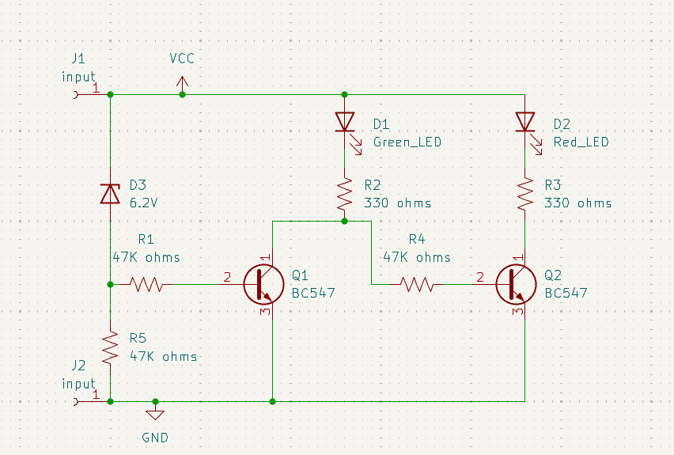
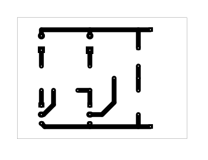
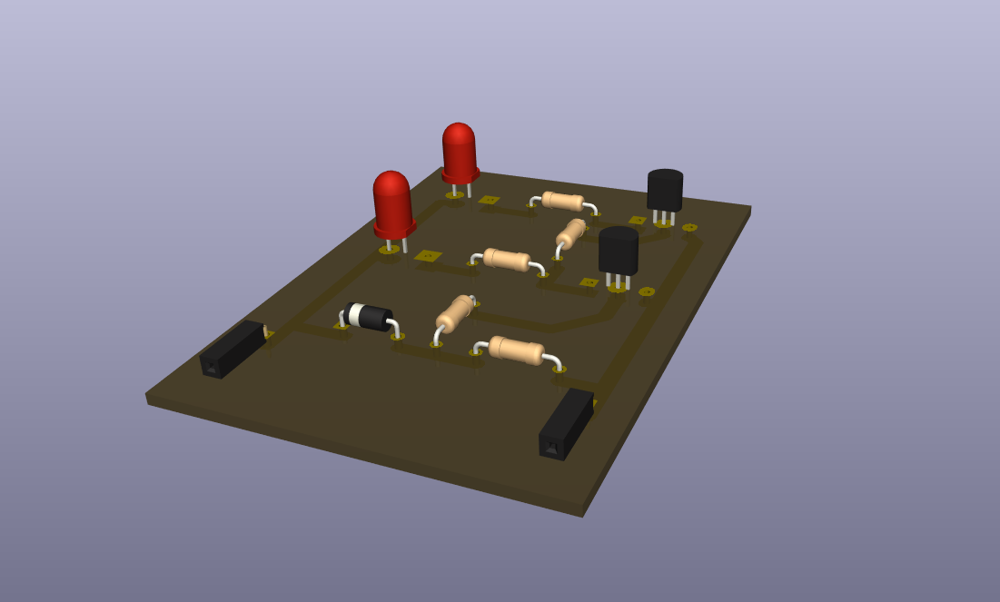

# 9V Battery Status Indicator Circuit

## Overview

This project contains a small LED indicator board intended to show battery-status conditions.

## Project Information

| Item | Details |
| --- | --- |
| Status | Educational prototype |
| Difficulty | Beginner |
| KiCad project file | [`9V Battery Status Indicator Circuit.kicad_pro`](<9V Battery Status Indicator Circuit.kicad_pro>) |
| Hardware tested | ✅ Yes (prototype successfully assembled and functionally tested) |
| Manufacturing release | Not yet prepared |

## Project Gallery

### Schematic

### PCB Layout

### 3D Render

### Finished Hardware

> Hardware photos will be added after additional prototype boards are assembled and photographed.

## Repository Navigation

This project is part of the DIY-Circuits collection.

- [Return to the repository overview](../README.md).
- Open the project by opening the `.kicad_pro` file in KiCad.
- The KiCad project, schematic, and PCB files are the authoritative design files.

## Circuit purpose

The schematic uses green and red LEDs with a zener diode and transistor stages to indicate a battery-voltage condition.

## Estimated difficulty

Beginner.

## KiCad source files

- `9V Battery Status Indicator Circuit.kicad_pro`
- `9V Battery Status Indicator Circuit.kicad_sch`
- `9V Battery Status Indicator Circuit.kicad_pcb`

## Operating principle

A 6.2 V zener reference and BC547 transistor stages are used with resistor networks to steer current to the red or green LED path as the input condition changes.

## Main components

- Q1, Q2: BC547 transistors.
- D1: Green LED; D2: Red LED; D3: 6.2 V zener diode.
- R1, R4, R5: 47K ohms; R2, R3: 330 ohms.

## Supply voltage

To be verified. The project title includes “9V,” but the supply range, connector polarity, and current requirement are not documented.

## Files included

The folder includes the KiCad project, schematic, PCB, and `9V Battery Status Indicator Circuit-B_Cu.pdf` plot export. A BOM is not included.

## Build and test notes

Assembly order, connector pinout, and expected LED thresholds are To be verified. Inspect the schematic and confirm the input polarity before applying power.

## Safety notes

Use a current-limited low-voltage supply while learning. Do not connect the circuit to mains electricity.

## Known limitations

The repository does not document the switching thresholds, battery chemistry, or measured indicator behavior.

## Before You Power the Circuit

- Verify transistor orientation and E/B/C pinout.
- Verify LED polarity.
- Check for solder bridges and cold solder joints.
- Verify resistor values before power-up.
- Confirm supply voltage and polarity.
- Perform a continuity check before applying power.

## Future improvements

- Add schematic and PCB screenshots for quick project review.
- Add input and LED-function silkscreen labels.
- Add test points for checking the zener-reference and LED paths.
- Document battery type, connector polarity, and threshold test results.

## Learning Objectives

After studying this project, readers should understand:

- How a zener diode can provide a voltage reference for a simple threshold circuit.
- How transistor stages and resistors can control separate LED indication paths.

## Common Beginner Mistakes

- Reversing LED or zener-diode polarity.
- Using the wrong resistor value for an LED current path.
- Installing a transistor without checking its emitter, base, and collector pin arrangement for the exact model being used.
- Applying power with unverified connector polarity.

## License

MIT - see the repository [LICENSE](../LICENSE).
