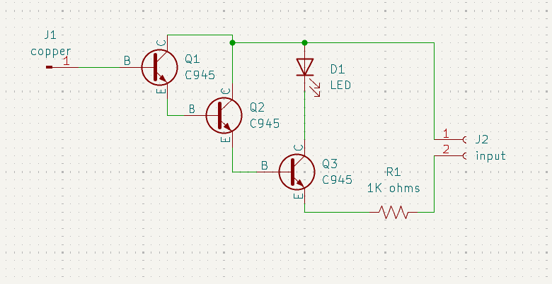
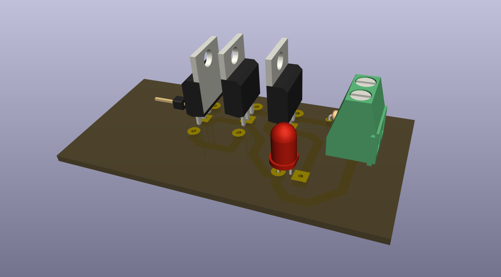

# Hidden Wire Detector

## Overview

This project contains a detector board with a copper connection, transistor stages, and LED output.

## Project Information

| Item | Details |
| --- | --- |
| Status | Educational prototype |
| Difficulty | Intermediate |
| KiCad project file | [`Hidden Wire Detector.kicad_pro`](<Hidden Wire Detector.kicad_pro>) |
| Hardware tested | ✅ Yes (prototype successfully assembled and functionally tested) |
| Manufacturing release | Not yet prepared |

## Project Gallery

### Schematic

### PCB Layout

### 3D Render

### Finished Hardware

> Hardware photos will be added after additional prototype boards are assembled and photographed.

## Repository Navigation

This project is part of the DIY-Circuits collection.

- [Return to the repository overview](../README.md).
- Open the project by opening the `.kicad_pro` file in KiCad.
- The KiCad project, schematic, and PCB files are the authoritative design files.

## Circuit purpose

The project is titled “Hidden Wire Detector” and includes a connector labeled `copper`, suggesting a sensing connection. This description is based on the project title and should be verified.

## Estimated difficulty

Intermediate.

## KiCad source files

- `Hidden Wire Detector.kicad_pro`
- `Hidden Wire Detector.kicad_sch`
- `Hidden Wire Detector.kicad_pcb`

## Operating principle

The schematic routes the copper sensing connection through three NPN transistor stages to an LED indicator. The specific sensing mechanism and detection range are To be verified.

## Main components

- Q1, Q2, Q3: C945 NPN transistors shown in the schematic.
- D1: LED; R1: 1K ohms.
- J1: connector labeled `copper`; J2: input connector.

## Supply voltage

To be verified. The source does not document the supply voltage, connector polarity, or detection sensitivity.

## Files included

The folder includes the KiCad project, schematic, PCB, and one B.Cu PDF plot export. A BOM is not included.

## Build and test notes

The sensing conductor arrangement and test setup are To be verified. Confirm transistor orientation and input polarity before powering the board.

## Safety notes

Do not use this project to determine whether wiring is safe to touch. Keep the detector isolated from mains wiring unless a qualified engineer defines a safe test method.

## Known limitations

No sensing range, target wire type, operating environment, or validated detection result is recorded.

## Before You Power the Circuit

- Verify transistor orientation and E/B/C pinout.
- Verify LED polarity.
- Check for solder bridges and cold solder joints.
- Verify resistor values before power-up.
- Confirm supply voltage and polarity.
- Perform a continuity check before applying power.

## Future improvements

- Add schematic and PCB screenshots that identify the sensing connection and indicator.
- Add silkscreen labels for the `copper` connection and power input.
- Add safe low-voltage test points for observing the transistor stages.
- Document sensing-electrode setup, detection-range tests, and false-trigger observations.

## Learning Objectives

After studying this project, readers should understand:

- How cascaded transistor stages can amplify a weak sensing input.
- Why a detector requires documented test conditions before its performance can be evaluated.

## Common Beginner Mistakes

- Rotating an NPN transistor incorrectly relative to its pinout.
- Assuming a different transistor part number has the same emitter, base, and collector order.
- Assuming any wire-detection circuit is safe for direct mains probing.
- Testing with an unverified supply polarity or sensing connection.

## License

MIT - see the repository [LICENSE](../LICENSE).
