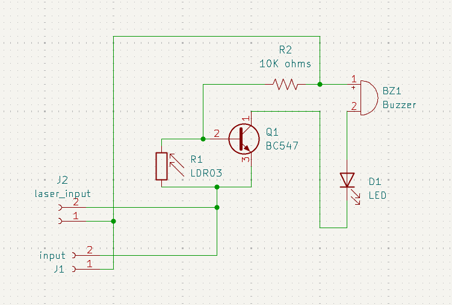
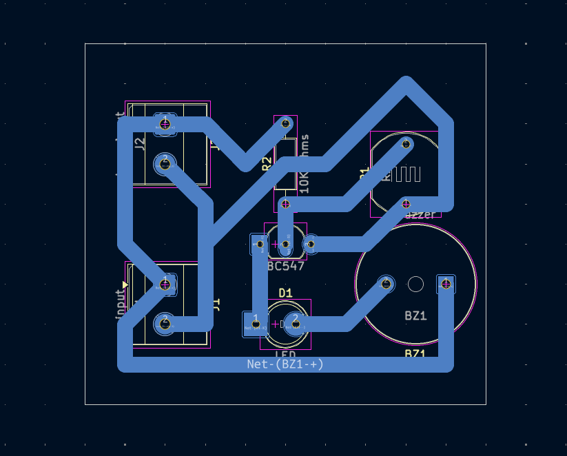
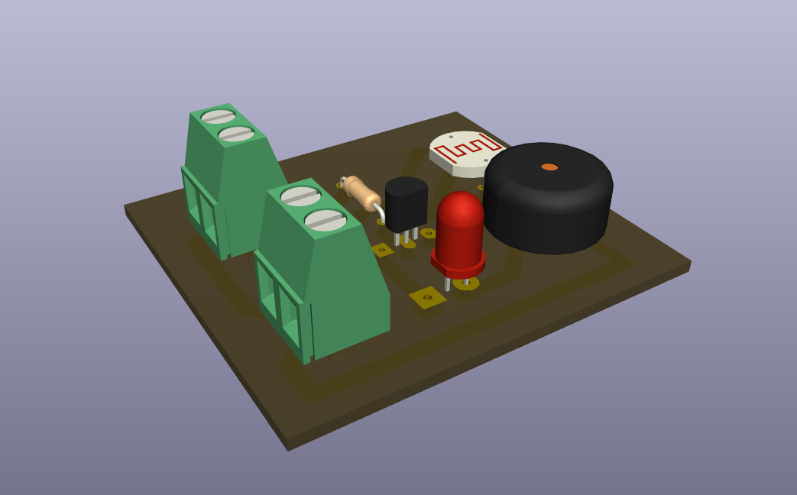

# Laser Alarm Security Circuit

## Overview

This project contains an LDR-based optical alarm circuit with LED and buzzer outputs.

## Project Information

| Item | Details |
| --- | --- |
| Status | Educational prototype |
| Difficulty | Intermediate |
| KiCad project file | [`Laser Alarm Security Circuit.kicad_pro`](<Laser Alarm Security Circuit.kicad_pro>) |
| Hardware tested | ✅ Yes (prototype successfully assembled and functionally tested) |
| Manufacturing release | Not yet prepared |

## Project Gallery

### Schematic

### PCB Layout

### 3D Render

### Finished Hardware

> Hardware photos will be added after additional prototype boards are assembled and photographed.

## Repository Navigation

This project is part of the DIY-Circuits collection.

- [Return to the repository overview](../README.md).
- Open the project by opening the `.kicad_pro` file in KiCad.
- The KiCad project, schematic, and PCB files are the authoritative design files.

## Circuit purpose

J2 is labeled `laser_input`, and the schematic includes an LDR, BC547 transistor, LED, and buzzer. These elements support a laser-interruption alarm application.

## Estimated difficulty

Intermediate.

## KiCad source files

- `Laser Alarm Security Circuit.kicad_pro`
- `Laser Alarm Security Circuit.kicad_sch`
- `Laser Alarm Security Circuit.kicad_pcb`

## Operating principle

The LDR and 10K resistor form a light-dependent input condition for the BC547 transistor stage. The stage drives visible and audible indication through D1 and BZ1.

## Main components

- R1: LDR03 light-dependent resistor; R2: 10K ohms.
- Q1: BC547 transistor; D1: LED; BZ1: buzzer.
- J2: connector labeled `laser_input`.

## Supply voltage

To be verified. The source does not specify supply voltage, laser-module requirements, or connector polarity.

## Files included

The folder includes the KiCad project, schematic, PCB, and one B.Cu PDF plot export. A BOM is not included.

## Build and test notes

Align the light source and LDR only after confirming the input voltage and buzzer rating. Alarm threshold and test distance are To be verified.

## Safety notes

Avoid directing a laser toward eyes or reflective surfaces. This project is not documented as a certified security system.

## Known limitations

Ambient-light response, laser type, detection distance, and alarm behavior are not recorded.

## Before You Power the Circuit

- Verify transistor orientation and E/B/C pinout.
- Verify LED polarity.
- Verify electrolytic capacitor polarity.
- Check for solder bridges and cold solder joints.
- Verify resistor values before power-up.
- Confirm supply voltage and polarity.
- Perform a continuity check before applying power.

## Future improvements

- Add schematic and PCB screenshots that show the LDR, laser input, and alarm outputs.
- Add silkscreen labels for the laser-input, LDR, buzzer, and supply connections.
- Add test points for the light-sensing threshold and transistor output.
- Document optical alignment and ambient-light test procedures.

## Learning Objectives

After studying this project, readers should understand:

- How an LDR and fixed resistor can create a light-dependent control signal.
- How optical alignment and ambient light affect a simple interruption alarm.

## Common Beginner Mistakes

- Wiring the LDR divider differently from the schematic.
- Reversing LED polarity or selecting a buzzer with the wrong voltage rating.
- Installing a transistor without confirming the emitter, base, and collector pin order for the exact model.
- Testing a laser path without considering eye safety and ambient light.

## License

MIT - see the repository [LICENSE](../LICENSE).
