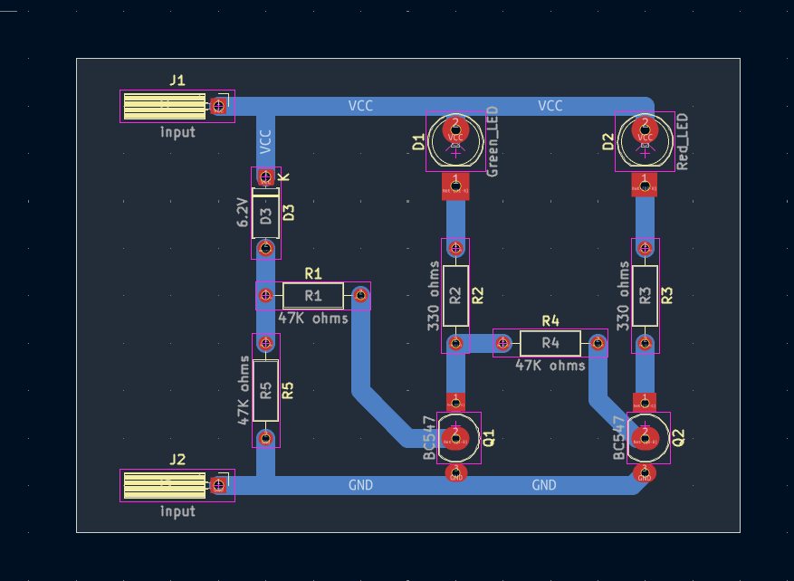

# 9V Battery Status Indicator Circuit

A beginner-friendly 9V battery indicator project using a zener diode reference, BC547 transistor stages, and red/green LED outputs.

## Project Information

| Item | Details |
| --- | --- |
| Status | Educational Prototype |
| Difficulty | Beginner |
| Hardware Tested | Prototype assembled and functionally tested |
| Supply Voltage | Intended for 9V battery checking; exact operating range not characterized |
| KiCad Compatibility | KiCad 10.0 metadata |
| License | MIT License |

## Project Overview

This project demonstrates a simple 9V battery status indicator. A 9V battery is connected to the input, and the zener/resistor/transistor network steers the indication path to either the green LED or red LED.

Based on the verified prototype, the green LED illuminated when testing an approximately 8.11 V 9V battery, while the red LED illuminated when testing an approximately 2.90 V 9V battery. The exact transition voltage between these indications has not been experimentally determined.

This circuit is intended for educational 9V battery checking only. It is not a calibrated battery analyzer and should not be used as certified test equipment.

## Features

- Two LED outputs for simple 9V battery indication.
- Green LED path for the tested serviceable 9V battery condition.
- Red LED path for the tested discharged 9V battery condition.
- 6.2V zener diode reference stage.
- Two BC547 transistor stages.
- Through-hole layout suitable for beginner soldering and inspection practice.
- Existing schematic, PCB layout images, 3D render, editable KiCad files, and B.Cu PDF export.

## Applications

- Beginner 9V battery indicator demonstrations.
- Learning how zener diodes can be used as simple voltage references.
- Studying transistor switching with LED outputs.
- Electronics laboratory exercises using low-voltage batteries.
- PCB fabrication, soldering, and troubleshooting practice.
- Comparing a circuit indication with a multimeter reading.

## Components Used

| Reference | Component | Role in the Circuit |
| --- | --- | --- |
| Q1, Q2 | BC547 transistors | Transistor stages that steer the LED indication paths. |
| D1 | Green LED | Visual indicator that lit during the verified serviceable 9V battery test. |
| D2 | Red LED | Visual indicator that lit during the verified discharged 9V battery test. |
| D3 | 6.2V zener diode | Reference diode used in the indicator network. |
| R1, R4, R5 | 47K ohm resistors | Resistors used in the zener/transistor bias network. |
| R2, R3 | 330 ohm resistors | Resistors used in the LED paths. |
| J1, J2 | `input` connectors | Schematic-labeled battery input connections. |
| VCC, GND | Power rails | Positive supply and ground reference shown in the schematic. |

## Circuit Explanation

The schematic shows a 6.2V zener diode, two BC547 transistors, two LEDs, and resistor networks connected around the 9V battery input. D1 is labeled `Green_LED`, and D2 is labeled `Red_LED`.

D3 and the 47K resistor network provide a reference and bias condition for the transistor stages. Q1 and Q2 respond to that bias condition and steer the LED indication path.

The circuit should be treated as a practical educational indicator. The repository and prototype notes document two observed battery test points, but they do not document the exact voltage where the indication changes from green to red.

## Theory

A zener diode can be used as a simple voltage reference when connected in the correct direction and operated in the intended part of its behavior. In this project, D3 is labeled 6.2V and is part of the bias network that influences the two BC547 transistor stages.

Transistors can act as electronic switches. Depending on the bias condition, one transistor path may allow one LED indication while the other path changes state.

The red and green LEDs provide a visual result, but they are not precision measurement instruments. The exact switching point depends on the component values used in the circuit and was not experimentally characterized during this prototype.

Use a multimeter as the reference measurement when evaluating an unfamiliar battery.

## How It Works

1. A 9V battery is measured with a multimeter before connection.
2. The battery is connected to J1/J2 with correct polarity.
3. The zener diode and resistor network establish the bias condition for Q1 and Q2.
4. The transistor stages steer current toward one of the LED indication paths.
5. In the verified prototype, an approximately 8.11 V battery caused the green LED to illuminate.
6. In the verified prototype, an approximately 2.90 V battery caused the red LED to illuminate.
7. The exact transition voltage was not measured, so the result should be treated as an educational indication rather than a calibrated threshold.

## Project Gallery

### Schematic

### PCB Layout Top

### PCB Layout Bottom

### 3D PCB Render

### Finished Hardware

> Finished hardware photographs will be added after the completed prototype is photographed.

## Assembly Guide

1. Review the schematic and PCB layout before soldering.
2. Install R1, R4, and R5, confirming each is 47K ohms.
3. Install R2 and R3, confirming each is 330 ohms.
4. Install D3, confirming zener diode polarity.
5. Install D1 and D2, confirming LED polarity and color placement.
6. Install Q1 and Q2 after checking the exact BC547 emitter, base, and collector pinout.
7. Install J1 and J2 input connections.
8. Inspect all solder joints for bridges, cold joints, or incomplete wetting.
9. Perform continuity checks before connecting a battery.

Disconnect the battery before changing component orientation, touching solder joints, or storing the circuit.

## Before You Power the Circuit

| Check | What to Verify |
| --- | --- |
| Battery type | Use a 9V battery for this project; other battery types are not valid tests for this circuit. |
| Battery polarity | Confirm correct polarity before connecting the battery. |
| Transistor orientation | Confirm Q1 and Q2 match the BC547 emitter, base, and collector pinout expected by the PCB footprint. |
| Zener diode polarity | Confirm D3 orientation before power-up. |
| LED polarity | Confirm D1 and D2 anode/cathode orientation. |
| Resistor values | Confirm R1/R4/R5 are 47K ohms and R2/R3 are 330 ohms. |
| Solder bridges | Inspect adjacent pads and traces for accidental shorts. |
| Continuity test | Check for unintended shorts before connecting a battery. |

## Testing

Use a multimeter as the reference measurement during testing. The indicator LEDs show the circuit response, but the switching threshold has not been fully characterized.

Suggested test procedure:

1. Inspect the assembled board under good lighting.
2. Confirm battery polarity before connection.
3. Verify Q1 and Q2 orientation.
4. Verify D3 zener diode polarity.
5. Verify D1 and D2 LED polarity.
6. Measure the 9V battery with a multimeter before connecting it to the circuit.
7. Connect a known higher-voltage 9V battery and observe the LED indication.
8. If available, connect a known discharged or weak 9V battery and observe the LED indication.
9. Compare the circuit indication with the multimeter reading when testing an unfamiliar battery.
10. Disconnect power immediately if any component becomes unusually hot.

Successful test indicators:

- The board powers without short-circuit symptoms.
- A serviceable 9V battery produces the expected green LED behavior based on prototype testing.
- A discharged or weak 9V battery produces the expected red LED behavior based on prototype testing.
- The multimeter reading and LED indication are reasonable for the known test battery condition.

## Practical Build Notes

### Prototype Notes

The following items are **Verified Prototype Observations** from the physical build. They extend beyond what is explicitly guaranteed by the KiCad schematic.

- The circuit was built and tested.
- Battery voltage measurements were taken using a digital multimeter before connecting the battery to the circuit.
- One higher-voltage 9V battery measured approximately **8.11 V** with a multimeter immediately before being connected to the circuit. When connected, the **green LED** illuminated.
- One discharged 9V battery measured approximately **2.90 V** with a multimeter immediately before being connected to the circuit. When connected, the **red LED** illuminated.
- The exact voltage point where the circuit changes from green indication to red indication was not measured or confirmed.
- More controlled testing would be needed before claiming an exact threshold.

### 9V Battery Use Only

The circuit was designed and tested for 9V batteries. Do not treat 3V, 6V, or other battery types as valid battery-health tests with this circuit.

The component values and indication circuit were designed around a nominal 9V battery. Using batteries with significantly different nominal voltages may produce misleading LED indications because the circuit was not designed or verified for those battery types.

### Polarity And Component Placement

Check battery polarity before connection. Verify Q1 and Q2 transistor orientation before soldering, and verify D1/D2 LED polarity and D3 zener diode polarity before applying power.

Incorrectly placed transistors, LEDs, or zener diode may prevent correct operation and may cause overheating or component damage. This is a general assembly caution; exact failure modes were not characterized.

### Builder Recommendations

- Compare the circuit indication with a multimeter whenever testing an unfamiliar battery.
- Use the multimeter as the reference measurement until the circuit's switching threshold has been fully characterized.
- If the circuit indication differs from the multimeter measurement, use the multimeter as the authoritative reference and inspect the circuit before drawing conclusions about the battery condition.
- Disconnect the battery after testing.
- Store the circuit without a battery connected to prevent unnecessary battery discharge and to reduce the risk of accidental overheating caused by incorrect connections during storage or transport.
- Inspect solder joints and component orientation before repeated demonstrations.

## Troubleshooting

| Symptom | Checks |
| --- | --- |
| No LED turns on | Check battery voltage with a multimeter, battery polarity, solder joints, resistor values, Q1/Q2 orientation, D3 polarity, and LED polarity. |
| Green LED does not light for a serviceable 9V battery | Confirm the battery voltage with a multimeter, check D1 polarity, Q1/Q2 orientation, D3 polarity, and R1/R4/R5 values. |
| Red LED does not light for a discharged or weak 9V battery | Confirm the battery voltage with a multimeter, check D2 polarity, Q1/Q2 orientation, D3 polarity, and R2/R3 values. |
| Multimeter reading and LED indication do not appear to agree | Verify multimeter accuracy, ensure good battery terminal contact, recheck Q1/Q2 orientation, verify D3 zener polarity, and confirm resistor values. |
| Both LEDs behave unexpectedly | Inspect for solder bridges, reversed LEDs, incorrect transistor orientation, wrong resistor values, or a battery type other than a 9V battery. |
| Component becomes hot | Disconnect the battery immediately and inspect for reversed polarity, solder bridges, incorrect diode orientation, and incorrect transistor placement. |
| Circuit works inconsistently | Check cold solder joints, loose battery contact, connector fit, and component orientation. |
| Wrong battery type used | Use a 9V battery for this project. Other nominal voltages may give misleading LED behavior. |

## Downloads

| File | Description |
| --- | --- |
| [`9V Battery Status Indicator Circuit.kicad_pro`](<9V Battery Status Indicator Circuit.kicad_pro>) | KiCad project file. Open this file in KiCad. |
| [`9V Battery Status Indicator Circuit.kicad_sch`](<9V Battery Status Indicator Circuit.kicad_sch>) | KiCad schematic source. |
| [`9V Battery Status Indicator Circuit.kicad_pcb`](<9V Battery Status Indicator Circuit.kicad_pcb>) | KiCad PCB layout source. |
| [`9V Battery Status Indicator Circuit-B_Cu.pdf`](<9V Battery Status Indicator Circuit-B_Cu.pdf>) | Existing bottom-copper PDF plot. |

## Educational Use Notice

This repository is intended for educational and personal learning purposes. The circuits, schematics, PCB layouts, fabrication files, and documentation are shared to help students understand electronics design, PCB fabrication, and circuit analysis.

Please do not submit these projects as your own academic work. If you use any design or idea from this repository, make sure you understand how it works, adapt it to your own requirements, and follow your institution's academic integrity policies.

The goal of this repository is to encourage learning, experimentation, and skill development—not to replace your own design process.

## Academic Integrity

If you are using this repository for a class, use it as a reference to understand concepts and improve your own designs. Always create and submit work that complies with your instructor's requirements and your institution's academic integrity policies.

## Revision History

| Version | Changes |
| --- | --- |
| 2.0.0 | Updated README to follow the Version 2.0.0 documentation standard with expanded project information, circuit explanation, theory, assembly guidance, testing notes, practical build notes, troubleshooting, gallery, downloads, and repository notices. |

## License

This project is released under the MIT License. See the repository [LICENSE](../../LICENSE).
