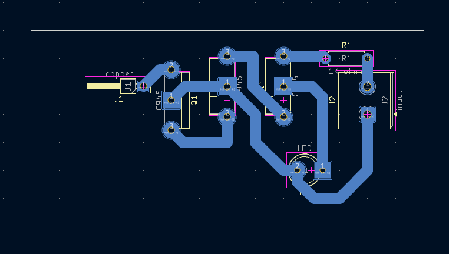
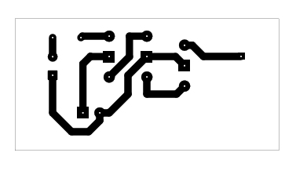

# Hidden Wire Detector

A beginner-friendly educational non-contact wire detector project using a copper sensing connection, three C945 transistor stages, and an LED indicator.

## Project Information

| Item | Details |
| --- | --- |
| Status | Educational Prototype |
| Difficulty | Intermediate |
| Hardware Tested | Prototype assembled and functionally tested |
| Supply Voltage | Not specified in repository; verify before powering |
| KiCad Compatibility | KiCad 10.0 metadata |
| License | MIT License |

## Project Overview

This project demonstrates a simple non-contact hidden wire detector concept. The KiCad schematic shows a sensing connection labeled `copper`, three C945 transistor stages, and an LED indicator.

The circuit is intended for electronics learning and supervised demonstration. It must not be connected directly to mains voltage, must not be treated as certified safety equipment, and must not be used as the only method to decide whether wiring is safe to touch.

Testing near live wiring should be done carefully, without touching exposed conductors, and with proper supervision.

## Features

- Non-contact wire-detection demonstration using a copper sensing connection.
- Three C945 transistor stages for signal amplification or switching.
- LED indicator output.
- Through-hole PCB layout suitable for beginner assembly and inspection practice.
- Includes schematic, PCB layout images, 3D render, editable KiCad files, and an existing B.Cu PDF export.
- Verified prototype notes document observed breadboard and PCB behavior separately from schematic-derived facts.

## Applications

- Demonstrating non-contact sensing concepts.
- Studying transistor amplification and switching stages.
- Practicing LED indicator circuits.
- Beginner electronics laboratory exercises.
- PCB fabrication, soldering, cleaning, and troubleshooting practice.
- Educational prototype demonstrations with conservative safety supervision.

## Components Used

| Reference | Component | Role in the Circuit |
| --- | --- | --- |
| J1 | `copper` connector | Schematic-labeled sensing connection for the detector input. |
| J2 | `input` connector | Schematic-labeled power/input connector. Supply voltage and polarity must be verified before powering. |
| Q1, Q2, Q3 | C945 transistors | Three transistor stages used between the sensing connection and LED indicator path. |
| D1 | LED | Visual indicator for detected response. |
| R1 | 1K ohm resistor | Resistor in the LED/transistor circuit path shown in the schematic. |

## Circuit Explanation

The schematic routes the `copper` sensing connection through three C945 transistor stages before reaching the LED indicator path. This arrangement is used to make a weak sensing response visible through D1.

J2 is the circuit input connector. The repository does not document the supply voltage, connector polarity, detection range, or measured sensitivity, so those details must be verified before powering or testing the circuit.

D1 provides the visual indication. In the verified prototype, the LED lit brightly when the sensing connection was pointed near a live wire and normally turned off when moved away.

Because this circuit is related to live-wire detection, it should be treated as an educational demonstrator only. It is not a replacement for a certified voltage tester or safe electrical work practices.

## Theory

Live AC wiring can produce an electric field around the energized conductor. A nearby sensing conductor, such as a copper wire or antenna-like pickup, can respond to that field without making direct electrical contact.

The signal picked up by the sensing connection is weak. Transistor stages can amplify or switch a small input response so it becomes strong enough to drive an indicator.

In this project, the LED is the indicator. A brighter LED response suggests that the circuit is reacting more strongly to the nearby energized conductor, while no light or a dim glow should be interpreted cautiously and investigated during testing.

The repository does not document measured detection distance, wire voltage, sensitivity, or environmental limits. Do not infer safe working conditions from this project alone.

## How It Works

1. Power is applied through J2 after supply polarity and voltage have been verified.
2. The copper sensing connection at J1 is positioned near the area being tested.
3. If a nearby live AC conductor produces enough field response at the sensing connection, the transistor stages respond.
4. The transistor stages drive the LED indicator path.
5. In the verified prototype, the LED lit brightly near a live wire and normally turned off when moved away.
6. Any faint LED glow with no nearby live wire should be treated as a troubleshooting clue, not as confirmed live-wire detection.

## Project Gallery

### Schematic

### PCB Layout Top

### PCB Layout Bottom

### 3D PCB Render

### Finished Hardware

> Finished hardware photos will be added after the completed PCB is photographed.

## Assembly Guide

1. Review the schematic and PCB layout before soldering.
2. Install R1, the 1K ohm resistor, and verify its value before soldering.
3. Install D1 and confirm LED polarity.
4. Install Q1, Q2, and Q3 only after checking the exact C945 transistor datasheet and pin order.
5. Install J1 for the copper sensing connection.
6. Install J2 for the input connection.
7. Inspect all solder joints for bridges, cold joints, incomplete wetting, or loose leads.
8. Clean flux residue if it may affect the sensitive input area.
9. Perform continuity checks before connecting power.

Disconnect power before changing the sensing connection, LED, transistor orientation, or wiring.

## Before You Power the Circuit

| Check | What to Verify |
| --- | --- |
| Transistor orientation | Confirm Q1, Q2, and Q3 match the exact C945 emitter, base, and collector pinout from the transistor datasheet. |
| LED polarity | Confirm D1 anode/cathode orientation before power-up. |
| Resistor verification | Confirm R1 is 1K ohms. |
| Copper sensing connection | Confirm J1 is connected only as the detector input and is not directly connected to mains voltage. |
| Input connector | Confirm J2 supply polarity before applying power. |
| Supply voltage | Verify the intended supply externally; it is not specified in the repository. |
| Solder joints | Inspect for cold solder joints, solder bridges, and loose leads. |
| Flux residue | Clean contamination around sensitive input areas if needed. |
| Continuity test | Check for shorts between supply rails and verify expected connections. |

## Testing

Testing should be supervised and conservative. Do not touch live conductors, do not connect the detector directly to mains voltage, and do not use this project as the only method to determine whether wiring is safe.

Suggested test procedure:

1. Inspect the assembled board under good lighting.
2. Verify Q1, Q2, and Q3 orientation against the transistor datasheet.
3. Confirm D1 LED polarity.
4. Confirm the copper sensing connection is secure and not connected directly to live wiring.
5. Apply power through J2 using a verified supply.
6. Perform a no-wire baseline test away from obvious energized wiring and observe the LED.
7. Carefully bring the sensing connection near a known live wire location without touching exposed conductors.
8. Observe whether the LED becomes bright near the live wire.
9. Move the detector away and confirm the LED turns off or becomes significantly dimmer.
10. Check for false triggering or dim LED glow when no live wire is nearby.
11. Disconnect power immediately if any component, wire, or connection becomes unusually hot.

Successful test indicators:

- The board powers without short-circuit symptoms.
- The LED is off during a clean no-wire baseline test.
- The LED lights brightly near a live wire during supervised testing.
- The LED normally turns off or becomes significantly dimmer when moved away.
- Any unexpected dim glow is investigated before presenting the result as detection.

## Practical Build Notes

### Prototype Notes

The following items are verified prototype observations from the physical build. They extend beyond what is explicitly measured or guaranteed by the KiCad files.

- The circuit was tested and worked.
- When the sensing connection was pointed near a live wire, the LED lit brightly as intended.
- When moved away from the live wire, the LED normally turned off.
- On the breadboard version, the LED stayed off when no live wire was nearby.
- On the PCB version, the LED sometimes glowed dimly even when no live wire was nearby.
- The exact cause of the dim LED glow on the PCB was not conclusively verified.
- A major assembly mistake was reversed transistor orientation.
- The transistor issue was fixed by checking the transistor datasheet and correctly matching emitter, base, and collector pins.

### Transistor Orientation

The prototype initially had transistor orientation problems. Always check the exact transistor datasheet before soldering Q1, Q2, and Q3.

Similar-looking transistors can have different emitter, base, and collector arrangements. Do not rely on package shape alone.

### Breadboard vs PCB Behavior

The verified breadboard version behaved cleanly: the LED stayed off when no live wire was nearby and lit brightly near a live wire.

The verified PCB version sometimes showed a dim LED glow even when no live wire was nearby. The exact cause was not confirmed, so faint LED glow should be treated as something to investigate rather than automatic evidence of live wiring.

### Possible Causes of Dim LED Glow

Possible causes include:

- cold solder joints;
- solder bridges;
- soldering quality;
- flux residue or contamination;
- sensitive sensing connection placement;
- PCB trace sensitivity;
- nearby electrical noise;
- incorrect transistor orientation.

No single cause has been confirmed from the repository evidence or prototype notes.

### Builder Recommendations

- Clean the PCB after soldering.
- Inspect all solder joints carefully.
- Check transistor orientation from the datasheet before soldering.
- Compare behavior on a breadboard if troubleshooting the PCB.
- Keep the sensing connection away from unnecessary electrical noise during testing.
- Treat faint LED glow as a troubleshooting condition, not automatically as live-wire detection.

## Troubleshooting

| Symptom | Checks |
| --- | --- |
| LED never turns on | Verify supply polarity, D1 polarity, R1 value, transistor orientation, solder joints, and the copper sensing connection. |
| LED always bright | Check for solder bridges, incorrect transistor orientation, nearby energized wiring, or unintended contact around the sensing connection. |
| LED glows dimly with no live wire nearby | Inspect for cold solder joints, flux residue, solder bridges, sensitive coil/copper placement, PCB trace sensitivity, nearby electrical noise, or transistor orientation errors. |
| Breadboard works but PCB does not | Compare transistor orientation, wiring order, solder quality, and copper sensing connection placement between the breadboard and PCB. |
| Circuit works after transistor orientation correction | Recheck all three C945 pinouts and document the correct emitter, base, and collector orientation before replacing or resoldering parts. |
| Weak detection | Check sensing connection placement, LED polarity, supply condition, transistor orientation, and solder joints. Avoid claiming a detection range without measurement. |
| False triggering | Move away from nearby electrical noise, clean flux residue, shorten or reposition the sensing connection, and inspect for solder contamination. |
| Unstable response | Check loose wiring, connector fit, solder joints, transistor orientation, and environmental electrical noise. |

## Downloads

| File | Description |
| --- | --- |
| [`Hidden Wire Detector.kicad_pro`](<Hidden Wire Detector.kicad_pro>) | KiCad project file. Open this file in KiCad. |
| [`Hidden Wire Detector.kicad_sch`](<Hidden Wire Detector.kicad_sch>) | KiCad schematic source. |
| [`Hidden Wire Detector.kicad_pcb`](<Hidden Wire Detector.kicad_pcb>) | KiCad PCB layout source. |
| [`Hidden Wire Detector-B_Cu.pdf`](<Hidden Wire Detector-B_Cu.pdf>) | Existing bottom-copper PDF plot. |

## Educational Use Notice

This repository is intended for educational and personal learning purposes. The circuits, schematics, PCB layouts, fabrication files, and documentation are shared to help students understand electronics design, PCB fabrication, and circuit analysis.

Please do not submit these projects as your own academic work. If you use any design or idea from this repository, make sure you understand how it works, adapt it to your own requirements, and follow your institution's academic integrity policies.

The goal of this repository is to encourage learning, experimentation, and skill development—not to replace your own design process.

## Academic Integrity

If you are using this repository for a class, use it as a reference to understand concepts and improve your own designs. Always create and submit work that complies with your instructor's requirements and your institution's academic integrity policies.

## Revision History

| Version | Changes |
| --- | --- |
| 2.0.0 | Updated README to follow the Version 2.0.0 documentation standard with expanded project information, safety guidance, circuit explanation, theory, assembly guidance, testing notes, practical build notes, troubleshooting, gallery, downloads, and repository notices. |

## License

This project is released under the MIT License. See the repository [LICENSE](../../LICENSE).
