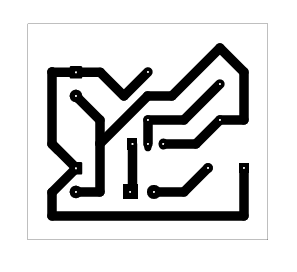

# Laser Alarm Security Circuit

A beginner-friendly laser-interruption alarm project using an LDR, BC547 transistor, LED, buzzer, and an external laser source for demonstration.

## Project Information

| Item | Details |
| --- | --- |
| Status | Educational Prototype |
| Difficulty | Intermediate |
| Hardware Tested | Breadboard and PCB prototype assembled and functionally tested |
| Supply Voltage | Prototype tested with a 9V battery; exact operating range not characterized |
| KiCad Compatibility | KiCad 10.0 metadata |
| License | MIT License |

## Project Overview

This project demonstrates an educational optical beam-interruption alarm. An external laser module projects a beam onto the LDR. The LDR and R2 form a light-dependent input condition for Q1. When the beam is interrupted, the LDR condition changes, Q1 responds, and D1/BZ1 provide visible and audible alarm indication.

The laser module used during prototype testing served only as the optical source. It is not part of the PCB schematic.

This project is intended for educational demonstration only and must not be relied upon as a real security or intrusion detection system.

## Features

- LDR-based optical sensing input.
- External laser beam used as the demonstration light source.
- Single BC547 transistor stage.
- LED visual output.
- Buzzer audible output.
- Beginner-friendly example of alignment-sensitive optical sensing.
- Existing schematic, PCB layout images, 3D render, editable KiCad files, and B.Cu PDF export.

## Applications

- Educational laser-interruption alarm demonstrations.
- LDR and fixed-resistor sensing exercises.
- Transistor switching laboratory activities.
- Optical alignment and interruption testing practice.
- Breadboard-to-PCB comparison practice.
- Soldering and cold-joint troubleshooting exercises.

## Components Used

| Reference | Component | Role in the Circuit |
| --- | --- | --- |
| J1 | `input` connector | Provides the main circuit input connection shown in the schematic. |
| J2 | `laser_input` connector | Schematic connector associated with the laser input connection. |
| R1 | `LDR03` | Light-dependent resistor used as the optical sensing element. |
| R2 | 10K ohm resistor | Fixed resistor used with the LDR to form the light-dependent input condition. |
| Q1 | BC547 transistor | Transistor stage that responds to the LDR sensing condition. |
| D1 | LED | Visual output indicator. |
| BZ1 | Buzzer | Audible output indicator. |

## Circuit Explanation

The schematic uses R1 as an LDR and R2 as a 10K ohm resistor. Together, they form a light-dependent input condition for Q1.

When the external laser beam is centered on the LDR, the LDR is illuminated and the circuit remains in its normal beam-present state. When an object interrupts the beam, the light reaching the LDR changes. That change affects the transistor stage, which drives the LED and buzzer output path.

Q1 is a BC547 transistor. Correct transistor orientation matters because the emitter, base, and collector must match the PCB footprint.

The external laser module is used as the optical source for testing and demonstration. The repository schematic documents the PCB circuit; it does not characterize laser power, detection distance, beam interruption distance, response time, or sensitivity range.

## Theory

An LDR, or light-dependent resistor, changes resistance as the light reaching its surface changes. In this project, the LDR is aimed at a laser beam so the circuit can respond when the beam is present or interrupted.

R2 works with the LDR to create a light-dependent input condition. Q1 responds to that condition and controls the output path for the LED and buzzer.

Optical alignment is important because the circuit depends on light actually reaching the LDR. A small movement of the laser or LDR can change the result, even if the electronic circuit is assembled correctly.

This project demonstrates the principle of beam interruption. It is not a certified security system and should not be used for real intrusion detection.

## How It Works

1. A 9V battery powers the PCB circuit.
2. An external laser module is powered according to its own operating-voltage requirements.
3. The laser beam is aligned so it reaches the LDR surface.
4. The LDR and R2 establish the light-dependent input condition for Q1.
5. When the beam reaches the LDR, the circuit remains in its normal beam-present state.
6. When an object interrupts the beam, the LDR condition changes.
7. Q1 responds to that change and drives D1/BZ1 for visible and audible indication.

This section describes the intended schematic operation and demonstration setup. Physical prototype observations are documented separately under **Verified Prototype Observations**.

## Project Gallery

### Schematic

### PCB Layout Top

### PCB Layout Bottom

### 3D PCB Render

### Finished Hardware

> Finished hardware photographs will be added after the completed prototype is photographed.

## Assembly Guide

1. Review the schematic and PCB layout before soldering.
2. Install R2, confirming it is 10K ohms.
3. Install R1, confirming the LDR placement.
4. Install D1, confirming LED polarity.
5. Install Q1 after checking the BC547 emitter, base, and collector pinout.
6. Install BZ1.
7. Install J1 and J2.
8. Inspect all solder joints for bridges, cold joints, and incomplete wetting.
9. Perform continuity checks before applying power.
10. Align the external laser module with the LDR during testing or after the demonstration mount is prepared.

## Before You Power the Circuit

| Check | What to Verify |
| --- | --- |
| Battery polarity | Confirm correct 9V battery polarity before connection. |
| Battery voltage | Measure the 9V battery with a multimeter before troubleshooting. |
| Laser module voltage | Confirm the laser module voltage requirement before applying power to the module. |
| Transistor orientation | Confirm Q1 matches the BC547 pinout expected by the PCB footprint. |
| LED polarity | Confirm D1 anode/cathode orientation. |
| LDR placement | Confirm R1 is installed at the LDR footprint. |
| LDR surface | Confirm the LDR surface is clean and unobstructed. |
| Resistor value | Confirm R2 is 10K ohms. |
| Solder bridges | Inspect adjacent pads and traces for accidental shorts. |
| Continuity test | Check for unintended shorts before connecting a battery. |

## Testing

This project is intended for educational demonstration only and must not be relied upon as a real security or intrusion detection system.

Suggested test procedure:

1. Inspect the PCB under good lighting.
2. Confirm battery polarity.
3. Measure the 9V battery with a multimeter to confirm the supply voltage is suitable for testing.
4. Verify the laser module operating-voltage requirement before applying power to the module.
5. Verify Q1 transistor orientation.
6. Confirm the LDR is installed and unobstructed.
7. Align the laser beam so it remains centered on the LDR.
8. Observe the normal beam-present state.
9. Interrupt the beam with an object and observe the LED/buzzer response.
10. Repeat the beam-interruption test several times.
11. Compare PCB behavior with the verified breadboard prototype if unexpected behavior occurs.
12. Disconnect power immediately if any component becomes unusually warm.

Successful test indicators:

- The PCB powers without short-circuit symptoms.
- The laser beam can be aligned onto the LDR.
- Interrupting the beam changes the output indication.
- Repeated interruption tests behave consistently when the laser and LDR remain aligned.
- PCB behavior matches the verified breadboard prototype after assembly issues are corrected.

## Practical Build Notes

### Prototype Notes

The following items are **Verified Prototype Observations** from the physical build. They extend beyond what is explicitly guaranteed by the KiCad schematic.

- Breadboard prototype operated correctly without modification.
- PCB prototype was assembled and successfully tested.
- Prototype was powered using a 9V battery.
- Minor PCB issues included cold solder joints and reversed transistor orientation.
- Correcting those assembly issues restored proper operation.
- Prototype testing used an external laser module connected to the PCB through female-to-male jumper wires.
- The laser module served only as the optical source during testing and is not part of the PCB schematic.
- The tested laser module specification indicated an operating voltage of **3.3 V to 5.0 V**.

### Laser Alignment Notes

Reliable operation depends on keeping the laser beam aligned with the LDR. Small alignment changes can affect prototype operation.

If the laser module will be mounted as part of the demonstration setup, align the laser with the LDR before permanently securing the laser module.

This README does not recommend exact alignment distances.

### Laser Module Notes

Verify the laser module's operating voltage requirements before applying power. Supplying a voltage outside the manufacturer's specified range may permanently damage the laser module.

Follow the module manufacturer's specifications when available. The tested laser module specification indicated an operating voltage of **3.3 V to 5.0 V**, but that is a verified prototype observation for the module used during testing, not a universal requirement for all laser modules.

### Builder Recommendations

- If the laser module will be mounted as part of the demonstration setup, align the laser with the LDR before permanently securing the laser module.
- Do not change resistor values unless intentionally redesigning and revalidating the circuit.
- Use a stable laser mount.
- Breadboard-test before PCB assembly whenever possible.
- Verify transistor orientation.
- Inspect solder joints carefully.
- Measure the 9V battery with a multimeter before troubleshooting to confirm the supply voltage is suitable for testing.
- Keep the laser beam centered on the LDR during testing.
- Ensure both the laser module aperture and the LDR surface are clean and unobstructed before alignment.
- Disconnect power immediately if any component becomes unusually warm, then verify component orientation before testing again.

### Laser Safety Notes

- Never look directly into the laser beam.
- Never intentionally shine the laser into another person's eyes.
- Avoid reflective surfaces that may redirect the laser beam unexpectedly during testing.
- Use the lowest practical laser power suitable for demonstration.
- Disconnect power before adjusting laser alignment.
- Do not use this project as a real security system.

## Troubleshooting

| Symptom | Checks |
| --- | --- |
| Alarm never activates | Check battery polarity and voltage, laser module power, laser alignment, LDR position, Q1 orientation, D1 polarity, BZ1 connection, solder joints, and resistor value. |
| Alarm always remains active | Confirm the laser beam reaches the LDR, check that the LDR surface is clean, inspect Q1 orientation, and look for solder bridges or cold solder joints. |
| Alarm activates intermittently | Verify the laser beam remains centered on the LDR, check that the laser mount has not shifted, inspect solder joints, and verify battery voltage. |
| Laser beam misses the LDR | Realign the laser and LDR, then repeat the interruption test. |
| Incorrect transistor orientation | Check the BC547 datasheet and confirm emitter, base, and collector match the PCB footprint. |
| Cold solder joints | Reinspect dull, cracked, or incomplete solder joints after disconnecting power. |
| Breadboard works but PCB does not | Compare PCB assembly against the verified breadboard prototype, then inspect solder bridges, cold solder joints, component placement, and transistor orientation. |
| Incorrect battery voltage | Measure the 9V battery with a multimeter and replace it if it is not suitable for testing. |
| Laser module does not illuminate | Verify laser module supply voltage, wiring, and module polarity before continuing. |
| Incorrect laser module supply voltage | Disconnect power and verify the module manufacturer's voltage specification before reconnecting. |

## Downloads

| File | Description |
| --- | --- |
| [`Laser Alarm Security Circuit.kicad_pro`](<Laser Alarm Security Circuit.kicad_pro>) | KiCad project file. Open this file in KiCad. |
| [`Laser Alarm Security Circuit.kicad_sch`](<Laser Alarm Security Circuit.kicad_sch>) | KiCad schematic source. |
| [`Laser Alarm Security Circuit.kicad_pcb`](<Laser Alarm Security Circuit.kicad_pcb>) | KiCad PCB layout source. |
| [`Laser Alarm Security Circuit-B_Cu.pdf`](<Laser Alarm Security Circuit-B_Cu.pdf>) | Existing B.Cu PDF plot export. |

## Educational Use Notice

This repository is intended for educational and personal learning purposes. The circuits, schematics, PCB layouts, fabrication files, and documentation are shared to help students understand electronics design, PCB fabrication, and circuit analysis.

Please do not submit these projects as your own academic work. If you use any design or idea from this repository, make sure you understand how it works, adapt it to your own requirements, and follow your institution's academic integrity policies.

The goal of this repository is to encourage learning, experimentation, and skill development—not to replace your own design process.

## Academic Integrity

If you are using this repository for a class, use it as a reference to understand concepts and improve your own designs. Always create and submit work that complies with your instructor's requirements and your institution's academic integrity policies.

## Revision History

| Version | Changes |
| --- | --- |
| 2.0.0 | Updated README to follow the Version 2.0.0 documentation standard with expanded project information, circuit explanation, theory, assembly guidance, testing notes, practical build notes, troubleshooting, gallery, downloads, and repository notices. |

## License

This project is released under the MIT License. See the repository [LICENSE](../../LICENSE).
