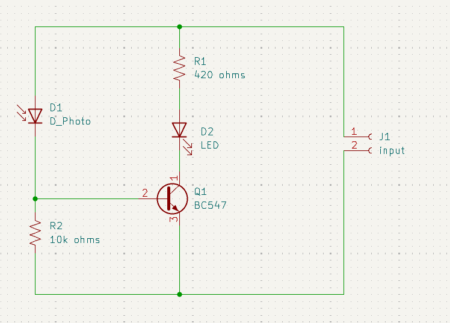
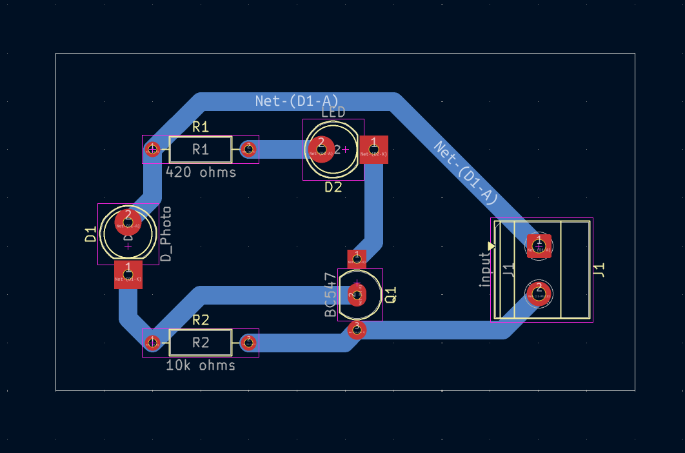
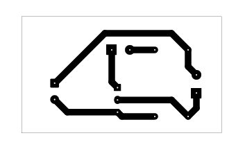
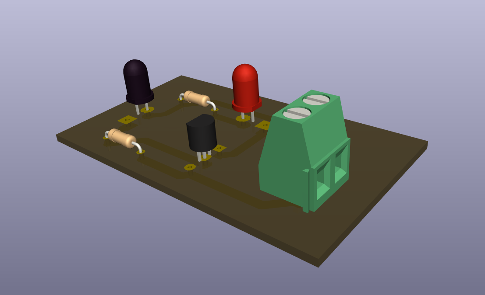

# Light-Activated Switch Circuit

A beginner-friendly photodiode and transistor switching project that uses light at the sensor input to control an LED output.

## Project Information

| Item | Details |
| --- | --- |
| Status | Educational Prototype |
| Difficulty | Beginner |
| Hardware Tested | Breadboard and PCB prototype assembled and functionally tested |
| Supply Voltage | Prototype tested with a 9V battery; operating range not characterized |
| KiCad Compatibility | KiCad 10.0 metadata |
| License | MIT License |

## Project Overview

This project demonstrates a simple light-activated transistor switch. A photodiode provides the light-sensitive input, a BC547 transistor responds to the sensor condition, and an LED provides the visible output indication.

The project was built to help beginners study sensor polarity, transistor orientation, resistor verification, and the effect of ambient lighting on a simple optical switching circuit. It is an educational prototype, not a calibrated light meter or certified sensing device.

This README documents the photodiode version shown in the KiCad schematic. An LDR could be explored as a future modification, but this README documents the photodiode version.

## Features

- Photodiode-based light sensing input.
- Single BC547 transistor switching stage.
- LED output indication.
- Beginner-friendly through-hole component layout.
- Useful for learning polarity-sensitive components.
- Existing schematic, PCB layout images, 3D render, editable KiCad files, and PDF plot exports.

## Applications

- Introductory light-sensing circuit demonstrations.
- Transistor switching exercises.
- Photodiode polarity and sensor-response demonstrations.
- Beginner electronics laboratory activities.
- PCB fabrication and soldering practice.
- Comparing breadboard behavior with a PCB build.

## Components Used

| Reference | Component | Role in the Circuit |
| --- | --- | --- |
| J1 | `input` connector | Provides the circuit input connection shown in the schematic. |
| D1 | `D_Photo` photodiode | Light-sensitive input device used by the sensor stage. |
| D2 | LED | Visible output indicator. |
| Q1 | BC547 transistor | Transistor switching stage controlled by the photodiode bias condition. |
| R1 | 420 ohm resistor | Resistor in the LED/output path shown in the schematic. |
| R2 | 10k ohm resistor | Bias resistor used with the photodiode/transistor input stage. |

## Circuit Explanation

The schematic shows a photodiode input connected to a BC547 transistor stage. The photodiode is a polarity-sensitive light sensor, so its orientation matters during assembly.

R2 is part of the photodiode/transistor bias path. As light reaches the photodiode, the sensor condition changes and affects the bias applied to Q1. Q1 then controls the LED output path through the circuit shown in the schematic.

R1 is placed in the LED/output path. It is documented as 420 ohms because that value is present in the KiCad schematic.

This project is designed around a photodiode, not an LDR. The circuit should be evaluated as the documented photodiode build unless a future schematic and PCB revision intentionally supports another sensor type.

## Theory

A photodiode is a semiconductor light sensor. When light reaches the photodiode, its electrical behavior changes. In a simple transistor circuit, that change can be used to influence the transistor bias.

A BC547 transistor can be used as a small-signal switch or amplifier stage. In this project, the photodiode and R2 form the input condition for Q1. When the input condition is suitable, Q1 changes the LED output state.

Ambient light matters because the photodiode responds to light reaching its surface, not only to the specific light source the builder intends to test. This is why controlled lighting, aiming, and shielding can make testing easier.

The exact light level, switching threshold, response time, and sensitivity range were not measured or characterized for this prototype.

## How It Works

1. A low-voltage supply is connected to the input connector with the correct polarity.
2. The photodiode senses light reaching its surface.
3. The photodiode and R2 establish the bias condition for Q1.
4. Q1 responds to the bias condition and controls the LED output path.
5. D2 provides the visible indication.

This section describes the intended operating principle from the schematic. Observed LED behavior from the physical prototype is documented separately under **Verified Prototype Observations**.

## Project Gallery

### Schematic

### PCB Layout Top

### PCB Layout Bottom

### 3D PCB Render

### Finished Hardware

> Finished hardware photographs will be added after the completed prototype is photographed.

## Assembly Guide

1. Review the schematic and PCB layout before soldering.
2. Install R1 and R2 after verifying their values.
3. Install D1, confirming the photodiode orientation.
4. Install D2, confirming LED polarity.
5. Install Q1 after checking the BC547 emitter, base, and collector pinout.
6. Install the input connector.
7. Inspect all solder joints for bridges, cold joints, and incomplete wetting.
8. Perform continuity checks before applying power.

## Before You Power the Circuit

| Check | What to Verify |
| --- | --- |
| Battery polarity | Confirm correct supply polarity before connection. |
| Transistor orientation | Confirm Q1 matches the BC547 pinout expected by the PCB footprint. |
| Photodiode orientation | Confirm D1 orientation before applying power. |
| LED polarity | Confirm D2 anode/cathode orientation. |
| Resistor values | Confirm R1 is 420 ohms and R2 is 10k ohms. |
| Photodiode surface | Confirm the photodiode is clean and unobstructed. |
| Solder bridges | Inspect adjacent pads and traces for accidental shorts. |
| Continuity test | Check for unintended shorts before connecting a battery. |

## Testing

Test the circuit in a controlled lighting environment so the intended light source can be distinguished from surrounding ambient light.

Suggested test procedure:

1. Inspect the assembled PCB under good lighting.
2. Confirm 9V battery polarity before connection.
3. Verify Q1 transistor orientation.
4. Verify D1 photodiode orientation.
5. Verify D2 LED polarity.
6. Verify R1 and R2 resistor values.
7. Connect the battery and keep the photodiode covered or away from the intended test light.
8. Observe whether the LED remains off when no intended light is applied.
9. Apply a consistent light source to the photodiode and observe the LED response.
10. Check whether ambient room lighting causes unintended triggering.
11. Verify the 9V battery voltage with a multimeter before testing if inconsistent sensor behavior is observed.
12. Disconnect power before changing wiring, moving the board, or reworking solder joints.

Successful test indicators:

- The board powers without short-circuit symptoms.
- The LED responds consistently to the intended light test.
- The LED does not respond unexpectedly to normal surroundings when the test setup is controlled.
- PCB behavior is consistent with the breadboard prototype after assembly issues are corrected.

## Practical Build Notes

### Prototype Notes

The following items are **Verified Prototype Observations** from the physical build. They extend beyond what is explicitly guaranteed by the KiCad schematic.

- The circuit was tested on a breadboard and worked as intended.
- The PCB version was assembled and tested.
- The project was powered using a 9V battery during testing.
- When light was detected by the photodiode during prototype testing, the LED turned on.
- When no light was detected by the photodiode during prototype testing, the LED remained off.
- PCB assembly mistakes included incorrect transistor orientation, reversed LED polarity, and wrong resistor value.
- These issues affected operation and were corrected during troubleshooting.
- During prototype testing, the photodiode sometimes responded to ambient room lighting instead of only the intended light source. This behavior made testing sensitive to the surrounding lighting conditions.

### Photodiode Sensitivity Notes

During prototype testing, the photodiode responded to ambient room lighting. Builders should expect surrounding light to influence circuit behavior unless testing is performed in a controlled lighting environment.

Aim or shield the photodiode when focusing on a specific light source. Resistor changes in the photodiode bias path could be explored experimentally, but this README does not provide unverified resistor substitutions, light thresholds, or detection distances.

### Photodiode vs LDR Note

This project is currently designed for a photodiode. An LDR could be explored as a future modification, but this README documents the photodiode version.

Do not assume an LDR will behave the same way unless a future LDR build is separately tested and documented.

### Builder Recommendations

- Verify transistor orientation, LED polarity, photodiode orientation, and resistor values before soldering.
- Breadboard-test the circuit before PCB assembly whenever possible.
- Compare the PCB behavior with the previously verified breadboard prototype. If the breadboard operates correctly but the PCB does not, inspect component orientation, resistor values, solder joints, and unintended shorts before modifying the circuit design.
- Ensure the photodiode surface is clean and unobstructed before testing, as dust or debris may affect the amount of light reaching the sensor.
- Use a consistent light source when checking sensor response.
- Reduce unintended ambient light exposure if false triggering occurs.

## Troubleshooting

| Symptom | Checks |
| --- | --- |
| LED does not turn on when light is applied | Check battery voltage and polarity, D1 photodiode orientation, D2 LED polarity, Q1 pinout, resistor values, and solder joints. |
| LED stays on without intended light | Reduce ambient light, shield the photodiode, inspect for solder bridges, and verify the photodiode and transistor orientation. |
| LED turns on under normal room lighting | Reduce ambient lighting, shield the photodiode from surrounding light, use a more directional light source, verify photodiode orientation, and inspect resistor values and solder joints. |
| LED polarity reversed | Confirm D2 anode/cathode orientation and reinstall correctly if needed. |
| Transistor orientation incorrect | Check the BC547 datasheet and confirm emitter, base, and collector match the PCB footprint. |
| Wrong resistor value installed | Confirm R1 is 420 ohms and R2 is 10k ohms. |
| Ambient light causes false triggering | Test in a more controlled lighting environment and aim or shield the photodiode. |
| Breadboard works but PCB does not | Compare the PCB against the breadboard wiring, then inspect solder bridges, cold solder joints, component orientation, and resistor placement. |
| Inconsistent light response | Use a consistent light source, check battery voltage with a multimeter, clean the photodiode surface, and inspect solder joints. |

## Downloads

| File | Description |
| --- | --- |
| [`Light-Activated Switch.kicad_pro`](<Light-Activated Switch.kicad_pro>) | KiCad project file. Open this file in KiCad. |
| [`Light-Activated Switch.kicad_sch`](<Light-Activated Switch.kicad_sch>) | KiCad schematic source. |
| [`Light-Activated Switch.kicad_pcb`](<Light-Activated Switch.kicad_pcb>) | KiCad PCB layout source. |
| [`Light-Activated Switch-B_Cu.pdf`](<Light-Activated Switch-B_Cu.pdf>) | Existing B.Cu PDF plot export. |
| [`Light-Activated Switch-B_Paste.pdf`](<Light-Activated Switch-B_Paste.pdf>) | Existing B.Paste PDF plot export. |

## Educational Use Notice

This repository is intended for educational and personal learning purposes. The circuits, schematics, PCB layouts, fabrication files, and documentation are shared to help students understand electronics design, PCB fabrication, and circuit analysis.

Please do not submit these projects as your own academic work. If you use any design or idea from this repository, make sure you understand how it works, adapt it to your own requirements, and follow your institution's academic integrity policies.

The goal of this repository is to encourage learning, experimentation, and skill development—not to replace your own design process.

## Academic Integrity

If you are using this repository for a class, use it as a reference to understand concepts and improve your own designs. Always create and submit work that complies with your instructor's requirements and your institution's academic integrity policies.

## Revision History

| Version | Changes |
| --- | --- |
| 2.0.0 | Updated README to follow the Version 2.0.0 documentation standard with expanded project information, circuit explanation, theory, assembly guidance, testing notes, practical build notes, troubleshooting, gallery, downloads, and repository notices. |

## License

This project is released under the MIT License. See the repository [LICENSE](../../LICENSE).
