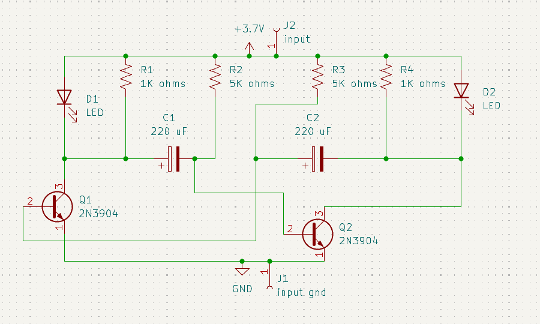

# Astable Multivibrator Circuit

A beginner-friendly two-transistor astable multivibrator that alternates two LED outputs using cross-coupled transistor and capacitor stages.

## Project Information

| Item | Details |
| --- | --- |
| Status | Educational Prototype |
| Difficulty | Beginner |
| Hardware Tested | Breadboard and PCB prototype assembled and functionally tested |
| Supply Voltage | Schematic shows a `+3.7V` power label; prototype testing was performed using a 9V battery |
| KiCad Compatibility | KiCad 10.0 metadata |
| License | MIT License |

## Project Overview

This project demonstrates a classic astable multivibrator circuit. Two 2N3904 transistor stages are cross-coupled through timing capacitors and resistor networks so the LED outputs alternate.

The circuit is useful for learning transistor switching, capacitor charging behavior, polarized component orientation, breadboard-to-PCB troubleshooting, and basic oscillator concepts. It is an educational demonstration only and does not document a measured blink frequency, duty cycle, timing accuracy, current consumption, or operating lifetime.

## Features

- Two-transistor astable multivibrator topology.
- Alternating LED outputs.
- Polarized timing capacitors.
- Through-hole components suitable for beginner assembly practice.
- Breadboard and PCB prototype behavior documented.
- Existing schematic, PCB layout images, 3D render, editable KiCad files, and B.Cu PDF exports.

## Applications

- Introductory transistor oscillator demonstrations.
- LED blinking and alternating-output exercises.
- Capacitor polarity and timing-network learning activities.
- Breadboard-to-PCB comparison practice.
- Beginner soldering and troubleshooting exercises.
- Educational demonstrations of how supply condition can affect a simple timing circuit.

## Components Used

| Reference | Component | Role in the Circuit |
| --- | --- | --- |
| J1 | `input gnd` connector | Ground/input connection shown in the schematic. |
| J2 | `input` connector | Input connection shown in the schematic. |
| Q1, Q2 | 2N3904 transistors | Cross-coupled transistor switching stages. |
| D1, D2 | LEDs | Visual outputs that indicate the alternating transistor states. |
| C1, C2 | 220 uF polarized capacitors | Timing/coupling capacitors between the transistor stages. |
| R1, R4 | 1K ohm resistors | Resistors in the LED/transistor output paths shown in the schematic. |
| R2, R3 | 5K ohm resistors | Resistors in the transistor timing/bias network shown in the schematic. |
| GND | Ground reference | Ground reference shown in the schematic. |
| `+3.7V` | Power label | Power label shown in the schematic. |

## Circuit Explanation

The schematic shows two 2N3904 transistor stages connected as an astable multivibrator. Each transistor stage is linked to the opposite side through a polarized 220 uF capacitor and resistor network.

As the circuit changes state, one transistor stage conducts while the other stage changes condition. The capacitor and resistor network then drives the opposite transition, creating alternating switching behavior between the two sides of the circuit.

D1 and D2 are LED indicators connected to the transistor stages. The intended schematic behavior is alternating LED indication, but the repository does not document measured blink frequency, duty cycle, timing accuracy, or current consumption.

## Theory

An astable multivibrator is a circuit with no single stable resting state. In this project, the two transistor stages repeatedly influence each other through the timing capacitors and resistors.

The 220 uF capacitors store and release charge as the circuit changes state. The resistor network controls how the transistor stages are biased and how the capacitors interact with those stages.

Because capacitor values, resistor values, transistor behavior, LED characteristics, and supply condition can all influence the visible result, this README treats blink behavior as an educational observation rather than a characterized timing specification.

## How It Works

1. Power is applied to the input connections.
2. One transistor stage begins conducting more than the other.
3. The corresponding LED path indicates that transistor state.
4. The cross-coupled capacitor and resistor network shifts the bias condition on the opposite transistor.
5. The opposite transistor stage turns on while the first stage turns off.
6. The LED indication changes to the other side.
7. The process repeats, producing alternating LED behavior.

This section describes the intended schematic operation. Physical build behavior is documented separately under **Verified Prototype Observations**.

## Project Gallery

### Schematic

### PCB Layout Top

### PCB Layout Bottom

### 3D PCB Render

### Finished Hardware

> Finished hardware photographs will be added after the completed prototype is photographed.

## Assembly Guide

1. Review the schematic and PCB layout before soldering.
2. Install R1 and R4 after confirming each is 1K ohms.
3. Install R2 and R3 after confirming each is 5K ohms.
4. Install D1 and D2, confirming LED polarity.
5. Install C1 and C2, confirming electrolytic capacitor polarity.
6. Install Q1 and Q2 after checking the 2N3904 emitter, base, and collector pinout.
7. Install J1 and J2.
8. Inspect all solder joints for bridges, cold joints, and incomplete wetting.
9. Perform continuity checks before applying power.

## Before You Power the Circuit

| Check | What to Verify |
| --- | --- |
| Battery polarity | Confirm correct supply polarity before connection. |
| Battery voltage | Measure battery voltage before troubleshooting. |
| Transistor orientation | Confirm Q1 and Q2 match the 2N3904 pinout expected by the PCB footprint. |
| LED polarity | Confirm D1 and D2 anode/cathode orientation. |
| Capacitor polarity | Confirm C1 and C2 electrolytic capacitor polarity before applying power. |
| Resistor values | Confirm R1/R4 are 1K ohms and R2/R3 are 5K ohms. |
| Solder bridges | Inspect adjacent pads and traces for accidental shorts. |
| Continuity test | Check for unintended shorts before connecting power. |

## Testing

The schematic shows a `+3.7V` power label, while prototype testing was performed using a 9V battery. Do not infer a universal operating voltage range from either item.

Suggested test procedure:

1. Inspect the PCB under good lighting.
2. Confirm supply polarity before connection.
3. Measure battery voltage before troubleshooting.
4. Verify Q1 and Q2 transistor orientation.
5. Verify D1 and D2 LED polarity.
6. Verify C1 and C2 electrolytic capacitor polarity.
7. Verify R1/R4 and R2/R3 resistor values.
8. Apply power and observe whether the LEDs alternate.
9. Compare PCB behavior with the verified breadboard prototype if unexpected behavior occurs.
10. Disconnect power immediately if any component becomes unusually warm.

Successful test indicators:

- The board powers without short-circuit symptoms.
- Both LED paths can illuminate.
- The LEDs alternate during operation.
- PCB behavior matches the verified breadboard prototype after assembly issues are corrected.

## Practical Build Notes

### Prototype Notes

The following items are **Verified Prototype Observations** from the physical build. They extend beyond what is explicitly guaranteed by the KiCad schematic.

- Breadboard testing required some troubleshooting before operating correctly.
- Breadboard prototype ultimately worked as intended.
- PCB prototype initially had reversed transistor orientation.
- PCB prototype also contained cold solder joints.
- Correcting those issues restored proper operation.
- Prototype testing was performed using a 9V battery.
- During prototype testing, both LEDs blinked alternately.
- Oscillation began immediately after power was applied.
- One LED appeared brighter than the other.
- Oscillation slowed or stopped as battery voltage became weak.
- Capacitor polarity was critical during assembly.
- During prototype testing, the apparent blink frequency changed slightly as the battery voltage decreased. This was observed only during the verified prototype and is not intended as a characterized timing specification

### Polarity And Orientation Notes

C1 and C2 are polarized electrolytic capacitors and must be installed with correct polarity. Reversed capacitor polarity can prevent correct operation and may damage the component.

Q1 and Q2 must match the 2N3904 pinout and the PCB footprint. D1 and D2 are polarity-sensitive LEDs; if either LED is reversed, that LED may not illuminate.

### Battery And Timing Observations

During prototype testing, blink behavior changed as battery voltage weakened. Measure battery voltage before troubleshooting, especially if the LEDs stop alternating, slow down, or behave inconsistently.

Battery-related timing changes are documented as **Verified Prototype Observations**, not characterized timing specifications.

### Builder Recommendations

- Verify transistor orientation.
- Verify LED polarity.
- Verify electrolytic capacitor polarity.
- Breadboard-test before PCB assembly.
- Inspect solder joints carefully.
- Measure battery voltage before troubleshooting.
- Use matched component values where appropriate.
- Do not change resistor values unless intentionally redesigning and revalidating the circuit.
- Disconnect power before replacing polarized components.

### Safety Notes

- Disconnect power before replacing polarized components.
- Verify capacitor polarity before applying power.
- This project is intended for educational demonstration only. It should not be represented as an industrial, production-ready, manufacturing-ready, certified, or long-life design.

## Troubleshooting

| Symptom | Checks |
| --- | --- |
| LEDs do not blink | Check battery voltage and polarity, Q1/Q2 orientation, C1/C2 polarity, LED polarity, resistor values, and solder joints. |
| Only one LED blinks | Check the non-blinking LED polarity, associated transistor orientation, capacitor polarity, resistor value, and solder joints. |
| LEDs remain off | Confirm power connection, battery voltage, LED polarity, transistor orientation, and solder continuity. |
| LEDs stay on without alternating | Check C1/C2 polarity, resistor values, transistor orientation, and possible solder bridges. |
| One LED appears brighter than the other | Check LED orientation, resistor values, solder joints, and component matching where appropriate. |
| Blinking slows or stops as battery weakens | Measure battery voltage and replace or recharge the battery used for testing. |
| Incorrect transistor orientation | Check the 2N3904 datasheet and confirm emitter, base, and collector match the PCB footprint. |
| Reversed LED polarity | Confirm D1/D2 anode and cathode orientation before powering again. |
| Reversed electrolytic capacitor polarity | Disconnect power immediately, verify C1/C2 polarity, and replace damaged capacitors if needed. |
| Cold solder joints | Reinspect dull, cracked, or incomplete solder joints after disconnecting power. |
| Breadboard works but PCB does not | Compare PCB assembly against the verified breadboard prototype, then inspect solder bridges, cold solder joints, component orientation, and PCB continuity. |
| Incorrect resistor values | Confirm R1/R4 are 1K ohms and R2/R3 are 5K ohms. |

## Downloads

| File | Description |
| --- | --- |
| [`astable miltivibrator.kicad_pro`](<astable miltivibrator.kicad_pro>) | KiCad project file. Open this file in KiCad. |
| [`astable miltivibrator.kicad_sch`](<astable miltivibrator.kicad_sch>) | KiCad schematic source. |
| [`astable miltivibrator.kicad_pcb`](<astable miltivibrator.kicad_pcb>) | KiCad PCB layout source. |
| [`astable miltivibrator-B_Cu.pdf`](<astable miltivibrator-B_Cu.pdf>) | Existing B.Cu PDF plot export. |
| [`astable miltivibrator-B_Cu01.pdf`](<astable miltivibrator-B_Cu01.pdf>) | Existing B.Cu PDF plot export. |

## Educational Use Notice

This repository is intended for educational and personal learning purposes. The circuits, schematics, PCB layouts, fabrication files, and documentation are shared to help students understand electronics design, PCB fabrication, and circuit analysis.

Please do not submit these projects as your own academic work. If you use any design or idea from this repository, make sure you understand how it works, adapt it to your own requirements, and follow your institution's academic integrity policies.

The goal of this repository is to encourage learning, experimentation, and skill development—not to replace your own design process.

## Academic Integrity

If you are using this repository for a class, use it as a reference to understand concepts and improve your own designs. Always create and submit work that complies with your instructor's requirements and your institution's academic integrity policies.

## Revision History

| Version | Changes |
| --- | --- |
| 2.0.0 | Updated README to follow the Version 2.0.0 documentation standard with expanded project information, circuit explanation, theory, assembly guidance, testing notes, practical build notes, troubleshooting, gallery, downloads, and repository notices. |

## License

This project is released under the MIT License. See the repository [LICENSE](../../LICENSE).
