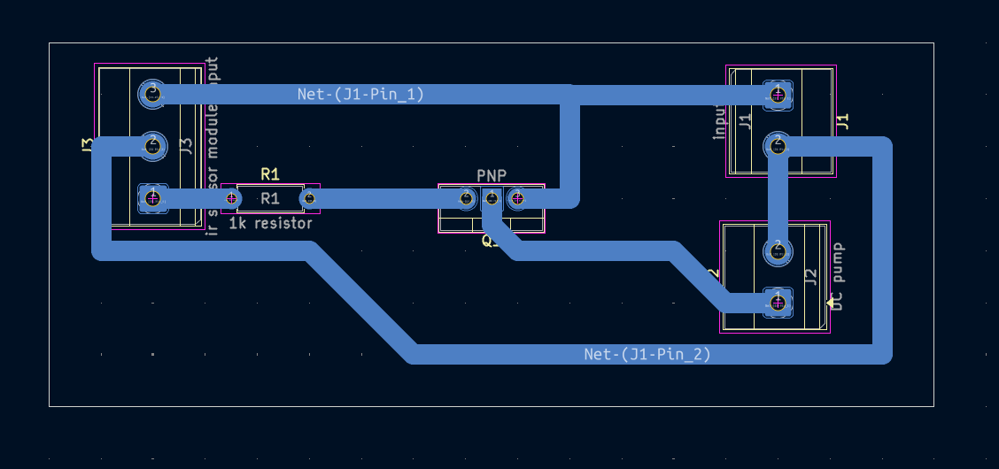

# Automatic Hand Sanitizer

A beginner-friendly automatic sanitizer pump controller using an IR sensor module input, TIP32C transistor switching stage, and DC pump connection.

## Project Information

| Item | Details |
| --- | --- |
| Status | Educational Prototype |
| Difficulty | Intermediate |
| Hardware Tested | Breadboard and PCB prototype assembled and functionally tested |
| Supply Voltage | Prototype tested with a 9V battery; exact operating range not characterized |
| KiCad Compatibility | Schematic KiCad 10.0 metadata; PCB KiCad 9.0 metadata |
| License | MIT License |

## Project Overview

This project demonstrates a simple sensor-controlled pump switch. The schematic provides an IR sensor module input at J3, a TIP32C transistor switching stage, and a DC pump connection at J2.

When the sensor module input changes state, the transistor stage responds and controls the pump connection. Verified prototype behavior is documented separately under **Verified Prototype Observations**.

This project is intended for educational demonstration only and must not be relied upon as a commercial or medical hand-sanitizing device.

## Features

- IR sensor module input connector.
- TIP32C transistor switching stage.
- DC pump output connector.
- 1k resistor between the sensor input path and transistor stage.
- Breadboard and PCB prototype testing documented.
- Existing schematic, PCB layout images, 3D render, editable KiCad files, and B.Cu PDF exports.

## Applications

- Educational sensor-controlled pump demonstrations.
- Transistor load-switching laboratory exercises.
- Beginner PCB assembly and troubleshooting practice.
- Breadboard-to-PCB comparison exercises.
- Demonstrations of practical wiring between modules and a PCB.
- Low-voltage prototype control projects.

## Components Used

| Reference | Component | Role in the Circuit |
| --- | --- | --- |
| J1 | `input` connector | Main circuit input connection shown in the schematic. |
| J2 | `DC pump` connector | Output connection for the DC pump load. |
| J3 | `ir sensor module input` connector | Interface for the external sensor-module signal. |
| R1 | 1k resistor | Resistor in the sensor-to-transistor control path. |
| Q1 | TIP 32C | PNP transistor switching stage used to control the pump connection. |

The PCB footprint identifies Q1 generically as `PNP`, while the schematic value identifies the intended transistor as `TIP 32C`.

## Circuit Explanation

The schematic shows J3 as the IR sensor module input. That input is routed through R1, labeled `1k resistor`, to Q1.

Q1 is identified in the schematic as `TIP 32C`, a PNP transistor used as the switching stage for the pump connection. J2 is labeled `DC pump`, indicating the output load connection.

The commercially available IR obstacle sensor module used in the verified prototype is documented as a build observation. It should not be treated as a PCB schematic component beyond the schematic interface at J3.

The repository does not document measured pump current, pump flow rate, sanitizer volume, response time, battery life, or certified medical suitability.

## Theory

Many sensor modules provide an output signal that can be used to control a separate load-switching circuit. In this project, the sensor-module signal enters the PCB at J3.

R1 provides the connection path from the sensor input toward the transistor stage. Q1 then acts as the switching device that controls the DC pump connection at J2.

The sensor module detects the hand in the prototype, but the PCB itself is mainly a pump-control board. This separation is important: the commercial sensor module is part of the verified prototype setup, while the KiCad schematic documents the PCB interface and switching stage.

## How It Works

1. A 9V battery powers the prototype circuit.
2. A sensor-module signal is connected to J3.
3. The sensor module output changes when detection occurs.
4. The signal at J3 passes through R1 to the TIP32C transistor stage.
5. Q1 controls the pump connection at J2.
6. When the sensor input indicates detection, the pump connection is activated.
7. When the sensor input is no longer active, the pump connection turns off.

This section describes the intended schematic operation. Detailed prototype lessons are listed separately under **Verified Prototype Observations**.

## Project Gallery

### Schematic

### PCB Layout Top

### PCB Layout Bottom

### 3D PCB Render

### Finished Hardware

> Finished hardware photographs will be added after the completed prototype is photographed.

## Assembly Guide

1. Review the schematic and PCB layout before soldering.
2. Install R1 after confirming it is 1k.
3. Install Q1 after checking the TIP32C pinout and matching it to the PCB footprint.
4. Install J1, J2, and J3.
5. Inspect all solder joints for bridges, cold joints, and incomplete wetting.
6. Confirm the pump wiring and sensor-module wiring before applying power.
7. Keep liquids away from the PCB during assembly and testing.
8. Perform continuity checks before connecting the battery.

## Before You Power the Circuit

| Check | What to Verify |
| --- | --- |
| Battery polarity | Confirm correct 9V battery polarity before connection. |
| Battery voltage | Measure the 9V battery with a multimeter before troubleshooting. |
| Transistor orientation | Confirm Q1 matches the TIP32C pinout and PCB footprint. |
| Sensor-module wiring | Confirm the external sensor module is connected to J3 correctly. |
| Pump polarity | Confirm the DC pump is connected to J2 with the intended polarity. |
| Resistor value | Confirm R1 is 1k. |
| Solder bridges | Inspect adjacent pads and traces for accidental shorts. |
| Continuity test | Check for unintended shorts before connecting a battery. |
| Liquid isolation | Keep the PCB, battery, and exposed electrical connections dry. |

## Testing

This project is intended for educational demonstration only and must not be relied upon as a commercial or medical hand-sanitizing device.

Suggested test procedure:

1. Inspect the PCB under good lighting.
2. Confirm battery polarity.
3. Measure the 9V battery before testing.
4. Verify sensor-module wiring at J3.
5. Verify TIP32C/transistor orientation.
6. Verify pump polarity at J2.
7. Keep liquids away from the PCB, battery, and exposed electrical connections.
8. Place a hand in front of the sensor and observe whether the pump starts.
9. Remove the hand and observe whether the pump stops.
10. Repeat the hand-detection test several times to verify consistent sensor activation and automatic pump shutoff after the hand is removed.
11. Compare PCB behavior with the verified breadboard prototype if unexpected behavior occurs.
12. Disconnect power immediately if any component becomes unusually warm.

Successful test indicators:

- The PCB powers without short-circuit symptoms.
- The sensor input activates the pump during the hand-detection demonstration.
- The pump stops after the hand is removed.
- Pump start/stop behavior is repeatable during demonstration testing.
- PCB behavior matches the verified breadboard prototype.

## Practical Build Notes

### Prototype Notes

The following items are **Verified Prototype Observations** from the physical build. They extend beyond what is explicitly guaranteed by the KiCad schematic.

- Breadboard prototype operated correctly without modification.
- PCB prototype also operated correctly on first power-up.
- Prototype was powered using a 9V battery.
- Verified prototype used a commercially available IR obstacle sensor module.
- The verified prototype connected the commercial IR obstacle sensor module to J3 using female-to-male jumper wires.
- The original design goal was to build a DIY IR sensor module. Since that version was not completed during development, the verified prototype used a commercially available IR obstacle sensor module instead.
- During prototype testing, placing a hand in front of the sensor activated the pump motor.
- Removing the hand stopped the pump motor.
- Battery discharge became noticeable during extended testing.
- The DC pump produced audible motor noise during operation.

### Sensor Module Notes

The verified prototype used a commercially available IR obstacle sensor module. That module is documented as part of the verified prototype setup and should not be interpreted as a PCB schematic component.

A DIY version of the sensor module could be explored as a future modification, but this README documents the verified prototype using the commercial IR obstacle sensor module.

### Wiring Notes

The PCB prototype used a standard terminal block. Female-to-male jumper wires were used during prototype testing to connect the commercial IR obstacle sensor module to J3.

Builders who prefer detachable wiring may use compatible connector solutions that match the PCB terminals without modifying the PCB design.

### Builder Recommendations

- Verify TIP32C/transistor orientation before soldering.
- Verify DC pump polarity.
- Verify sensor-module wiring before applying power.
- Measure the 9V battery with a multimeter before troubleshooting.
- Breadboard-test before PCB assembly whenever possible.
- Inspect solder joints carefully.
- Use a fresh or fully charged 9V battery during demonstrations to reduce inconsistent pump operation caused by supply voltage drop.
- Do not change resistor values unless intentionally redesigning and revalidating the circuit.
- Disconnect power before changing wiring.
- Keep liquids away from the PCB, battery, and exposed electrical connections during testing and operation.

### Liquid And Electrical Safety Notes

- Keep the PCB, battery, and wiring dry.
- Keep sanitizer and other liquids away from exposed electrical connections to reduce the risk of short circuits.
- Only pump components intended for liquid handling should contact sanitizer.
- Never submerge the PCB, battery, or wiring.
- Disconnect power before servicing, rewiring, or refilling the pump.
- Do not rely on this project as a commercial or medical sanitizing device.

### Future Improvement Ideas

The following are possible future improvements inspired by observations made during prototype testing. They are not planned or verified features in this README:

- DIY IR sensing stage.
- Power switch.
- Power-indicator LED.
- Improved battery efficiency.
- Reduced pump noise.

## Troubleshooting

| Symptom | Checks |
| --- | --- |
| Pump never activates | Check battery polarity and voltage, J3 sensor wiring, Q1 orientation, R1 value, pump polarity, and solder joints. |
| Pump always runs | Check sensor-module wiring, Q1 orientation, solder bridges, and whether the sensor output is staying active. |
| Sensor does not detect a hand | Verify sensor-module power and wiring, then compare with the verified breadboard prototype. |
| Intermittent activation | Check battery voltage, jumper-wire connections, sensor alignment, solder joints, and pump wiring. |
| Pump activates but runs weakly or inconsistently | Check battery voltage, pump polarity, and sensor wiring. |
| Incorrect transistor orientation | Check the TIP32C datasheet and confirm the pinout matches the PCB footprint. |
| Incorrect pump polarity | Disconnect power and verify the pump wiring at J2 before testing again. |
| Cold solder joints | Reinspect dull, cracked, or incomplete solder joints after disconnecting power. |
| Breadboard works but PCB does not | Compare PCB assembly against the verified breadboard prototype, then inspect solder bridges, cold solder joints, component placement, PCB continuity, and wiring. |
| Incorrect battery voltage | Measure the 9V battery with a multimeter and use a fresh or fully charged battery for demonstration testing. |
| Excessive motor noise | Treat pump noise as a practical prototype observation; check pump mounting, wiring, and battery condition without assuming a measured noise level. |

## Downloads

| File | Description |
| --- | --- |
| [`automatic hand sanitizer.kicad_pro`](<automatic hand sanitizer.kicad_pro>) | KiCad project file. Open this file in KiCad. |
| [`automatic hand sanitizer.kicad_sch`](<automatic hand sanitizer.kicad_sch>) | KiCad schematic source. |
| [`automatic hand sanitizer.kicad_pcb`](<automatic hand sanitizer.kicad_pcb>) | KiCad PCB layout source. |
| [`automatic hand sanitizer-B_Cu.pdf`](<automatic hand sanitizer-B_Cu.pdf>) | Existing B.Cu PDF plot export. |
| [`automatic hand sanitizer-B_Cu-2.pdf`](<automatic hand sanitizer-B_Cu-2.pdf>) | Existing B.Cu PDF plot export. |

## Educational Use Notice

This repository is intended for educational and personal learning purposes. The circuits, schematics, PCB layouts, fabrication files, and documentation are shared to help students understand electronics design, PCB fabrication, and circuit analysis.

Please do not submit these projects as your own academic work. If you use any design or idea from this repository, make sure you understand how it works, adapt it to your own requirements, and follow your institution's academic integrity policies.

The goal of this repository is to encourage learning, experimentation, and skill development—not to replace your own design process.

## Academic Integrity

If you are using this repository for a class, use it as a reference to understand concepts and improve your own designs. Always create and submit work that complies with your instructor's requirements and your institution's academic integrity policies.

## Revision History

| Version | Changes |
| --- | --- |
| 2.0.0 | Updated README to follow the Version 2.0.0 documentation standard with expanded project information, circuit explanation, theory, assembly guidance, testing notes, practical build notes, troubleshooting, gallery, downloads, and repository notices. |

## License

This project is released under the MIT License. See the repository [LICENSE](../../LICENSE).
