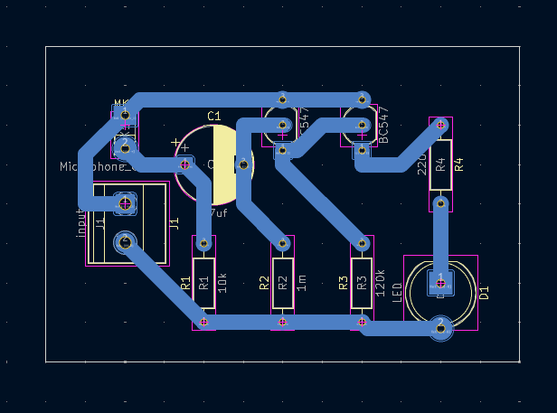
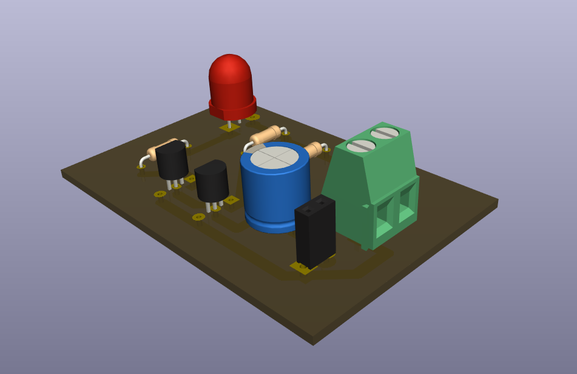

# Clap Switch Circuit

A beginner-friendly sound-activated switching project using an electret condenser microphone, two BC547 transistor stages, and an LED output indicator.

## Project Information

| Item | Details |
| --- | --- |
| Status | Educational Prototype |
| Difficulty | Intermediate |
| Hardware Tested | Prototype assembled and functionally tested |
| Supply Voltage | Not specified in repository; verify before powering |
| KiCad Compatibility | KiCad 10.0 metadata |
| License | MIT License |

## Project Overview

This project demonstrates a simple clap-activated transistor circuit. A clap or sharp sound reaches the electret microphone, the signal is coupled through C1, transistor stages amplify or switch the response, and D1 provides the visible output indication.

The circuit was built as an educational prototype for learning about microphone input circuits, coupling capacitors, transistor stages, and practical PCB assembly. It is intended for low-voltage learning and demonstration, not for industrial sound detection or production equipment.

## Features

- Sound-responsive input using an electret condenser microphone.
- Two BC547 transistor stages for amplification or switching.
- LED output indicator.
- Coupling through a polarized 47uF capacitor.
- Through-hole PCB layout suitable for assembly and troubleshooting practice.
- Existing schematic, PCB layout images, 3D render, editable KiCad files, and B.Cu PDF exports.

## Applications

- Clap-switch circuit demonstrations.
- Introductory audio-triggered transistor experiments.
- Beginner electronics laboratory exercises.
- Microphone input and coupling capacitor study.
- PCB fabrication, soldering, and troubleshooting practice.
- Educational prototype presentations using a visible LED output.

## Components Used

| Reference | Component | Role in the Circuit |
| --- | --- | --- |
| MK1 | Electret condenser microphone | Sound input device. The schematic labels this as `Microphone_Condenser`; the project documentation refers to it as an electret microphone for the verified prototype build. |
| C1 | 47uF polarized capacitor | Couples the microphone signal into the transistor stages while requiring correct polarity during assembly. |
| Q1, Q2 | BC547 transistors | Transistor stages used to amplify or switch the sound-triggered response. |
| D1 | LED | Visible output indicator. |
| R1 | 10k ohm resistor | Bias resistor in the microphone/transistor input path. |
| R2 | 1M ohm resistor | Bias resistor in the transistor stage. |
| R3 | 120k ohm resistor | Bias resistor connected to the output transistor stage. |
| R4 | 220 ohm resistor | LED current-path resistor shown with D1. |
| J1 | `input` connector | Schematic-labeled input/power connector. Supply polarity must be verified before powering. |

## Circuit Explanation

The schematic shows MK1 as the microphone input, C1 as a polarized coupling capacitor, Q1 and Q2 as BC547 transistor stages, and D1 as the LED output.

The microphone converts a sharp sound into a small electrical signal. C1 couples that signal into the transistor stages. The resistor network sets the bias conditions for the two BC547 stages, and the LED provides a simple visual indication when the circuit responds.

The repository does not document sound pressure level, clap distance, microphone sensitivity, operating frequency, current consumption, or exact trigger threshold. These values should not be assumed from the schematic.

## Theory

An electret microphone is a small sound sensor. Sound waves cause tiny movement inside the microphone, and the microphone produces a small changing electrical signal.

Because the microphone signal is small, the circuit uses transistor stages to make the response large enough to drive an output indicator. The first transistor stage responds to the microphone-coupled signal, and the second transistor stage controls the LED path.

C1 is a coupling capacitor. In this project, it passes the changing microphone signal into the transistor stage while blocking direct current between parts of the circuit. Since C1 is polarized, installing it backwards can prevent correct operation or damage the part.

The LED is the visible output. It confirms that the circuit is responding, but it does not provide a calibrated measurement of sound level.

## How It Works

1. Power is applied through J1 after polarity and supply voltage are verified.
2. A clap or sharp sound reaches the electret microphone.
3. The microphone produces a small changing signal.
4. C1 couples the microphone signal into the BC547 transistor stages.
5. Q1 and Q2 respond according to their biasing and the incoming signal.
6. D1 lights when the transistor stages drive the LED output path.
7. Repeated clap testing can confirm whether the assembled circuit responds consistently under the chosen test conditions.

## Project Gallery

### Schematic

### PCB Layout Top

### PCB Layout Bottom

### 3D PCB Render

### Finished Hardware

> Finished hardware photographs will be added after the completed prototype is photographed.

## Assembly Guide

1. Review the schematic and PCB layout before soldering.
2. Install R1 through R4 and verify each resistor value before soldering.
3. Install C1, confirming the 47uF polarized capacitor orientation.
4. Install Q1 and Q2 after checking the exact BC547 emitter, base, and collector pinout.
5. Install D1 and confirm LED polarity.
6. Install J1.
7. Install MK1 last if possible, using careful and efficient soldering on the electret microphone terminals.
8. Inspect all microphone, transistor, capacitor, and LED solder joints.
9. Perform continuity checks before applying power.

Disconnect power before changing the microphone, transistor orientation, capacitor orientation, or wiring.

## Before You Power the Circuit

| Check | What to Verify |
| --- | --- |
| Microphone polarity | Confirm MK1 polarity before soldering and before applying power. |
| Capacitor polarity | Confirm C1 orientation because it is a polarized 47uF capacitor. |
| Transistor orientation | Confirm Q1 and Q2 match the BC547 emitter, base, and collector pinout expected by the PCB footprint. |
| LED polarity | Confirm D1 anode/cathode orientation. |
| Resistor values | Confirm R1 is 10k ohms, R2 is 1M ohms, R3 is 120k ohms, and R4 is 220 ohms. |
| Input connector | Confirm J1 supply polarity before applying power. |
| Solder bridges | Inspect adjacent pads and traces for accidental shorts. |
| Continuity test | Check for unintended shorts before power-up. |

## Testing

Test the circuit with a verified low-voltage supply. The repository does not document a numeric supply range, so confirm the intended supply before powering the board.

Suggested test procedure:

1. Inspect the PCB under good lighting.
2. Verify microphone polarity and microphone solder joints.
3. Confirm C1 capacitor polarity.
4. Confirm Q1 and Q2 transistor orientation.
5. Confirm D1 LED polarity.
6. Inspect for solder bridges or poor solder joints.
7. Use continuity testing where needed before applying power.
8. Test the circuit in a reasonably quiet environment before clap-response testing to reduce background noise during initial verification.
9. Apply power through J1 with correct polarity.
10. Clap near the microphone and observe the LED response.
11. Repeat clap testing several times to check for consistent operation.
12. Disconnect power immediately if any component becomes unusually hot or the circuit behaves unexpectedly.

Successful test indicators:

- The board powers without short-circuit symptoms.
- The LED responds to clap or sharp sound events.
- Repeated clap tests produce a consistent response under the same setup.
- The microphone stage remains physically secure and the microphone solder joints stay intact.

## Practical Build Notes

### Prototype Notes

The following items are **Verified Prototype Observations** from the physical build. They extend beyond what is explicitly guaranteed by the KiCad schematic.

- The breadboard prototype was tested through multiple iterations before operating correctly.
- The PCB prototype was successfully assembled and tested.
- The finished circuit operated as intended after correcting assembly issues.
- The greatest challenge during prototype development was handling and soldering the electret microphone. Once the microphone stage was assembled correctly, the clap-switch circuit itself operated as intended.
- Several electret microphones were accidentally damaged while learning proper soldering techniques for their delicate terminals.
- Several prototype iterations were required because of inexperience handling electret microphones.
- During PCB assembly, the microphone initially failed to operate correctly.
- Troubleshooting included verifying microphone polarity, inspecting solder joints, and checking surrounding component placement.
- After correcting these issues, the circuit functioned as intended.

### Microphone Handling

Electret microphones are delicate components. Excessive soldering heat can damage the microphone terminals or the microphone body.

Solder carefully and efficiently. Avoid prolonged heating of the terminals, and let the part cool if additional soldering is needed.

If available, an electret microphone supplied with pre-attached leads or pins can make assembly easier for beginners and reduce the risk of damaging the microphone during soldering.

### Builder Recommendations

- Verify microphone polarity before soldering.
- Avoid prolonged heating of microphone terminals.
- Inspect nearby solder joints if the circuit does not respond.
- Breadboard-test the microphone circuit before PCB assembly when possible.
- If the microphone stage does not respond after PCB assembly, verify the circuit first on a breadboard before assuming the PCB design is incorrect. This helped isolate assembly-related issues during prototype development.
- If replacing a damaged electret microphone during troubleshooting, verify the replacement microphone's polarity and wiring before powering the circuit again.

## Troubleshooting

| Symptom | Checks |
| --- | --- |
| No response to clap | Verify supply polarity, microphone polarity, microphone solder joints, C1 polarity, Q1/Q2 orientation, D1 polarity, and solder continuity. |
| Intermittent response | Check loose microphone connections, cracked solder joints, noisy test conditions, and component placement around MK1 and C1. |
| Microphone wired incorrectly | Recheck the electret microphone polarity and wiring before powering the circuit again. |
| Damaged microphone | Replace the microphone, then verify replacement polarity and wiring before power-up. |
| Transistor orientation errors | Compare Q1 and Q2 orientation with the BC547 datasheet and PCB footprint. |
| Solder bridges | Inspect and clear bridges around microphone pads, transistor pins, capacitor pads, and LED pads. |
| Breadboard works but PCB does not | Compare the breadboard and PCB node by node, then inspect solder joints, microphone polarity, transistor orientation, and C1 polarity. |
| Unstable triggering | Test in a quieter environment, inspect microphone wiring, check surrounding solder joints, and compare behavior with the breadboard prototype. |

## Downloads

| File | Description |
| --- | --- |
| [`clap switch circuit.kicad_pro`](<clap switch circuit.kicad_pro>) | KiCad project file. Open this file in KiCad. |
| [`clap switch circuit.kicad_sch`](<clap switch circuit.kicad_sch>) | KiCad schematic source. |
| [`clap switch circuit.kicad_pcb`](<clap switch circuit.kicad_pcb>) | KiCad PCB layout source. |
| [`clap switch circuit-B_Cu.pdf`](<clap switch circuit-B_Cu.pdf>) | Existing bottom-copper PDF plot. |
| [`clap switch circuit-B_Cu-dan.pdf`](<clap switch circuit-B_Cu-dan.pdf>) | Existing bottom-copper PDF plot. |

## Educational Use Notice

This repository is intended for educational and personal learning purposes. The circuits, schematics, PCB layouts, fabrication files, and documentation are shared to help students understand electronics design, PCB fabrication, and circuit analysis.

Please do not submit these projects as your own academic work. If you use any design or idea from this repository, make sure you understand how it works, adapt it to your own requirements, and follow your institution's academic integrity policies.

The goal of this repository is to encourage learning, experimentation, and skill development—not to replace your own design process.

## Academic Integrity

If you are using this repository for a class, use it as a reference to understand concepts and improve your own designs. Always create and submit work that complies with your instructor's requirements and your institution's academic integrity policies.

## Revision History

| Version | Changes |
| --- | --- |
| 2.0.0 | Updated README to follow the Version 2.0.0 documentation standard with expanded project information, circuit explanation, theory, assembly guidance, testing notes, practical build notes, troubleshooting, gallery, downloads, and repository notices. |

## License

This project is released under the MIT License. See the repository [LICENSE](../../../LICENSE).
