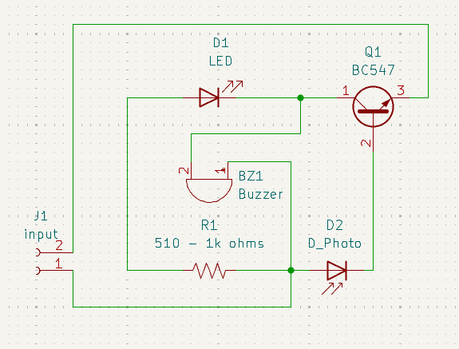
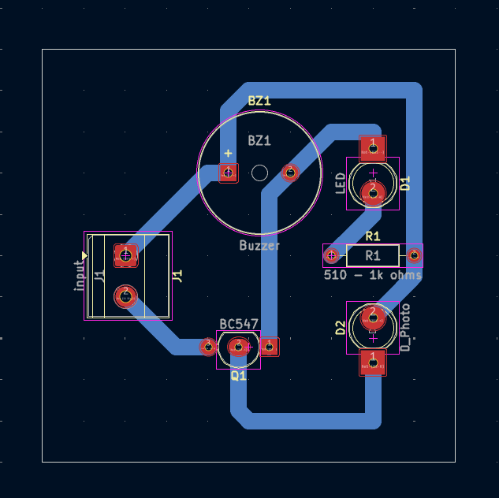
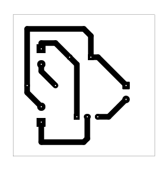
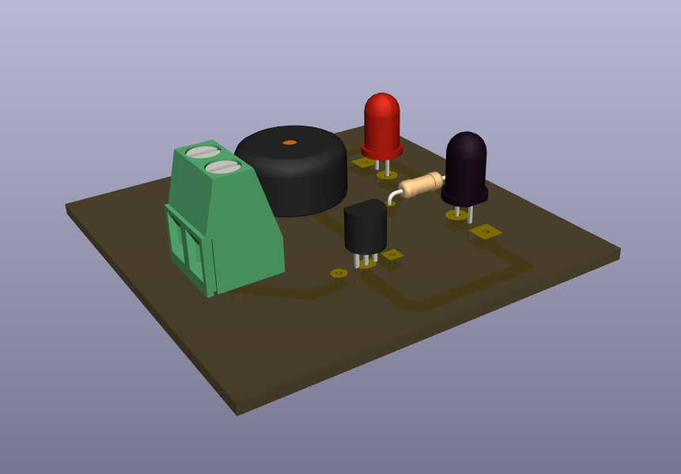

# Fire Alarm System Using Photodiode

A beginner-friendly photodiode alarm project that demonstrates how light from a flame can activate a transistor-driven LED and buzzer output.

## Project Information

| Item | Details |
| --- | --- |
| Status | Educational Prototype |
| Difficulty | Intermediate |
| Hardware Tested | Breadboard and PCB prototype assembled and functionally tested |
| Supply Voltage | Prototype tested with a 9V battery; exact operating range not characterized |
| KiCad Compatibility | KiCad 10.0 metadata |
| License | MIT License |

## Project Overview

This project demonstrates an educational optical fire-alarm concept using a photodiode, BC547 transistor, LED, and buzzer. Light from a flame reaches the photodiode, the photodiode changes the sensing condition, the transistor stage responds, and the LED/buzzer output path activates.

This README documents the photodiode implementation shown in the KiCad schematic. A thermistor-based version could be explored as a future modification, but this README documents the verified photodiode implementation.

This project is intended for educational demonstration only and must not be relied upon as a fire detection, fire alarm, or life-safety device.

## Features

- Photodiode-based optical sensing input.
- Single BC547 transistor stage.
- LED visual output.
- Buzzer audible output.
- Beginner-friendly example of sensor polarity, transistor orientation, and resistor verification.
- Existing schematic, PCB layout images, 3D render, editable KiCad files, and B.Cu PDF export.

## Applications

- Educational photodiode alarm demonstrations.
- Introductory transistor switching exercises.
- Low-voltage optical sensor laboratory activities.
- Breadboard-to-PCB comparison practice.
- Soldering, continuity, and cold-joint troubleshooting exercises.
- Demonstrations of how ambient light can influence optical sensor circuits.

## Components Used

| Reference | Component | Role in the Circuit |
| --- | --- | --- |
| J1 | `input` connector | Provides the circuit input connection shown in the schematic. |
| BZ1 | Buzzer | Audible output device in the alarm output path. |
| D1 | LED | Visual output indicator. |
| D2 | `D_Photo` photodiode | Optical sensor input that responds to light reaching its surface. |
| Q1 | BC547 transistor | Transistor stage that responds to the photodiode sensing condition. |
| R1 | Schematic resistor value | Resistor in the sensing/output network; use the value documented in the schematic for the verified build. |

## Circuit Explanation

The schematic uses D2 as the photodiode input. When light reaches the photodiode, the sensing condition changes and affects the bias at Q1.

Q1 is a BC547 transistor stage connected to the LED and buzzer output path. When the transistor stage responds to the photodiode condition, D1 and BZ1 provide visible and audible indication.

R1 is shown in the schematic with its documented value. Because the schematic label is the repository evidence for this build, verify the resistor value against the schematic before assembly instead of guessing or substituting parts.

This circuit is an educational optical alarm demonstration. It does not document a measured flame-detection distance, sensing angle, response time, temperature threshold, light-intensity threshold, or output current.

## Theory

A photodiode is a light-sensitive semiconductor device. In this project, it is used as the optical input device for a transistor alarm stage. Light from a flame can reach the photodiode and change the condition applied to the transistor stage.

A BC547 transistor can be used as a small-signal switching stage. The transistor does not measure fire or temperature directly; it responds to the electrical condition created by the photodiode and surrounding resistor network.

Ambient light can also influence a photodiode. This is why testing should be performed under controlled indoor lighting, and why unwanted LED glow can be diagnosed by covering the photodiode.

The photodiode approach is different from a temperature-based alarm. A thermistor-based version could be explored as a future modification, but this README documents the verified photodiode implementation.

## How It Works

1. A 9V battery is connected to J1 with correct polarity.
2. The photodiode is exposed to the intended optical test source.
3. Light from a flame reaches the photodiode.
4. The photodiode changes the sensing condition at the transistor stage.
5. Q1 responds to that sensing condition.
6. The LED and buzzer output path activates.

This section describes the intended photodiode alarm concept from the schematic. Physical prototype observations, including flashlight activation during testing, are documented separately under **Verified Prototype Observations**.

## Project Gallery

### Schematic

### PCB Layout Top

### PCB Layout Bottom

### 3D PCB Render

### Finished Hardware

> Finished hardware photographs will be added after the completed prototype is photographed.

## Assembly Guide

1. Review the schematic and PCB layout before soldering.
2. Install R1 after verifying the resistor value against the schematic.
3. Install D2, confirming photodiode polarity.
4. Install D1, confirming LED polarity.
5. Install Q1 after checking the BC547 emitter, base, and collector pinout.
6. Install BZ1, confirming the selected buzzer is appropriate for the build.
7. Install the input connector.
8. Inspect all solder joints and PCB copper traces before applying power.
9. Perform continuity checks before connecting the battery.

## Before You Power the Circuit

| Check | What to Verify |
| --- | --- |
| Battery polarity | Confirm correct supply polarity before connection. |
| Transistor orientation | Confirm Q1 matches the BC547 pinout expected by the PCB footprint. |
| Photodiode polarity | Confirm D2 orientation before applying power. |
| LED polarity | Confirm D1 anode/cathode orientation. |
| Resistor value | Verify R1 against the schematic before assembly. |
| Buzzer connection | Confirm BZ1 is connected in the intended output location. |
| PCB copper traces | Inspect for oxidation, contamination, or visible damage. |
| Solder bridges | Inspect adjacent pads and traces for accidental shorts. |
| Continuity test | Check for unintended shorts before connecting a battery. |

## Testing

This project is intended for educational demonstration only and must not be relied upon as a fire detection, fire alarm, or life-safety device. Flame testing should be performed only with a small controlled flame source, appropriate supervision, and safe surroundings.

Suggested test procedure:

1. Inspect the PCB under good lighting.
2. Confirm 9V battery polarity before connection.
3. Check battery voltage with a multimeter if behavior is inconsistent.
4. Verify Q1 transistor orientation.
5. Verify D2 photodiode polarity.
6. Verify D1 LED polarity.
7. Verify the R1 value against the schematic.
8. Test indoors under controlled lighting before introducing a flame source.
9. Perform a conservative flame-response demonstration and observe the LED/buzzer response.
10. Use a mobile phone flashlight only as a prototype-observed optical response check, not as the intended design description.
11. Evaluate whether ambient light causes unwanted LED glow or false triggering.
12. Compare PCB behavior with the verified breadboard prototype if unexpected behavior occurs.
13. Disconnect power immediately if any component becomes unusually warm.

Successful test indicators:

- The board powers without short-circuit symptoms.
- The circuit responds during the intended educational optical demonstration.
- Unwanted LED glow can be explained by ambient light rather than a wiring fault.
- PCB behavior is consistent with the breadboard prototype after assembly issues are corrected.

## Practical Build Notes

### Prototype Notes

The following items are **Verified Prototype Observations** from the physical build. They extend beyond what is explicitly guaranteed by the KiCad schematic.

- Breadboard prototype required several rounds of troubleshooting before operating correctly.
- Incorrect resistor selection and wiring mistakes that affected the intended circuit power distribution initially prevented proper operation.
- Breadboard prototype eventually operated as intended.
- PCB prototype was assembled and successfully tested.
- Prototype was powered using a 9V battery.
- During prototype testing, light from a flame activated the circuit.
- During prototype testing, a mobile phone flashlight also activated the circuit.
- PCB prototype initially experienced photodiode sensitivity issues and cold solder joints.
- During prototype testing, increasing the resistor value associated with the photodiode sensing stage reduced unwanted triggering caused by ambient light in this specific prototype.
- During prototype testing, the LED occasionally glowed dimly because the photodiode responded to surrounding light.
- Covering the photodiode removed the unwanted LED illumination, indicating that surrounding ambient light not a wiring fault was causing the unwanted sensor response during prototype testing.

### Photodiode Sensitivity Notes

Photodiodes may respond to surrounding ambient light. Test indoors under controlled lighting conditions, and avoid direct sunlight or other intense light sources that may cause unintended activation.

The resistor-value change described above is a verified prototype observation, not the documented schematic configuration. Retain the resistor value shown in the schematic unless intentionally redesigning and revalidating the sensing stage.

This README does not recommend resistor substitutions.

### Photodiode vs Thermistor Note

A thermistor-based version could be explored as a future modification, but this README documents the verified photodiode implementation.

Do not assume a thermistor version has been verified for this project unless a future schematic, PCB, and tested prototype explicitly document that change.

### Builder Recommendations

- Verify transistor orientation using the datasheet.
- Verify photodiode polarity and LED polarity before soldering.
- Verify the resistor value against the schematic before assembly. Use the documented schematic value for the verified build.
- Breadboard-test before PCB assembly whenever possible.
- Inspect solder joints carefully.
- Inspect PCB copper traces for oxidation, contamination, or damage.
- Compare PCB behavior with the verified breadboard prototype.
- Make only one circuit modification at a time during troubleshooting, then retest before changing additional components.
- If the LED glows dimly unexpectedly, cover the photodiode to determine whether ambient light is influencing the circuit.
- Disconnect power immediately if components become unusually warm, then verify polarity, transistor orientation, resistor value, and solder quality before testing again.

## Troubleshooting

| Symptom | Checks |
| --- | --- |
| Circuit does not respond to flame | Check battery polarity and voltage, photodiode polarity, Q1 orientation, R1 value, solder joints, and whether the flame test is safely positioned for the photodiode to receive light. |
| Circuit responds to flashlight but not flame | Recheck the flame demonstration setup, photodiode orientation, ambient lighting, and breadboard comparison; do not infer a certified fire-detection capability. |
| LED glows dimly without a flame | Cover the photodiode completely, reduce ambient lighting, verify photodiode polarity, inspect the resistor value associated with the photodiode sensing stage, check solder joints, and compare behavior with the verified breadboard prototype. |
| False triggering from ambient light | Test under controlled indoor lighting, avoid direct sunlight or intense light sources, and cover the photodiode to confirm whether ambient light is influencing the circuit. |
| Incorrect transistor orientation | Check the BC547 datasheet and confirm emitter, base, and collector match the PCB footprint. |
| Incorrect photodiode polarity | Confirm D2 orientation and reinstall correctly if needed. |
| Wrong resistor value | Verify R1 against the schematic and compare with the breadboard prototype. |
| Cold solder joints | Reinspect dull, cracked, or incomplete solder joints after disconnecting power. |
| Breadboard works but PCB does not | Compare PCB assembly against the verified breadboard prototype, then inspect solder bridges, cold solder joints, copper trace condition, component polarity, and resistor placement. |
| Buzzer or LED output does not activate | Check BZ1 and D1 connections, Q1 orientation, photodiode polarity, R1 value, solder joints, and battery condition. |

If covering the photodiode completely causes the LED to turn off, the sensor is responding to ambient light rather than a wiring fault.

## Downloads

| File | Description |
| --- | --- |
| [`fire alarm system using photodiode.kicad_pro`](<fire alarm system using photodiode.kicad_pro>) | KiCad project file. Open this file in KiCad. |
| [`fire alarm system using photodiode.kicad_sch`](<fire alarm system using photodiode.kicad_sch>) | KiCad schematic source. |
| [`fire alarm system using photodiode.kicad_pcb`](<fire alarm system using photodiode.kicad_pcb>) | KiCad PCB layout source. |
| [`fire alarm system using photodiode-B_Cu.pdf`](<fire alarm system using photodiode-B_Cu.pdf>) | Existing B.Cu PDF plot export. |

## Educational Use Notice

This repository is intended for educational and personal learning purposes. The circuits, schematics, PCB layouts, fabrication files, and documentation are shared to help students understand electronics design, PCB fabrication, and circuit analysis.

Please do not submit these projects as your own academic work. If you use any design or idea from this repository, make sure you understand how it works, adapt it to your own requirements, and follow your institution's academic integrity policies.

The goal of this repository is to encourage learning, experimentation, and skill development—not to replace your own design process.

## Academic Integrity

If you are using this repository for a class, use it as a reference to understand concepts and improve your own designs. Always create and submit work that complies with your instructor's requirements and your institution's academic integrity policies.

## Revision History

| Version | Changes |
| --- | --- |
| 2.0.0 | Updated README to follow the Version 2.0.0 documentation standard with expanded project information, circuit explanation, theory, assembly guidance, testing notes, practical build notes, troubleshooting, gallery, downloads, and repository notices. |

## License

This project is released under the MIT License. See the repository [LICENSE](../../LICENSE).
