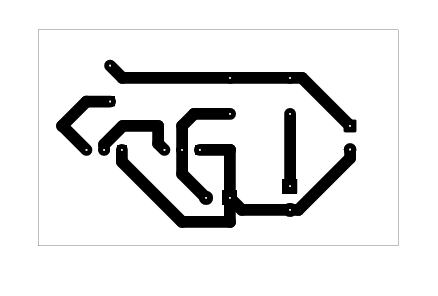
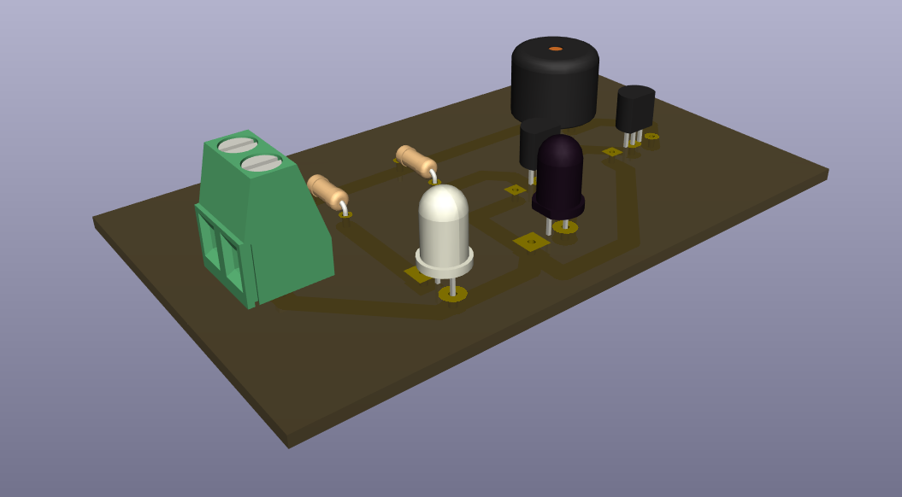

# Obstacle Detector

A beginner-friendly infrared obstacle detector project using an IR LED, photodiode, BC547 transistor stages, and a speaker output footprint.

## Project Information

| Item | Details |
| --- | --- |
| Status | Educational Prototype |
| Difficulty | Intermediate |
| Hardware Tested | Breadboard and PCB prototype assembled and functionally tested |
| Supply Voltage | Prototype tested with a 9V battery; exact operating range not characterized |
| KiCad Compatibility | Schematic KiCad 9.0 metadata; PCB KiCad 10.0 metadata |
| License | MIT License |

## Project Overview

This project demonstrates a reflected-infrared obstacle detector. The IR LED emits infrared light toward the sensing area. When a nearby object reflects that infrared light toward the photodiode, the transistor stages respond and drive the output device.

The circuit is intended for educational study of infrared sensing, photodiode orientation, transistor stages, component alignment, and PCB troubleshooting. It is not a calibrated distance sensor, production detector, or certified safety device.

The KiCad schematic identifies the output footprint as `LS1 Speaker`. The physical prototype was tested with a buzzer as the output indicator, and that detail is documented separately as a verified prototype observation.

## Features

- Infrared emitter and photodiode sensing pair.
- Two BC547 transistor stages.
- Speaker output footprint for audible indication.
- Through-hole layout suitable for inspection and beginner troubleshooting.
- Useful for learning optical alignment and ambient-light effects.
- Existing schematic, PCB layout images, 3D render, editable KiCad files, and B.Cu PDF export.

## Applications

- Introductory infrared obstacle-detection demonstrations.
- Photodiode and IR LED alignment exercises.
- Transistor switching and sensor-conditioning laboratory work.
- PCB assembly and solder-joint troubleshooting practice.
- Comparing breadboard behavior with a PCB prototype.
- Educational sensor-response demonstrations under controlled lighting.

## Components Used

| Reference | Component | Role in the Circuit |
| --- | --- | --- |
| J1 | `input` connector | Provides the input connection shown in the schematic. |
| D1 | IR LED | Infrared emitter used as the optical source. |
| D2 | Photodiode | Light-sensitive detector for reflected infrared light. |
| Q1, Q2 | BC547 transistors | Transistor stages that respond to the photodiode sensing condition. |
| R1 | 100 ohm resistor | Resistor used in the circuit stage shown in the schematic. |
| R2 | 56K resistor | Resistor associated with the photodiode sensing stage. |
| LS1 | Speaker | Schematic output device footprint. |
| VCC, GND | Power rails | Positive supply and ground reference shown in the schematic. |

## Circuit Explanation

The circuit uses D1 as an infrared emitter and D2 as a photodiode detector. The intended sensing action depends on infrared light from D1 reflecting from a nearby object and reaching D2.

Q1 and Q2 are BC547 transistor stages. They respond to the sensing condition created by the photodiode and resistor network, then drive the output device connected at LS1.

Sensor polarity, transistor orientation, resistor values, and solder quality are important because the circuit depends on small changes at the photodiode sensing stage. The repository does not document a measured detection distance, response time, sensing angle, or output current.

## Theory

An infrared LED emits light that is usually not visible to the human eye. A photodiode can respond to light reaching its sensing surface. In a reflected-light obstacle detector, the emitter and detector are arranged so that a nearby object can reflect infrared light back toward the photodiode.

The photodiode does not decide on its own whether an obstacle is present. Instead, its light-dependent behavior changes the bias condition seen by the transistor stages. The BC547 transistors then condition that sensor response and control the output path.

Ambient light can also reach the photodiode. Strong surrounding light may affect the sensor condition, so the circuit should be tested in a controlled lighting environment before drawing conclusions about alignment or component faults.

This project is an educational prototype. Exact detection distance, object reflectivity behavior, response time, sensing angle, and current consumption were not characterized.

## How It Works

1. A 9V battery or other suitable low-voltage supply is connected to J1 with correct polarity.
2. D1 emits infrared light toward the sensing area.
3. A nearby object can reflect infrared light back toward D2.
4. D2 changes the sensing condition seen by the transistor stages.
5. Q1 and Q2 respond to that condition and drive the LS1 output path.
6. The output indication changes when the sensor stage detects reflected infrared light.

This section describes the intended schematic operation. Physical prototype behavior is documented separately under **Verified Prototype Observations**.

## Project Gallery

### Schematic

### PCB Layout Top

### PCB Layout Bottom

### 3D PCB Render

### Finished Hardware

> Finished hardware photographs will be added after the completed prototype is photographed.

## Assembly Guide

1. Review the schematic and PCB layout before soldering.
2. Install R1 and R2 after verifying their values.
3. Install D1, confirming IR LED polarity.
4. Install D2, confirming photodiode polarity.
5. Install Q1 and Q2 after checking the BC547 emitter, base, and collector pinout.
6. Install the LS1 output device footprint connection.
7. Install the input connector.
8. Inspect all solder joints for bridges, cold joints, and incomplete wetting.
9. Perform continuity checks before applying power.

## Before You Power the Circuit

| Check | What to Verify |
| --- | --- |
| Battery polarity | Confirm correct supply polarity before connection. |
| IR LED polarity | Confirm D1 orientation before applying power. |
| Photodiode polarity | Confirm D2 orientation before applying power. |
| Transistor orientation | Confirm Q1 and Q2 match the BC547 pinout expected by the PCB footprint. |
| Resistor values | Confirm R1 is 100 ohms and R2 is 56K. |
| Output wiring | Confirm the LS1/output wiring is connected as intended for the build. |
| Optical surfaces | Confirm the front surfaces of the IR LED and photodiode are clean. |
| Solder bridges | Inspect adjacent pads and traces for accidental shorts. |
| Continuity test | Check for unintended shorts before connecting a battery. |

## Testing

Test the circuit in a controlled indoor lighting environment before evaluating obstacle response. Avoid direct sunlight or intense light sources that may reach the photodiode during testing.

Suggested test procedure:

1. Inspect the assembled PCB under good lighting.
2. Confirm 9V battery polarity before connection.
3. Verify D1 IR LED orientation.
4. Verify D2 photodiode orientation.
5. Verify Q1 and Q2 transistor orientation.
6. Verify R1 and R2 resistor values.
7. Verify IR LED emission before extensive troubleshooting; many smartphone cameras can reveal infrared light, but this depends on the camera model and should be treated only as an optional troubleshooting aid.
8. Connect power and observe the output with no object placed near the sensor pair.
9. Place an object above or in front of the IR LED and photodiode and observe the output response.
10. Repeat the obstacle detection test several times for consistency.
11. Evaluate whether ambient light causes unintended activation.
12. Compare PCB behavior with the verified breadboard prototype if unexpected behavior occurs.
13. Disconnect power immediately if any component becomes unusually warm.

Successful test indicators:

- The board powers without short-circuit symptoms.
- The output responds when the sensing pair detects reflected infrared light.
- The output stops responding when the reflecting object is removed.
- The response is more consistent in controlled indoor lighting than in excessive ambient light.
- PCB behavior is consistent with the breadboard prototype after assembly issues are corrected.

## Practical Build Notes

### Prototype Notes

The following items are **Verified Prototype Observations** from the physical build. They extend beyond what is explicitly guaranteed by the KiCad schematic.

- Breadboard prototype required several rounds of testing before reliable operation was achieved.
- PCB prototype was assembled and successfully tested.
- Prototype was powered using a 9V battery.
- Although the schematic identifies LS1 as the output device, the prototype was tested using a buzzer as the output indicator.
- When an object was placed above the IR LED and photodiode, the buzzer activated.
- When the reflecting object was removed during prototype testing, the buzzer stopped, indicating that the reflected infrared signal was no longer being detected.
- Early testing showed the photodiode sometimes failed to detect the IR LED even when positioned nearby.
- Reliable operation during prototype testing was restored after adjusting the spacing between the IR LED and photodiode and replacing the original photodiode with another compatible device after other assembly issues had been ruled out.
- During prototype testing, bright outdoor lighting caused unintended activation of the sensor.
- Indoor testing also produced occasional unintended triggering until cold solder joints were corrected.

### Infrared Sensor Alignment

Proper alignment between the IR LED and photodiode is important for reliable operation. Check sensor polarity, sensor spacing, and solder quality before modifying the circuit.

Do not assume exact spacing from this README. The prototype required spacing adjustment, but no measured spacing value was documented.

### Ambient Light Notes

Ambient light can influence the photodiode. During prototype testing, bright outdoor lighting caused unintended activation of the sensor.

Test in a controlled indoor lighting environment. Avoid direct sunlight or other intense light sources that may reach the photodiode during testing.

### Sensitivity Notes

During prototype testing, modifying the resistor associated with the photodiode sensing stage was explored in an attempt to reduce ambient-light sensitivity. In this prototype, those changes prevented reliable detection of the infrared light emitted by the IR LED.

Retain the resistor values shown in the schematic unless you intend to experimentally redesign and revalidate the sensing stage. This README does not recommend resistor substitutions.

### Builder Recommendations

- Verify IR LED polarity, photodiode polarity, transistor orientation, resistor values, and LS1/output wiring before soldering.
- Breadboard-test before PCB assembly when possible.
- Compare PCB behavior with the verified breadboard prototype.
- Adjust the alignment of the IR LED and photodiode before replacing components, as small positioning changes may affect prototype performance.
- Keep the front surfaces of both the IR LED and photodiode clean before testing, as dust or debris may reduce optical performance during demonstrations.
- Inspect for cold solder joints if false triggering occurs.
- If the circuit still does not respond after verifying component orientation and solder joints, compare the behavior with a known-working photodiode if one is available.
- Disconnect power immediately if components become unusually warm, then verify sensor polarity and transistor orientation before testing again.

## Troubleshooting

| Symptom | Checks |
| --- | --- |
| Buzzer or output never activates | Check battery polarity, IR LED polarity, photodiode polarity, Q1/Q2 orientation, R1/R2 values, LS1/output wiring, and solder joints. |
| Buzzer or output always remains on | Reduce ambient light, avoid direct sunlight, inspect for solder bridges, check photodiode orientation, and inspect cold solder joints. |
| Intermittent detection | Check sensor alignment, clean the IR LED and photodiode surfaces, inspect solder joints, and compare with breadboard behavior. |
| Photodiode does not detect IR LED | Verify IR LED emission, confirm photodiode polarity, check sensor spacing, and inspect the photodiode sensing-stage solder joints. |
| IR LED and photodiode are very close but no detection occurs | Verify component orientation before assuming the components are faulty. |
| Ambient-light false triggering | Move to controlled indoor lighting, shield the photodiode from direct bright light, and inspect for cold solder joints. |
| Breadboard works but PCB does not | Compare PCB assembly against the verified breadboard prototype, then inspect solder bridges, cold solder joints, component orientation, and resistor placement. |
| Incorrect resistor value installed | Confirm R1 is 100 ohms and R2 is 56K. |
| Cold solder joints | Reinspect and rework dull, cracked, or incomplete solder joints after disconnecting power. |
| Incorrect transistor orientation | Check the BC547 datasheet and confirm emitter, base, and collector match the PCB footprint. |
| Reversed IR LED | Confirm D1 polarity and reinstall correctly if needed. |
| Reversed photodiode | Confirm D2 polarity and reinstall correctly if needed. |

## Downloads

| File | Description |
| --- | --- |
| [`obstacle detector.kicad_pro`](<obstacle detector.kicad_pro>) | KiCad project file. Open this file in KiCad. |
| [`obstacle detector.kicad_sch`](<obstacle detector.kicad_sch>) | KiCad schematic source. |
| [`obstacle detector.kicad_pcb`](<obstacle detector.kicad_pcb>) | KiCad PCB layout source. |
| [`obstacle detector-B_Cu.pdf`](<obstacle detector-B_Cu.pdf>) | Existing B.Cu PDF plot export. |

## Educational Use Notice

This repository is intended for educational and personal learning purposes. The circuits, schematics, PCB layouts, fabrication files, and documentation are shared to help students understand electronics design, PCB fabrication, and circuit analysis.

Please do not submit these projects as your own academic work. If you use any design or idea from this repository, make sure you understand how it works, adapt it to your own requirements, and follow your institution's academic integrity policies.

The goal of this repository is to encourage learning, experimentation, and skill development—not to replace your own design process.

## Academic Integrity

If you are using this repository for a class, use it as a reference to understand concepts and improve your own designs. Always create and submit work that complies with your instructor's requirements and your institution's academic integrity policies.

## Revision History

| Version | Changes |
| --- | --- |
| 2.0.0 | Updated README to follow the Version 2.0.0 documentation standard with expanded project information, circuit explanation, theory, assembly guidance, testing notes, practical build notes, troubleshooting, gallery, downloads, and repository notices. |

## License

This project is released under the MIT License. See the repository [LICENSE](../../LICENSE).
