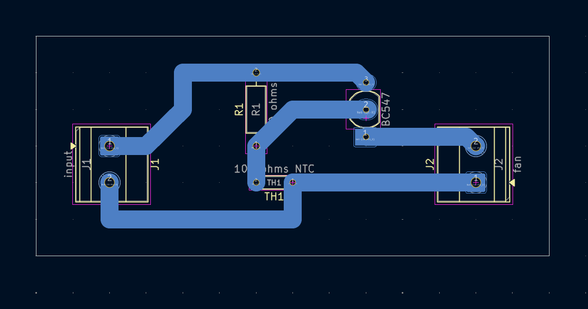
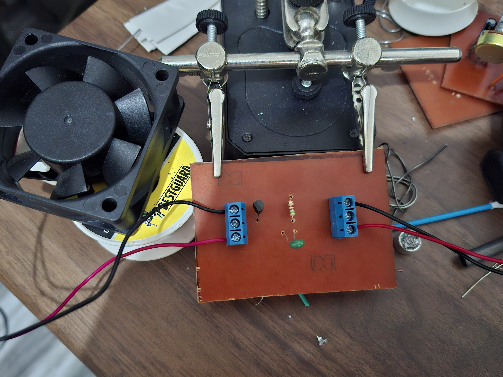
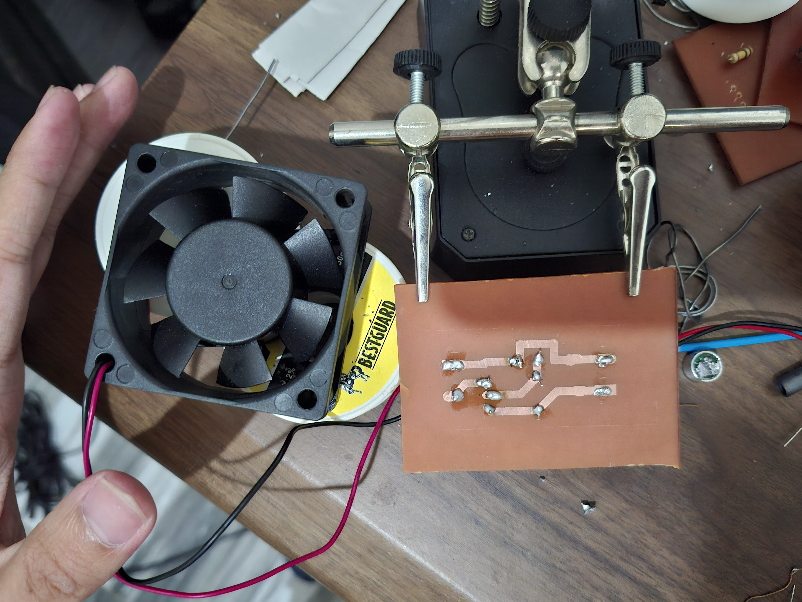

# Temperature Controlled DC Fan - BC547

A beginner-friendly temperature-responsive fan control project using a 10K NTC thermistor and a BC547 transistor.

## Project Information

| Item | Details |
| --- | --- |
| Status | Completed Educational Prototype |
| Difficulty | Beginner |
| Hardware Tested | Prototype assembled and functionally tested |
| Supply Voltage | Not specified in repository; verify before powering |
| KiCad Compatibility | KiCad 10.0 metadata |
| License | MIT License |

## Project Overview

This project demonstrates a simple temperature-controlled DC fan concept. A 10K NTC thermistor changes resistance as temperature changes, and that resistance change affects the bias condition of a BC547 transistor connected to the fan output.

The circuit was built as an educational PCB project for studying temperature sensing, transistor biasing, and basic load-control behavior. It is intended for learning and experimentation, not for certified thermal protection or production equipment.

## Features

- Temperature-responsive control concept using a 10K NTC thermistor.
- BC547 transistor stage for demonstrating sensor-controlled switching.
- Separate input and fan connectors for simple wiring.
- Through-hole component layout suitable for beginner assembly practice.
- Includes schematic, PCB layout images, 3D render, finished hardware photos, and editable KiCad source files.

## Applications

- Learning how an NTC thermistor can influence a transistor bias condition.
- Practicing basic sensor-to-transistor circuit analysis.
- Building a small educational fan-control demonstration.
- Demonstrating transistor switching with a small DC load.
- Introducing temperature-sensing circuits in electronics laboratory exercises.
- Practicing PCB fabrication, soldering, inspection, and bring-up.
- Presenting an educational prototype project in a classroom setting.
- Studying the relationship between schematic symbols, PCB layout, and assembled hardware.
- Comparing a prototype build with its KiCad design files.

## Components Used

| Reference | Component | Role in the Circuit |
| --- | --- | --- |
| Q1 | BC547 transistor | Acts as the transistor control stage connected to the fan output. Its base bias is affected by the thermistor and resistor network. |
| TH1 | 10K NTC thermistor | Provides temperature-dependent resistance. As temperature changes, its resistance changes and alters the transistor bias condition. |
| R1 | 510 ohm resistor | Works with the thermistor to set the transistor bias path shown in the schematic. |
| J1 | Input connector | Provides the circuit input connection. The repository does not specify the supply voltage or connector polarity, so both must be verified before powering. |
| J2 | Fan connector | Provides the fan connection. Fan polarity, voltage rating, and current requirement must be checked before use. |

## Circuit Explanation

### Temperature Sensing

TH1 is a 10K NTC thermistor. NTC means negative temperature coefficient: its resistance decreases as temperature increases. In this circuit, that temperature-dependent resistance is used as the sensing element.

### Thermistor And Resistor Bias Network

TH1 and R1 form the bias path that influences Q1. The schematic identifies R1 as 510 ohms and TH1 as a 10K NTC thermistor. Together, they create a temperature-dependent condition at the transistor connection rather than a fixed bias.

### Transistor Biasing And Switching

Q1 is a BC547 bipolar junction transistor. A transistor can use a small base current to control current through its collector-emitter path. In this project, the thermistor and resistor network affect whether the transistor is driven toward fan activation.

The repository does not specify the exact switching threshold, measured temperature, fan current, or transistor thermal margin. These values should be verified before relying on the circuit for any real cooling task.

### Fan Control

J2 is labeled `fan` in the schematic. The fan is the controlled load connection for the project. Before connecting a fan, confirm that the fan voltage and current are appropriate for the circuit and for the BC547 transistor's current and thermal limits.

### Connector Polarity

The schematic labels J1 as `input` and J2 as `fan`, but the repository does not document supply voltage, connector polarity, or fan polarity. Verify these from the schematic, PCB layout, and physical board before applying power.

### Not Applicable Components

This schematic does not include a MOSFET, flyback diode, electrolytic capacitor, or LED. Those parts should not be treated as active stages of this specific project.

## Theory

An NTC thermistor is a temperature-dependent resistor. NTC means negative temperature coefficient, so its resistance decreases as the thermistor gets warmer. This behavior happens because the thermistor material allows charge carriers to move more easily as temperature increases.

In this circuit, the thermistor does not work alone. TH1 and R1 form a bias path connected to the BC547 transistor. As TH1 changes resistance, the voltage and current conditions around the transistor base also change.

The BC547 is a bipolar junction transistor. When its base receives enough bias, the transistor can conduct through its collector-emitter path. In a fan-control circuit, this switching action allows the small temperature-sensing network to influence the connected fan load.

The exact turn-on point depends on the actual thermistor, fan, supply, transistor behavior, and assembled circuit conditions. The repository does not document measured switching thresholds, so those values should be confirmed by testing rather than assumed.

## How It Works

1. Power is applied through the input connector after the supply voltage and polarity have been verified.
2. The 10K NTC thermistor senses the local temperature around TH1.
3. As temperature changes, the thermistor resistance changes.
4. The thermistor and 510 ohm resistor affect the bias condition of the BC547 transistor.
5. When the transistor is biased into conduction, it provides a current path associated with the fan output.
6. The fan connection responds according to the transistor state and the connected fan's electrical characteristics.

Because the repository does not provide measured test data, the exact activation point and fan behavior should be confirmed during bench testing.

## Project Gallery

### Schematic

### PCB Layout Top

### PCB Layout Bottom

### 3D PCB Render

### Finished Hardware Front

### Finished Hardware Back

## Assembly Guide

1. Review the schematic and PCB layout before soldering.
2. Install R1, the 510 ohm resistor, and verify its value before soldering.
3. Install TH1, the 10K NTC thermistor, where it can sense the temperature of interest.
4. Install Q1, the BC547 transistor, using the PCB footprint and transistor pinout to confirm orientation.
5. Install J1 and J2 connectors.
6. Inspect all solder joints for bridges, incomplete wetting, or loose leads.
7. Perform continuity checks before connecting power or a fan.

Disconnect power before changing the thermistor or fan wiring.

## Before You Power the Circuit

| Check | What to Verify |
| --- | --- |
| Transistor orientation | Confirm Q1 matches the BC547 emitter, base, and collector pinout used by the PCB footprint. |
| Thermistor placement | Confirm TH1 is positioned where it can sense the intended temperature. |
| Resistor verification | Confirm R1 is 510 ohms. |
| Fan connector | Confirm the fan wiring and polarity before connection. |
| Input connector | Confirm the supply polarity before applying power. |
| Supply voltage | Verify the correct voltage externally; it is not specified in the repository. |
| Solder bridges | Inspect adjacent pads and traces for accidental shorts. |
| Continuity test | Check for shorts between supply rails and verify expected connections. |
| MOSFET orientation | Not applicable to this schematic. |
| Flyback diode polarity | Not applicable to this schematic. |
| Electrolytic capacitor polarity | Not applicable to this schematic. |
| LED polarity | Not applicable to this schematic. |

## Testing

Start testing with the current-limited bench supply if available. Use a supply voltage appropriate for the fan and circuit only after verifying polarity and transistor limits.

Expected behavior is temperature-responsive fan control: changing the temperature around TH1 should change the transistor bias condition and affect fan operation. The repository confirms that a prototype was assembled and functionally tested, but it does not document a measured activation temperature or fan current.

Suggested test procedure:

1. Inspect the assembled board under good lighting.
2. Confirm battery or supply polarity before connecting J1.
3. Confirm fan polarity before connecting the fan to J2.
4. Confirm TH1 is placed where it can sense the intended temperature.
5. Connect the fan to J2.
6. Apply power through J1 using a verified supply.
7. Observe the fan while gently warming or cooling the thermistor area.
8. Disconnect power immediately if the transistor, fan, wiring, or battery becomes unusually hot, or if the fan behaves unexpectedly.

Successful test indicators:

- No visible solder bridges or overheating.
- The board powers without short-circuit symptoms.
- Fan behavior changes when the thermistor temperature changes.
- The BC547 remains within safe operating limits for the connected fan.

## Practical Build Notes

### Prototype Configuration

The verified prototype configuration used one 9V battery as the power source and one 12V DC fan as the connected load. This was the actual setup used during prototype testing and classroom presentation.

This configuration is documented as build experience, not as the recommended configuration for every build.

### Fan Voltage Compatibility

During prototype testing, a 12V DC fan was powered from a 9V battery because a lower-voltage fan was not available. This was sufficient for classroom demonstration, but builders should select a DC fan whose rated voltage matches the intended supply voltage whenever possible.

Using a higher-rated fan with a lower supply may result in reduced performance, such as slower operation or failure to start, depending on the characteristics of the fan. Treat this as a practical prototype observation, not a universal engineering rule.

### Battery Conservation

Leaving the 9V battery connected may allow the circuit to continue drawing current depending on its operating state. Over time this can gradually discharge the battery, even if the fan is not visibly spinning.

For classroom demonstrations or presentations, connect the battery shortly before use and disconnect it after testing or demonstrations to help preserve battery life. This is practical operating guidance, not a circuit fault.

Battery life depends on battery capacity, fan characteristics, supply voltage, and operating time. No measured current consumption is documented in the repository.

### Builder Recommendation

Choose a fan whose rated voltage matches the intended power supply whenever possible. If a lower-voltage DC fan is available, it is generally a better choice for educational demonstrations than operating a higher-rated fan from a lower supply voltage.

Verify that the selected fan's operating requirements are compatible with the intended power supply and with the components used in the circuit before extended operation.

## Troubleshooting

| Symptom | Checks |
| --- | --- |
| No fan operation | Verify supply voltage and polarity, fan wiring, J2 connection, Q1 orientation, R1 value, and solder joints. |
| Battery connected but fan does not start | Confirm battery polarity, fan polarity, battery condition, fan voltage rating, and that the thermistor is being warmed enough to change the bias condition. |
| Fan does not start with a 9V battery and 12V fan | The fan may be rated for a higher voltage than the available supply. Try a fan rated for the intended supply voltage if available. |
| Battery becomes discharged after repeated demonstrations | Disconnect the battery after testing or presenting. A connected battery may gradually discharge depending on the circuit state, even when the fan is not visibly spinning. |
| Fan wiring appears correct but the circuit does not respond to temperature | Check TH1 placement, thermistor solder joints, and continuity through the thermistor path. |
| Transistor gets hot | Disconnect power and verify the connected fan current is suitable for a BC547 transistor. Also check for shorts and incorrect transistor orientation. |
| Fan runs unexpectedly | Recheck thermistor wiring, R1 value, connector polarity, and transistor pinout. |
| Intermittent operation | Inspect for cold solder joints, loose connector pins, cracked solder joints, or poor fan leads. |
| Incorrect response after replacing or installing Q1 | Confirm the BC547 is installed with the emitter, base, and collector matching the PCB footprint. Different transistor packages or substitutes may use different pin arrangements. |
| Diode, capacitor, MOSFET, or LED issue | Not applicable to this schematic unless the circuit has been modified outside the repository design. |

## Downloads

| File | Description |
| --- | --- |
| [`temperature controlled dc fan.kicad_pro`](<temperature controlled dc fan.kicad_pro>) | KiCad project file. Open this file in KiCad. |
| [`temperature controlled dc fan.kicad_sch`](<temperature controlled dc fan.kicad_sch>) | KiCad schematic source. |
| [`temperature controlled dc fan.kicad_pcb`](<temperature controlled dc fan.kicad_pcb>) | KiCad PCB layout source. |
| [`temperature controlled dc fan-B_Cu.pdf`](<temperature controlled dc fan-B_Cu.pdf>) | Existing bottom-copper PDF plot. |

## Educational Use Notice

This repository is intended for educational and personal learning purposes. The circuits, schematics, PCB layouts, fabrication files, and documentation are shared to help students understand electronics design, PCB fabrication, and circuit analysis.

Please do not submit these projects as your own academic work. If you use any design or idea from this repository, make sure you understand how it works, adapt it to your own requirements, and follow your institution's academic integrity policies.

The goal of this repository is to encourage learning, experimentation, and skill development—not to replace your own design process.

## Academic Integrity

If you are using this repository for a class, use it as a reference to understand concepts and improve your own designs. Always create and submit work that complies with your instructor's requirements and your institution's academic integrity policies.

## Revision History

| Version | Changes |
| --- | --- |
| 2.0.0 | Updated README to establish the Version 2.0.0 documentation standard with expanded project information, circuit explanation, assembly guidance, testing notes, troubleshooting, gallery, downloads, and repository notices. |

## License

This project is released under the MIT License. See the repository [LICENSE](../../LICENSE).
