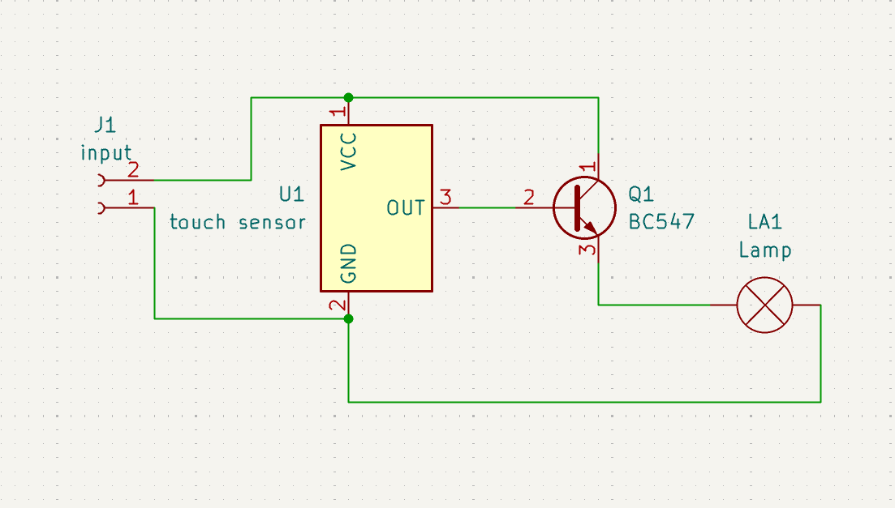
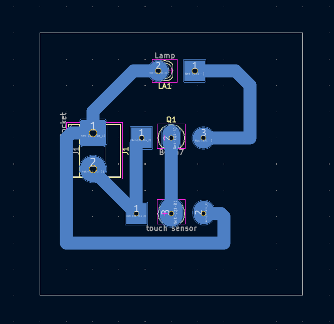
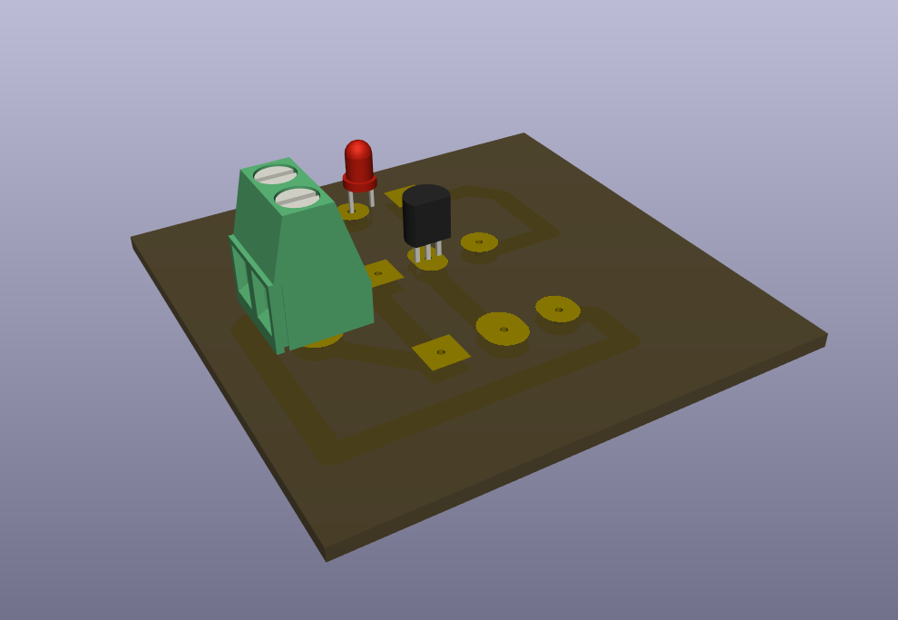
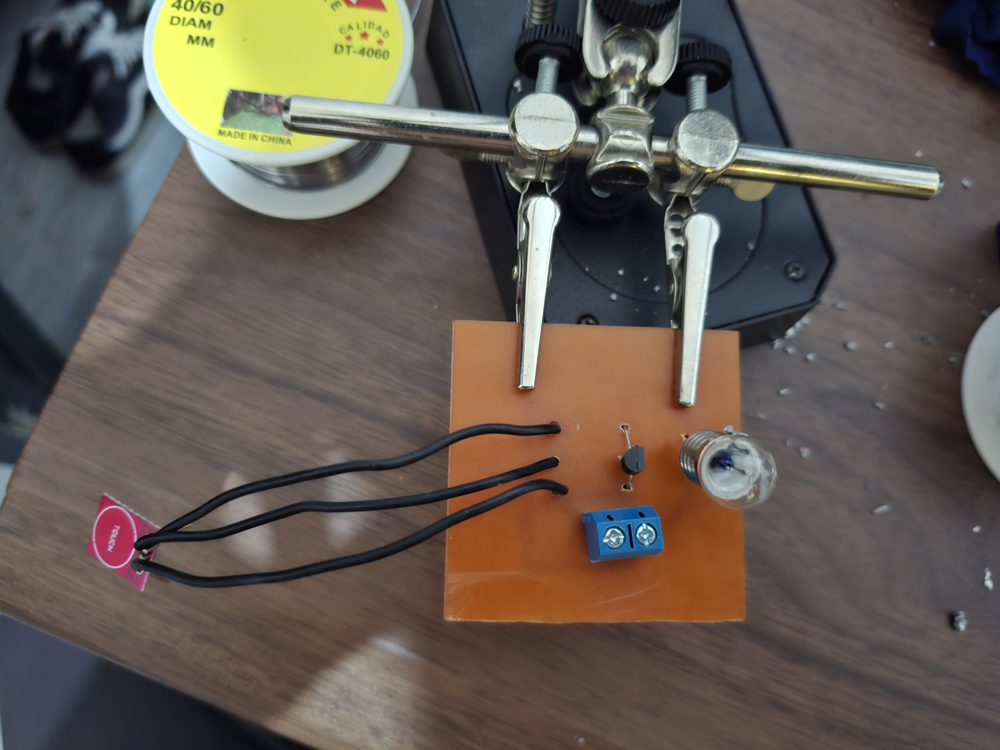

# Touch Sensor Circuit

A beginner-friendly touch-controlled switching project using a touch sensor input, a BC547 transistor stage, and a low-power output indicator.

## Project Information

| Item | Details |
| --- | --- |
| Status | Completed Educational Prototype |
| Difficulty | Beginner–Intermediate |
| Hardware Tested | Prototype assembled and functionally tested |
| Supply Voltage | Not specified in repository; verify before powering |
| KiCad Compatibility | KiCad 10.0 metadata |
| License | MIT License |

## Project Overview

This project demonstrates a touch-controlled output circuit. The KiCad schematic labels U1 as `touch sensor`, Q1 as `BC547`, J1 as `input`, and LA1 as `Lamp`. In the verified prototype, the touch sensor module was a TTP223 capacitive touch sensor module, and the output indicator was a miniature incandescent flashlight bulb.

The project was built for educational use: it shows how a human-interface sensor module can control a transistor-switched output on a simple PCB. It is intended for learning, classroom demonstration, and low-voltage experimentation, not for industrial control or safety-critical switching.

## Features

- Touch-controlled switching demonstration.
- BC547 transistor output-control stage.
- Low-power indicator output for educational testing.
- Through-hole layout suitable for beginner soldering and PCB inspection practice.
- Includes schematic, PCB layout images, 3D render, finished hardware photos, editable KiCad files, and existing PDF exports.
- Verified prototype notes document the tested TTP223 module behavior separately from schematic-derived facts.

## Applications

- Touch-sensitive switching demonstrations.
- Beginner electronics laboratory exercises.
- Sensor module demonstrations.
- Introductory human-interface projects.
- PCB fabrication, soldering, and inspection practice.
- Educational prototype presentations using low-power indicators.

## Components Used

| Reference | Component | Role in the Circuit |
| --- | --- | --- |
| U1 | Touch sensor input | Schematic-labeled touch sensor stage. In the verified prototype, this was a TTP223 capacitive touch sensor module. |
| Q1 | BC547 transistor | Transistor stage controlled by the touch sensor output. |
| LA1 | Lamp / output indicator | Schematic-labeled output load. The primary PCB layout in this repository includes an LED-style footprint for LA1. The verified prototype instead used a miniature incandescent flashlight bulb as the output indicator. |
| J1 | Input connector | Provides the circuit input connection. Supply voltage and polarity must be verified before powering. |

## Circuit Explanation

The schematic shows J1 providing the input connection to the circuit. U1 is labeled `touch sensor` and provides an output signal to the BC547 transistor stage. Q1 then controls the current path for LA1, the schematic-labeled lamp output.

The active KiCad schematic does not identify U1 as a TTP223 by library symbol; it labels U1 as `touch sensor`. The TTP223 module identification is a verified prototype observation from the physical build, not a schematic-derived fact.

LA1 is labeled `Lamp` in the schematic, and the active PCB footprint for LA1 is an LED-style through-hole footprint. The verified prototype used a miniature incandescent flashlight bulb as the output indicator, so that specific prototype did not require an LED current-limiting resistor.

The repository does not document the supply voltage, output load rating, measured current, or exact sensor thresholds. Verify the selected output device and power source before extended operation.

## Theory

A TTP223 module is a capacitive touch sensor module. Instead of using a mechanical pushbutton, it detects a touch by sensing a change in capacitance near its sensing pad.

Capacitance is the ability of a conductive area to store electric charge relative to its surroundings. A human finger near the sensor changes the local electric field and capacitance. The module detects that change and updates its output.

In this project's verified prototype, the module output was used to control the BC547 transistor stage. When touch was detected in the configured operating mode, the module output drove the transistor so the connected indicator could turn on. When touch was released, the output turned off in the tested momentary configuration.

This explanation is intentionally practical. The README does not claim exact sensing distance, response time, current draw, or threshold values because those measurements are not documented in the repository.

## How It Works

1. Power is applied through J1 after supply polarity and voltage have been verified.
2. The touch sensor module monitors its sensing area.
3. In the verified prototype configuration, touching the sensor activates the module output.
4. The module output drives the BC547 transistor stage.
5. The transistor controls the connected output indicator at LA1.
6. In the verified momentary configuration, releasing the touch turns the output off.

Builders who change the TTP223 module's onboard solder-pad configuration may observe different behavior.

## Project Gallery

### Schematic

### PCB Layout Top

### PCB Layout Bottom

### 3D PCB Render

### Finished Hardware Front

### Finished Hardware Back

## Assembly Guide

1. Review the schematic, PCB layout, and selected output version before soldering.
2. Install the input connector J1.
3. Install the touch sensor module at U1, confirming orientation and pin alignment before soldering.
4. Install Q1, the BC547 transistor, using the PCB footprint and transistor pinout to confirm orientation.
5. Install the selected output indicator at LA1 or use the appropriate alternate PCB layout for the intended output.
6. If using an LED version, verify LED polarity and include the required current-limiting resistor for that version.
7. Inspect all solder joints for bridges, incomplete wetting, or loose leads.
8. Perform continuity checks before connecting power.

Disconnect power before changing the touch sensor module, output indicator, or wiring.

## Before You Power the Circuit

| Check | What to Verify |
| --- | --- |
| Selected PCB/output version | Confirm the board version matches the intended output device. Do not populate multiple output variants as if they were one combined design. |
| Touch sensor orientation | Confirm U1 orientation, VCC, GND, and output wiring before applying power. |
| Transistor orientation | Confirm Q1 matches the BC547 emitter, base, and collector pinout expected by the PCB footprint. |
| Output device | Confirm the selected output indicator is compatible with the circuit before extended operation. |
| LED polarity | Required only when using an LED output version. |
| LED current-limiting resistor | Required only when using an LED output version. The verified incandescent-bulb prototype did not use an LED. |
| Input connector | Confirm J1 polarity before applying power. |
| Solder bridges | Inspect adjacent pads and traces for accidental shorts. |
| Continuity test | Check for shorts between supply rails and verify expected connections. |

## Testing

Start testing with a low-voltage supply appropriate for the selected module and output device. The repository does not document a measured supply range, so verify the intended supply before powering the circuit.

Suggested test procedure:

1. Inspect the assembled board under good lighting.
2. Confirm J1 polarity before connecting power.
3. Confirm the touch sensor module orientation and wiring.
4. Confirm the output device is installed in the correct location and orientation.
5. Apply power through J1.
6. Touch the sensor area and observe whether the output indicator turns on.
7. Remove the touch and confirm the output turns off when using this project's verified momentary configuration.
8. Move a finger near the sensor and around the sensor edges to check for accidental false triggering.
9. Disconnect power immediately if the transistor, sensor module, output device, or wiring becomes unusually hot.

Successful test indicators:

- The board powers without short-circuit symptoms.
- Touch detection turns the output on in the verified momentary configuration.
- Releasing the touch turns the output off.
- The output device operates without overheating or unstable wiring.
- Sensitivity is acceptable for the intended demonstration setup.

## Practical Build Notes

### Prototype Notes

The following items are verified prototype observations from the physical build. They extend beyond what is explicitly identified in the KiCad schematic and may differ if builders choose different modules, PCB variants, output devices, or solder-pad configurations.

- The prototype used a TTP223 capacitive touch sensor module at U1.
- The prototype used a miniature incandescent flashlight bulb as the output indicator.
- The incandescent-bulb PCB version did not require an LED current-limiting resistor because the prototype output was not an LED.
- The TTP223 module was intentionally configured and tested in momentary mode.
- The module was observed to be highly sensitive before the optional C2 capacitor modification.
- Adding a 100 pF capacitor across the C2 pads on the rear of the TTP223 module reduced the observed sensitivity.
- The repository contains alternate PCB layout/export variants for LED and lamp-socket builds.

### Alternate PCB Versions

The project includes multiple existing PDF exports and verified prototype context for different output approaches, including an incandescent bulb version, an LED version with current-limiting resistor, and a lamp-socket version. Builders should choose the PCB layout appropriate for the intended output device.

Do not assume these output variants should be populated simultaneously. Treat them as separate build choices.

### Output Flexibility

The output is not limited to the miniature incandescent bulb used in the verified prototype. Suitable educational outputs may include an LED, miniature incandescent flashlight bulb, buzzer, or other compatible low-power indicator.

Do not use high-current loads unless the circuit design, power supply, transistor stage, and wiring have been reviewed for that load.

### Touch Sensor Sensitivity

The verified prototype TTP223 module was highly sensitive. Touching the edges could trigger the output, and bringing a finger close to the sensing area could also trigger it.

This is documented as observed prototype behavior, not as a guaranteed sensitivity specification for every TTP223 module.

### Sensitivity Adjustment

For the tested module, soldering a 100 pF capacitor across the C2 pads on the rear of the TTP223 module reduced the observed sensitivity. This modification is optional.

No exact sensing distance after the C2 modification is documented.

### Operating Mode

The TTP223 module used for this project was personally tested by the author and verified to support four configurable operating modes through its onboard solder-pad configuration.

This README documents only the momentary configuration used in this project:

| Touch State | Output State |
| --- | --- |
| Touch detected | Output ON |
| Touch released | Output OFF |

Changing the onboard solder-pad configuration may change the module behavior and is outside the scope of this project.

The other three operating modes are available through the TTP223 module's solder-pad configuration but are outside the scope of this project.

### Builder Recommendations

- Choose the PCB layout appropriate for the intended output device.
- Verify LED polarity when using the LED version.
- Include the required LED current-limiting resistor when using an LED output version.
- Verify the selected output device is compatible with the circuit before extended operation.
- Test sensitivity before final presentation or classroom use.

## Troubleshooting

| Symptom | Checks |
| --- | --- |
| No touch detection | Confirm power at J1, touch sensor orientation, module wiring, and solder joints around U1. |
| Output always ON | Check for solder bridges, accidental touch/contact near the sensor area, overly sensitive module behavior, or a changed TTP223 solder-pad configuration. |
| Output never activates | Verify supply polarity, U1 orientation, Q1 orientation, output wiring, and the selected output device. |
| Incandescent bulb works but LED does not | Check LED polarity and confirm the LED version includes the required current-limiting resistor. |
| LED polarity reversed | Reinstall or rewire the LED according to its anode/cathode orientation and the selected PCB version. |
| Touch sensitivity too high | Keep nearby conductive objects away from the sensor area, then consider the optional 100 pF capacitor across the C2 pads if using the same TTP223 module style. |
| False triggering from nearby objects | Inspect for flux residue, loose wiring, nearby conductive materials, or a sensing area that is too exposed for the demonstration setup. |
| C2 capacitor modification not functioning | Confirm the capacitor is actually connected across the C2 pads, inspect for solder bridges, and verify the module still operates after modification. |
| Transistor installed incorrectly | Confirm the BC547 emitter, base, and collector match the PCB footprint. Substitute transistors may use different pin arrangements. |

## Downloads

| File | Description |
| --- | --- |
| [`touch sensor circuit.kicad_pro`](<touch sensor circuit.kicad_pro>) | KiCad project file. Open this file in KiCad. |
| [`touch sensor circuit.kicad_sch`](<touch sensor circuit.kicad_sch>) | KiCad schematic source. |
| [`touch sensor circuit.kicad_pcb`](<touch sensor circuit.kicad_pcb>) | KiCad PCB layout source. |
| [`touch sensor circuit-B_Cu-new.pdf`](<touch sensor circuit-B_Cu-new.pdf>) | Existing PDF export. |
| [`touch sensor circuit-B_Cu02-new.pdf`](<touch sensor circuit-B_Cu02-new.pdf>) | Existing PDF export. |
| [`touch sensor circuit-B_Cu03-new2.pdf`](<touch sensor circuit-B_Cu03-new2.pdf>) | Existing PDF export. |
| [`touch sensor circuit-B_Cu03-new21.pdf`](<touch sensor circuit-B_Cu03-new21.pdf>) | Existing PDF export. |
| [`touch sensor circuit01 no socket.pdf`](<touch sensor circuit01 no socket.pdf>) | Existing PDF export. |
| [`touch sensor circuit01 with socket.pdf`](<touch sensor circuit01 with socket.pdf>) | Existing PDF export. |
| [`touch sensor circuit02 no sokect.pdf`](<touch sensor circuit02 no sokect.pdf>) | Existing PDF export. |
| [`touch sensor circuit02 with socket.pdf`](<touch sensor circuit02 with socket.pdf>) | Existing PDF export. |

## Educational Use Notice

This repository is intended for educational and personal learning purposes. The circuits, schematics, PCB layouts, fabrication files, and documentation are shared to help students understand electronics design, PCB fabrication, and circuit analysis.

Please do not submit these projects as your own academic work. If you use any design or idea from this repository, make sure you understand how it works, adapt it to your own requirements, and follow your institution's academic integrity policies.

The goal of this repository is to encourage learning, experimentation, and skill development—not to replace your own design process.

## Academic Integrity

If you are using this repository for a class, use it as a reference to understand concepts and improve your own designs. Always create and submit work that complies with your instructor's requirements and your institution's academic integrity policies.

## Revision History

| Version | Changes |
| --- | --- |
| 2.0.0 | Updated README to follow the Version 2.0.0 documentation standard with expanded project information, circuit explanation, theory, assembly guidance, testing notes, practical build notes, troubleshooting, gallery, downloads, and repository notices. |

## License

This project is released under the MIT License. See the repository [LICENSE](../../LICENSE).
