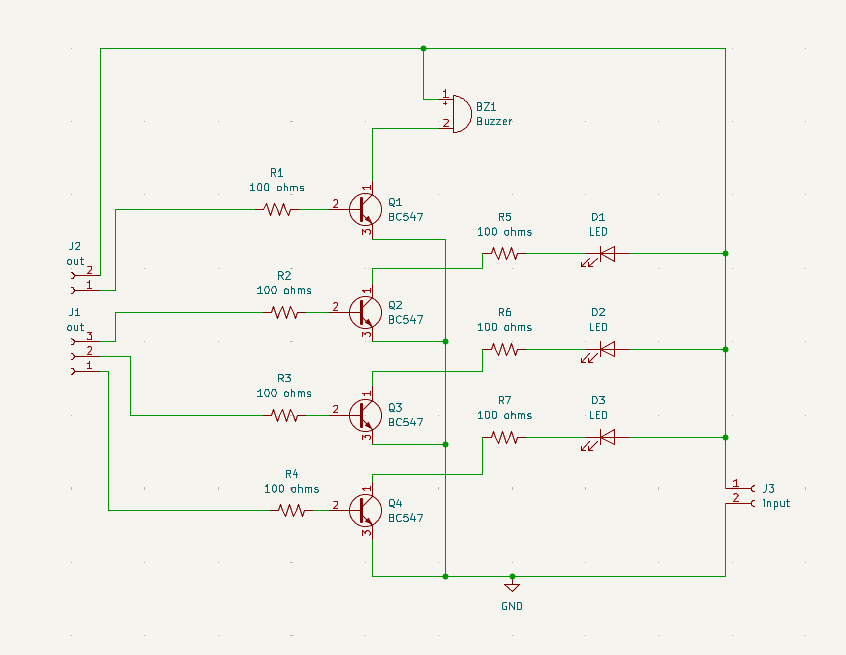
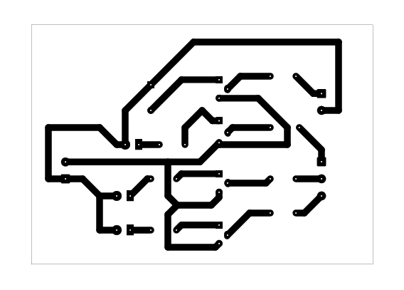

# Water Level Indicator

A beginner-friendly transistor-based water level indicator project using conductive sensing probes, BC547 transistor stages, LED indicators, and a buzzer.

## Project Information

| Item | Details |
| --- | --- |
| Status | Educational Prototype |
| Difficulty | Beginner–Intermediate |
| Hardware Tested | Prototype assembled and functionally tested |
| Supply Voltage | Not specified in repository; prototype testing used a 9V battery |
| KiCad Compatibility | KiCad 9.0 metadata |
| License | MIT License |

## Project Overview

This project demonstrates a multi-stage water level indicator concept. A conductive liquid bridges sensing probes, allowing the transistor stages to respond, LEDs to indicate the detected level, and the buzzer to provide an audible alert.

The circuit was built as an educational prototype for learning about water-level sensing, transistor switching, indicator outputs, and practical PCB troubleshooting. It is intended for supervised low-voltage demonstrations, not for industrial monitoring, safety-critical systems, or unattended water-control equipment.

## Features

- Multiple BC547 transistor stages for water-level sensing and indication.
- Three LED indicators for visual level feedback.
- Buzzer output for audible indication.
- Through-hole layout suitable for beginner soldering and inspection practice.
- Existing schematic, PCB layout images, 3D render, editable KiCad files, and B.Cu PDF exports.
- Verified prototype notes document real breadboard and PCB bring-up experience.

## Applications

- Beginner water-level sensing demonstrations.
- Transistor switching and indicator circuit practice.
- Electronics laboratory exercises using low-voltage battery power.
- PCB fabrication, soldering, continuity testing, and troubleshooting practice.
- Educational prototype presentations using an appropriate conductive liquid.

## Components Used

| Reference | Component | Role in the Circuit |
| --- | --- | --- |
| Q1-Q4 | BC547 transistors | Transistor stages used for sensing and output indication paths. |
| D1-D3 | LEDs | Visual indicators for detected water-level states. |
| BZ1 | Buzzer | Audible output device. |
| R1-R7 | 100 ohm resistors | Resistors used in the transistor, LED, and buzzer circuit paths shown in the schematic. |
| J1, J2 | `out` connectors | Schematic-labeled output connectors. |
| J3 | `input` connector | Schematic-labeled input connector. |
| GND | Ground symbol | Common reference node shown in the schematic. |

## Circuit Explanation

The schematic shows four BC547 transistor stages, three LEDs, a buzzer, seven 100 ohm resistors, output connectors J1 and J2, input connector J3, and GND reference symbols.

The educational operating concept is based on probe conductivity. When a conductive liquid bridges the appropriate sensing probes, it can provide a signal path that drives one or more transistor stages. Those transistor stages then control the LED indicators and buzzer path.

The repository does not document exact probe geometry, water-level thresholds, liquid conductivity range, supply-current values, or buzzer rating. Those items should be verified during controlled testing instead of assumed from the schematic alone.

## Theory

Pure electronic circuits cannot sense water level directly unless the water or liquid participates in the electrical path. In this project, the sensing idea depends on electrical conductivity between probes.

When a conductive liquid reaches a probe level, it can bridge that sensing point to the circuit reference path. The transistor stage connected to that sensing point can then respond and drive an output indicator.

Each transistor stage acts like a small electronic switch. A small signal at the transistor base can control current through its output path, allowing an LED or buzzer circuit to respond to the sensed level.

Liquids with very low electrical conductivity may not provide a reliable sensing path. The README does not claim a required conductivity value or concentration because no such measurement is documented in the repository.

## How It Works

1. Power is applied after supply polarity and probe wiring are verified.
2. The sensing probes are placed in the demonstration container.
3. As the liquid level rises, an appropriate conductive liquid can bridge probe connections.
4. The bridged probe path biases the related BC547 transistor stage.
5. The transistor stage drives the corresponding LED indicator path.
6. At the configured buzzer stage, BZ1 provides an audible alert.
7. Removing the liquid from the probe path should stop the related indication after the circuit is cleaned and dried as needed.

## Project Gallery

### Schematic

### PCB Layout Top

### PCB Layout Bottom

### 3D PCB Render

### Finished Hardware

> Finished hardware photographs will be added after the completed prototype is photographed.

## Assembly Guide

1. Review the schematic and PCB layout before soldering.
2. Install R1 through R7 and verify each resistor value before soldering.
3. Install D1, D2, and D3 after confirming LED polarity.
4. Install BZ1 after confirming its polarity and footprint orientation.
5. Install Q1 through Q4 only after checking the exact BC547 emitter, base, and collector pinout.
6. Install J1, J2, and J3 connectors.
7. Inspect transistor pins closely for solder bridges.
8. Inspect all solder joints for bridges, cold joints, incomplete wetting, or loose leads.
9. Perform continuity checks before connecting the 9V battery or any other verified supply.

Disconnect power before adjusting probes, moving wiring, or correcting solder joints.

## Before You Power the Circuit

| Check | What to Verify |
| --- | --- |
| Transistor orientation | Confirm Q1-Q4 match the exact BC547 emitter, base, and collector pinout from the transistor datasheet. |
| LED polarity | Confirm D1-D3 anode/cathode orientation. |
| Buzzer polarity | Confirm BZ1 polarity and footprint orientation. |
| Resistor verification | Confirm R1-R7 are 100 ohms. |
| Probe wiring | Confirm sensing probe connections match the intended demonstration setup. |
| Input/output connectors | Confirm J1, J2, and J3 wiring before power-up. |
| Solder bridges | Check closely between transistor pins and adjacent pads. |
| Continuity test | Check for unintended shorts before applying power. |
| Liquid setup | Keep the PCB, battery, and electronics dry; only the sensing probes should contact the demonstration liquid. |

## Testing

Test the circuit in a safe, low-voltage environment. Avoid exposed electrical hazards, keep the battery and electronics dry, and disconnect power before moving probes or modifying wiring.

Suggested test procedure:

1. Inspect the PCB under good lighting.
2. Verify Q1-Q4 orientation against the BC547 datasheet.
3. Confirm D1-D3 LED polarity.
4. Confirm BZ1 buzzer polarity and wiring.
5. Inspect transistor pins for solder bridges.
6. Use a continuity meter to check for unintended connections between adjacent transistor pins and nearby pads.
7. Connect the 9V battery or another verified supply with correct polarity.
8. Test the probes using an appropriate conductive liquid.
9. Raise or lower the liquid level around the probes and observe the LED sequence or response.
10. Confirm the buzzer operates at the intended sensing condition.
11. Disconnect power before moving probes, changing wiring, or drying the setup.

Successful test indicators:

- The board powers without short-circuit symptoms.
- LEDs respond as probes are bridged by the demonstration liquid.
- The buzzer sounds at the expected stage after assembly issues are corrected.
- No transistor pins are unintentionally bridged by solder.
- The PCB and electronics remain dry during testing.

## Practical Build Notes

### Prototype Notes

The following items are **Verified Prototype Observations** from the physical build. They extend beyond what is explicitly guaranteed by the KiCad schematic.

- The PCB was assembled and successfully tested.
- The breadboard prototype also operated as intended.
- The project was powered using a 9V battery during testing.
- Initial PCB testing revealed assembly mistakes that prevented correct operation.
- Some transistor pins were accidentally soldered together, creating unintended electrical connections.
- One transistor was installed incorrectly, preventing the buzzer circuit from operating.
- The issues were resolved by removing the solder bridges and reinstalling the transistor using the correct pin orientation.
- After correcting the assembly mistakes, the PCB functioned as intended.
- During prototype testing, purified water did not reliably trigger the circuit. Using a more conductive demonstration liquid produced the expected water-level indication.

### Conductive Liquid Requirement

The circuit operates by detecting electrical conductivity through the sensing probes. Liquids with very low electrical conductivity may not produce reliable detection.

As a **Verified Prototype Observation**, purified water was not suitable during testing because it did not provide a reliable conductive path for the circuit. Builders should use an appropriate conductive liquid when demonstrating the project.

No conductivity values, mixture concentrations, or scientific performance limits are documented for this project.

### Maintenance

These practices help preserve reliable operation during demonstrations:

- Disconnect the 9V battery after testing.
- Dry the sensing probes after use.
- Keep the PCB and electronic components dry.
- Clean and dry the probes before storing the project.
- Inspect the probes and wiring before the next demonstration.

These are practical maintenance recommendations, not claims about corrosion rate, long-term durability, or material degradation.

## Troubleshooting

| Symptom | Checks |
| --- | --- |
| LEDs do not illuminate | Verify supply polarity, probe wiring, LED polarity, transistor orientation, resistor values, and solder joints. |
| Buzzer does not sound | Check BZ1 polarity, buzzer wiring, the related transistor orientation, and whether the sensing condition is reaching the buzzer stage. |
| Incorrect water-level indication | Check probe placement, connector wiring, transistor orientation, LED polarity, and whether the demonstration liquid provides sufficient electrical conductivity for reliable sensing. |
| Transistor installed incorrectly | Compare the installed transistor orientation with the BC547 datasheet and the PCB footprint before resoldering. |
| Solder bridges between transistor pins | Remove the bridge, clean the area, and verify separation with continuity testing. |
| Poor solder joints | Reflow dull, cracked, or incomplete joints and inspect with good lighting. |
| Breadboard works but PCB does not | Compare wiring node by node, inspect transistor orientation, check for solder bridges, and verify continuity around the PCB connectors. |
| Liquid does not trigger reliable sensing | Confirm probe contact, clean the probes, and use an appropriate conductive liquid for the demonstration. |

## Downloads

| File | Description |
| --- | --- |
| [`water level indicator.kicad_pro`](<water level indicator.kicad_pro>) | KiCad project file. Open this file in KiCad. |
| [`water level indicator.kicad_sch`](<water level indicator.kicad_sch>) | KiCad schematic source. |
| [`water level indicator.kicad_pcb`](<water level indicator.kicad_pcb>) | KiCad PCB layout source. |
| [`water level indicator-B_Cu01.pdf`](<water level indicator-B_Cu01.pdf>) | Existing bottom-copper PDF plot. |
| [`water level indicator-B_Cu02.pdf`](<water level indicator-B_Cu02.pdf>) | Existing bottom-copper PDF plot. |

## Educational Use Notice

This repository is intended for educational and personal learning purposes. The circuits, schematics, PCB layouts, fabrication files, and documentation are shared to help students understand electronics design, PCB fabrication, and circuit analysis.

Please do not submit these projects as your own academic work. If you use any design or idea from this repository, make sure you understand how it works, adapt it to your own requirements, and follow your institution's academic integrity policies.

The goal of this repository is to encourage learning, experimentation, and skill development—not to replace your own design process.

## Academic Integrity

If you are using this repository for a class, use it as a reference to understand concepts and improve your own designs. Always create and submit work that complies with your instructor's requirements and your institution's academic integrity policies.

## Revision History

| Version | Changes |
| --- | --- |
| 2.0.0 | Updated README to follow the Version 2.0.0 documentation standard with expanded project information, circuit explanation, theory, assembly guidance, testing notes, practical build notes, troubleshooting, gallery, downloads, and repository notices. |

## License

This project is released under the MIT License. See the repository [LICENSE](../../LICENSE).
