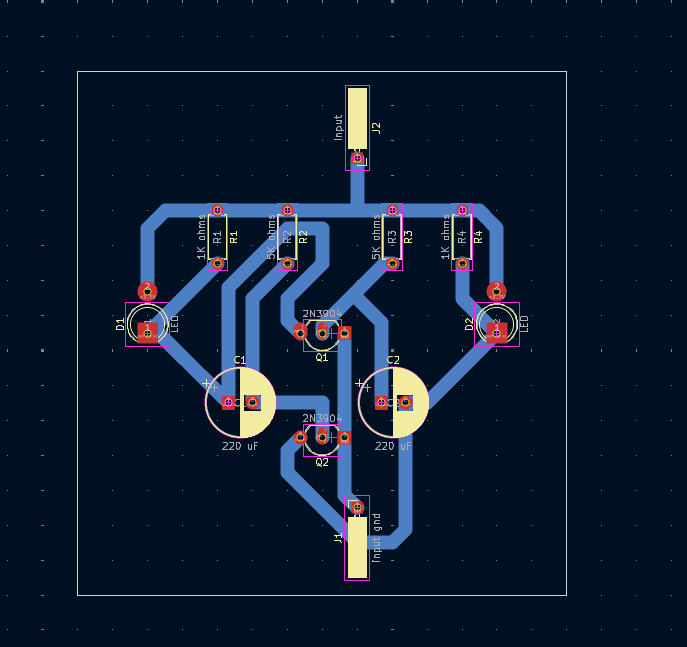
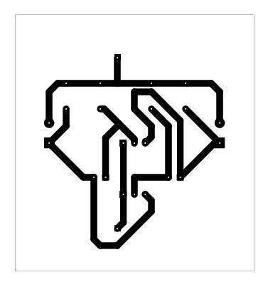
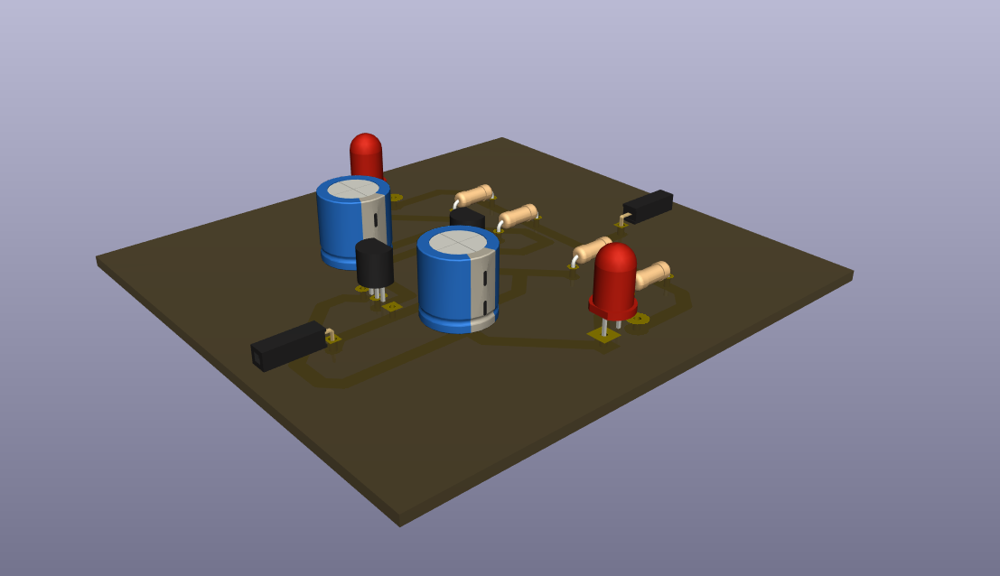

# Astable Multivibrator Circuit

## Overview

This project is a two-transistor astable multivibrator that alternates two LEDs.

## Project Information

| Item | Details |
| --- | --- |
| Status | Educational prototype |
| Difficulty | Beginner |
| KiCad project file | [`astable miltivibrator.kicad_pro`](<astable miltivibrator.kicad_pro>) |
| Hardware tested | ✅ Yes (prototype successfully assembled and functionally tested) |
| Manufacturing release | Not yet prepared |

## Project Gallery

### Schematic

### PCB Layout

### 3D Render

### Finished Hardware

> Hardware photos will be added after additional prototype boards are assembled and photographed.

## Repository Navigation

This project is part of the DIY-Circuits collection.

- [Return to the repository overview](../README.md).
- Open the project by opening the `.kicad_pro` file in KiCad.
- The KiCad project, schematic, and PCB files are the authoritative design files.

## Circuit purpose

The schematic implements a self-oscillating LED flasher using two cross-coupled transistor stages.

## Estimated difficulty

Beginner.

## KiCad source files

- `astable miltivibrator.kicad_pro`
- `astable miltivibrator.kicad_sch`
- `astable miltivibrator.kicad_pcb`

## Operating principle

The two 2N3904 transistors alternately charge and discharge the 220 uF capacitors through the resistor network. This switching action alternates current through D1 and D2.

## Main components

- Q1, Q2: 2N3904 transistors.
- C1, C2: 220 uF polarized capacitors.
- D1, D2: LEDs.
- R1, R4: 1K ohms; R2, R3: 5K ohms.

## Supply voltage

A +3.7 V rail is labeled in the schematic. Current requirement, connector polarity, and acceptable voltage range are To be verified.

## Files included

The folder includes the KiCad project, schematic, PCB, and two B.Cu PDF plot exports. A BOM is not included.

## Build and test notes

Capacitor polarity, transistor orientation, and LED orientation must be checked against the schematic. Flash rate and test conditions are To be verified.

## Safety notes

Use only a low-voltage supply appropriate for the labeled rail. Disconnect power before changing polarized parts.

## Known limitations

The repository does not record the measured flash rate, component tolerances, or tested supply range.

## Before You Power the Circuit

- Verify transistor orientation and E/B/C pinout.
- Verify LED polarity.
- Verify electrolytic capacitor polarity.
- Check for solder bridges and cold solder joints.
- Verify resistor values before power-up.
- Confirm supply voltage and polarity.
- Perform a continuity check before applying power.

## Future improvements

- Add schematic and PCB screenshots that show the timing network.
- Add silkscreen polarity markings for the capacitors and LEDs.
- Add test points at the two transistor timing nodes.
- Document blink-rate, supply-current, and component-tolerance tests.

## Learning Objectives

After studying this project, readers should understand:

- How cross-coupled transistor stages form an astable multivibrator.
- How capacitor charging time and resistor values influence a blinking circuit.

## Common Beginner Mistakes

- Installing polarized capacitors backwards.
- Rotating a transistor incorrectly relative to its pinout.
- Assuming different transistor models share the same emitter, base, and collector pin arrangement.
- Reversing either LED or selecting incorrect timing resistors.

## License

MIT - see the repository [LICENSE](../LICENSE).
