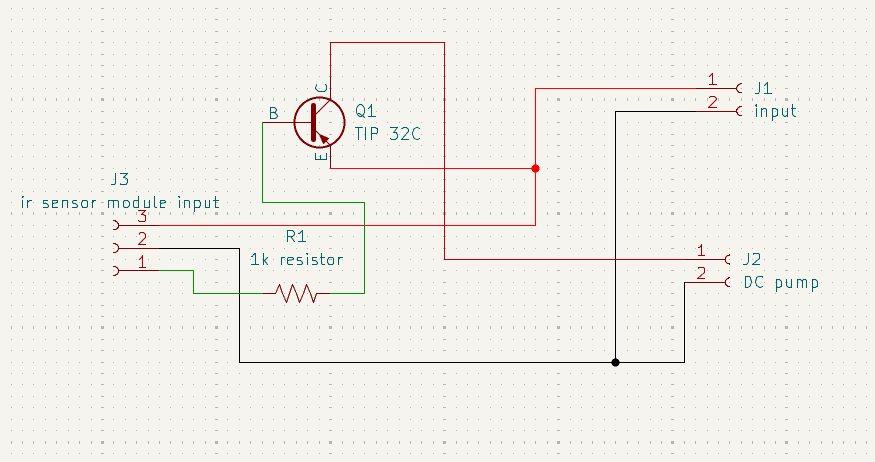
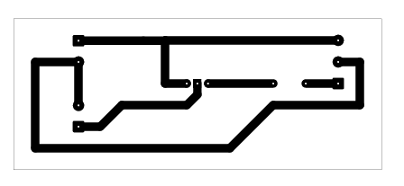

# Automatic Hand Sanitizer

## Overview

This project contains a control board intended to switch a DC pump from an external IR sensor module input.

## Project Information

| Item | Details |
| --- | --- |
| Status | Educational prototype |
| Difficulty | Intermediate |
| KiCad project file | [`automatic hand sanitizer.kicad_pro`](<automatic hand sanitizer.kicad_pro>) |
| Hardware tested | ✅ Yes (prototype successfully assembled and functionally tested) |
| Manufacturing release | Not yet prepared |

## Project Gallery

### Schematic

### PCB Layout

### 3D Render

### Finished Hardware

> Hardware photos will be added after additional prototype boards are assembled and photographed.

## Repository Navigation

This project is part of the DIY-Circuits collection.

- [Return to the repository overview](../README.md).
- Open the project by opening the `.kicad_pro` file in KiCad.
- The KiCad project, schematic, and PCB files are the authoritative design files.

## Circuit purpose

J3 is labeled as an IR sensor module input and J2 as a DC pump connection, indicating an automatic sanitizer-pump control application.

## Estimated difficulty

Intermediate.

## KiCad source files

- `automatic hand sanitizer.kicad_pro`
- `automatic hand sanitizer.kicad_sch`
- `automatic hand sanitizer.kicad_pcb`

## Operating principle

The sensor-module input is routed through a 1K resistor to Q1, which is identified as a TIP32C PNP transistor. The transistor stage is intended to control the pump connection.

## Main components

- Q1: TIP32C PNP transistor.
- R1: 1K resistor.
- J2: DC pump connector; J3: IR sensor module input connector.

## Supply voltage

To be verified. The schematic does not document the pump voltage, sensor-module voltage, connector polarity, or current requirement.

## Files included

The folder includes the KiCad project, schematic, PCB, and two B.Cu PDF plot exports. A BOM is not included.

## Build and test notes

Verify the pump current, transistor dissipation, and sensor-module output behavior before assembly. A tested wiring and timing procedure is To be verified.

## Safety notes

Keep liquid away from the PCB and isolate electronics from the sanitizer container. Confirm pump and supply ratings before powering the circuit.

## Known limitations

No pump specification, flyback-protection documentation, or sensor-interface test evidence is recorded.

## Before You Power the Circuit

- Verify transistor orientation and E/B/C pinout.
- Check for solder bridges and cold solder joints.
- Verify resistor values before power-up.
- Confirm supply voltage and polarity.
- Perform a continuity check before applying power.

## Future improvements

- Add schematic and PCB screenshots that identify the sensor and pump connectors.
- Add connector polarity and function labels for the sensor and pump interfaces.
- Document pump-load limits, supply requirements, and transistor thermal considerations.
- Add an assembly and sensor-to-pump functional test procedure.

## Learning Objectives

After studying this project, readers should understand:

- How a sensor-module signal can be used to control a transistor-based load switch.
- Why load current and transistor dissipation must be checked for a pump application.

## Common Beginner Mistakes

- Reversing pump or supply polarity.
- Exceeding the transistor’s safe current or thermal limits.
- Installing a transistor without confirming the emitter, base, and collector pinout for the selected part.
- Connecting a sensor output without first confirming its voltage level and ground reference.

## License

MIT - see the repository [LICENSE](../LICENSE).
