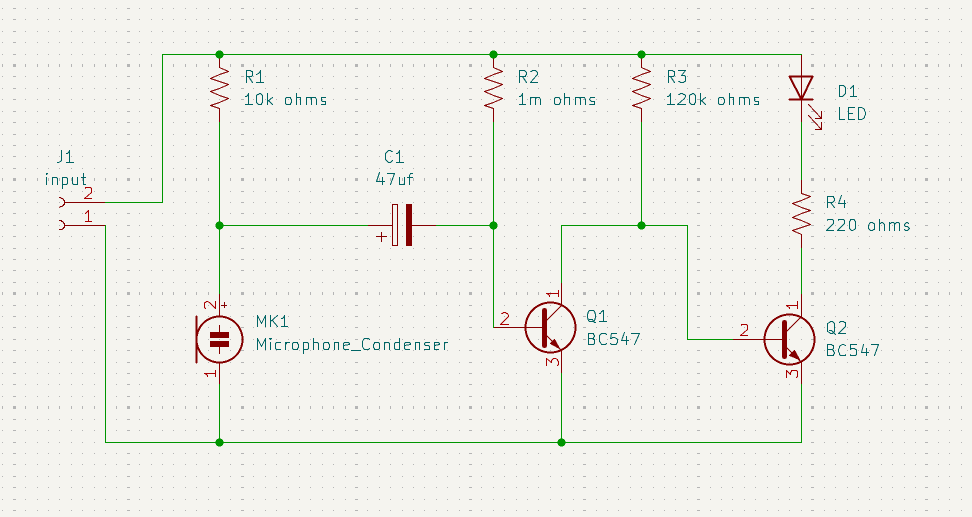
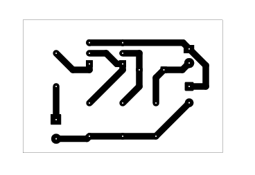

# Clap Switch Circuit

## Overview

This project is a microphone-input circuit with transistor stages and an LED output.

## Project Information

| Item | Details |
| --- | --- |
| Status | Educational prototype |
| Difficulty | Intermediate |
| KiCad project file | [`clap switch circuit.kicad_pro`](<clap switch circuit.kicad_pro>) |
| Hardware tested | ✅ Yes (prototype successfully assembled and functionally tested) |
| Manufacturing release | Not yet prepared |

## Project Gallery

### Schematic

### PCB Layout

### 3D Render

### Finished Hardware

> Hardware photos will be added after additional prototype boards are assembled and photographed.

## Repository Navigation

This project is part of the DIY-Circuits collection.

- [Return to the repository overview](../../README.md).
- Open the project by opening the `.kicad_pro` file in KiCad.
- The KiCad project, schematic, and PCB files are the authoritative design files.

## Circuit purpose

The condenser microphone, transistor stages, and LED indicate a sound-responsive circuit. This description is based on the project title and should be verified.

## Estimated difficulty

Intermediate.

## KiCad source files

- `clap switch circuit.kicad_pro`
- `clap switch circuit.kicad_sch`
- `clap switch circuit.kicad_pcb`

## Operating principle

The microphone signal is coupled through C1 into two BC547 transistor stages. The resistor values establish bias and gain, while D1 provides a visible output indication.

## Main components

- MK1: condenser microphone.
- Q1, Q2: BC547 transistors.
- C1: 47 uF polarized capacitor; D1: LED.
- R1: 10K ohms; R2: 1M ohms; R3: 120K ohms; R4: 220 ohms.

## Supply voltage

To be verified. The source does not document the supply range, connector polarity, or microphone bias conditions.

## Files included

The folder includes the KiCad project, schematic, PCB, and two B.Cu PDF plot exports. A BOM is not included.

## Build and test notes

Microphone orientation, capacitor polarity, and transistor pinout must be checked during assembly. Trigger sensitivity and test conditions are To be verified.

## Safety notes

Use a low-voltage supply only. Avoid powering the board while changing microphone or transistor connections.

## Known limitations

The repository does not specify sound threshold, load interface, false-trigger behavior, or tested operating conditions.

## Before You Power the Circuit

- Verify transistor orientation and E/B/C pinout.
- Verify LED polarity.
- Verify electrolytic capacitor polarity.
- Check for solder bridges and cold solder joints.
- Verify resistor values before power-up.
- Confirm supply voltage and polarity.
- Perform a continuity check before applying power.

## Future improvements

- Add schematic and PCB screenshots that show the microphone and amplifier stages.
- Add microphone, input, and LED-function silkscreen labels.
- Add test points for checking the microphone signal and transistor-stage bias.
- Document sensitivity testing, supply range, and the intended output interface.

## Learning Objectives

After studying this project, readers should understand:

- How a microphone signal can be amplified with transistor stages.
- How bias resistors and coupling capacitors influence a simple audio-trigger circuit.

## Common Beginner Mistakes

- Reversing the polarized capacitor.
- Rotating a transistor incorrectly relative to its pinout.
- Assuming the replacement transistor uses the same emitter, base, and collector order as the schematic symbol.
- Mounting the microphone with the wrong polarity or overlooking noise pickup during testing.

## License

MIT - see the repository [LICENSE](../../LICENSE).
