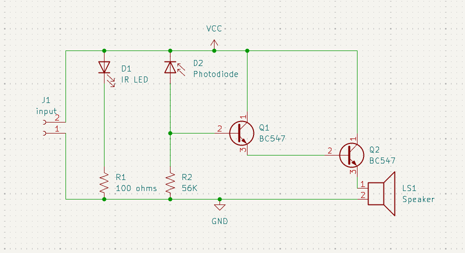
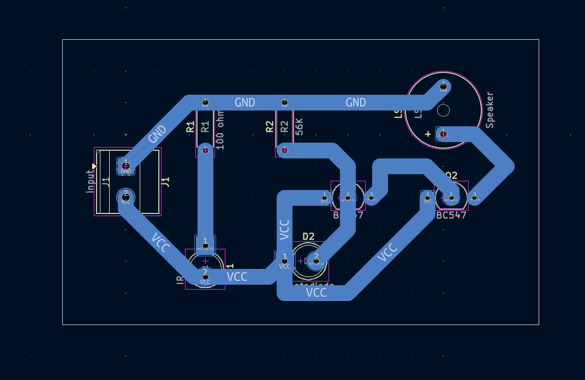

# Obstacle Detector

## Overview

This project contains an IR LED and photodiode sensing circuit with transistor stages, an LED, and a speaker output.

## Project Information

| Item | Details |
| --- | --- |
| Status | Educational prototype |
| Difficulty | Intermediate |
| KiCad project file | [`obstacle detector.kicad_pro`](<obstacle detector.kicad_pro>) |
| Hardware tested | ✅ Yes (prototype successfully assembled and functionally tested) |
| Manufacturing release | Not yet prepared |

## Project Gallery

### Schematic

### PCB Layout

### 3D Render

### Finished Hardware

> Hardware photos will be added after additional prototype boards are assembled and photographed.

## Repository Navigation

This project is part of the DIY-Circuits collection.

- [Return to the repository overview](../README.md).
- Open the project by opening the `.kicad_pro` file in KiCad.
- The KiCad project, schematic, and PCB files are the authoritative design files.

## Circuit purpose

The IR LED, photodiode, two BC547 transistor stages, LED, and speaker support an obstacle-detection learning project.

## Estimated difficulty

Intermediate.

## KiCad source files

- `obstacle detector.kicad_pro`
- `obstacle detector.kicad_sch`
- `obstacle detector.kicad_pcb`

## Operating principle

The IR LED provides an optical source and D2 is identified as a photodiode input. The Q1/Q2 transistor stages condition that input for the LED and speaker outputs.

## Main components

- D1: IR LED; D2: photodiode; LS1: speaker.
- Q1, Q2: BC547 transistors.
- R1: 100 ohms; R2: 56K ohms.

## Supply voltage

To be verified. VCC and GND symbols are present, but no numeric supply voltage, speaker rating, or connector polarity is documented.

## Files included

The folder includes the KiCad project, schematic, PCB, and one B.Cu PDF plot export. A BOM is not included.

## Build and test notes

Check IR LED and photodiode orientation, then test with a known reflective target. Detection distance and speaker behavior are To be verified.

## Safety notes

Use a low-voltage supply. Do not view an IR LED through optical instruments unless the emitter’s safety information is known.

## Known limitations

Target reflectivity, ambient light, alignment, detection range, and speaker load requirements are not documented.

## Before You Power the Circuit

- Verify transistor orientation and E/B/C pinout.
- Verify LED polarity.
- Check for solder bridges and cold solder joints.
- Verify resistor values before power-up.
- Confirm supply voltage and polarity.
- Perform a continuity check before applying power.

## Future improvements

- Add schematic and PCB screenshots that show the IR emitter, photodiode, and speaker output.
- Add emitter, receiver, speaker, and connector silkscreen labels.
- Add test points for the photodiode and conditioned transistor signal.
- Document alignment, target-distance, and target-surface test procedures.

## Learning Objectives

After studying this project, readers should understand:

- How an IR emitter and photodiode can form a reflected-light sensing pair.
- How transistor stages can condition a sensor signal for visual and audio outputs.

## Common Beginner Mistakes

- Reversing the IR LED or photodiode polarity.
- Misaligning the emitter and receiver during a reflected-light test.
- Installing a transistor without checking whether its emitter, base, and collector pinout matches the PCB footprint.
- Connecting a speaker without confirming its voltage and current requirements.

## License

MIT - see the repository [LICENSE](../LICENSE).
