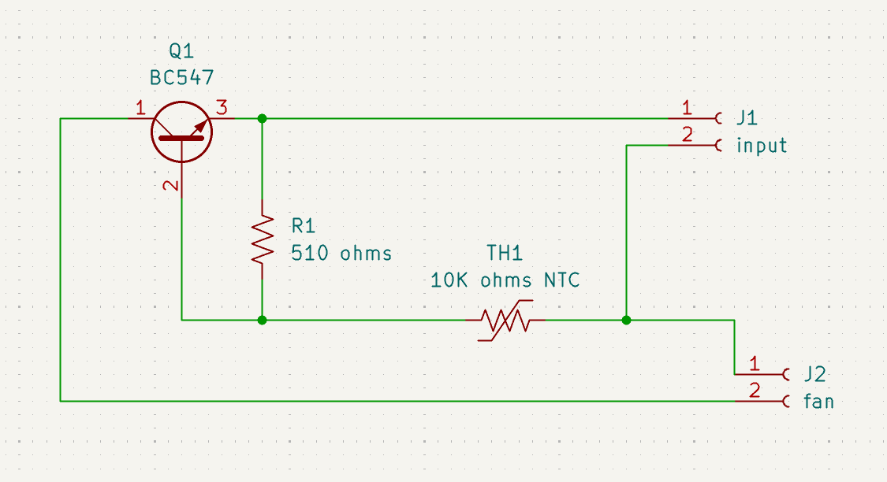
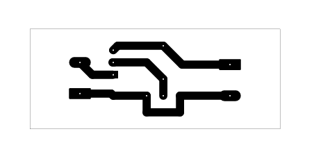
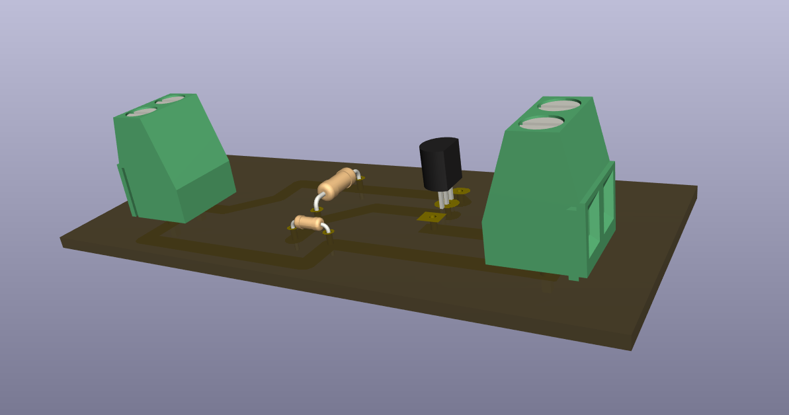

# Temperature Controlled DC Fan - BC547

## Overview

This project contains a thermistor-controlled BC547 transistor circuit with a fan connection.

## Project Information

| Item | Details |
| --- | --- |
| Status | Educational prototype |
| Difficulty | Beginner |
| KiCad project file | [`temperature controlled dc fan.kicad_pro`](<temperature controlled dc fan.kicad_pro>) |
| Hardware tested | ✅ Yes (prototype successfully assembled and functionally tested) |
| Manufacturing release | Not yet prepared |

## Project Gallery

### Schematic

### PCB Layout

### 3D Render

### Finished Hardware

## Repository Navigation

This project is part of the DIY-Circuits collection.

- [Return to the repository overview](../README.md).
- Open the project by opening the `.kicad_pro` file in KiCad.
- The KiCad project, schematic, and PCB files are the authoritative design files.

## Circuit purpose

TH1 is identified as a 10K NTC thermistor and J2 is labeled `fan`, indicating a temperature-responsive fan-control concept.

## Estimated difficulty

Beginner.

## KiCad source files

- `temperature controlled dc fan.kicad_pro`
- `temperature controlled dc fan.kicad_sch`
- `temperature controlled dc fan.kicad_pcb`

## Operating principle

The 10K NTC thermistor and 510 ohm resistor provide a temperature-dependent bias condition for the BC547 transistor, which is connected to the fan output.

## Main components

- TH1: 10K ohms NTC thermistor.
- Q1: BC547 transistor; R1: 510 ohms.
- J2: connector labeled `fan`.

## Supply voltage

To be verified. The source does not specify fan voltage, fan current, transistor thermal limits, or connector polarity.

## Files included

The folder includes the KiCad project, schematic, PCB, and one B.Cu PDF plot export. A BOM is not included.

## Build and test notes

Confirm the fan current and BC547 suitability before connecting a load. Temperature threshold and test method are To be verified.

## Safety notes

Disconnect power before changing the thermistor or fan wiring. Do not exceed the transistor’s current or thermal limits.

## Known limitations

The repository does not document the fan load, switching threshold, hysteresis, or measured thermal performance.

## Before You Power the Circuit

- Verify transistor orientation and E/B/C pinout.
- Verify LED polarity.
- Check for solder bridges and cold solder joints.
- Verify resistor values before power-up.
- Confirm supply voltage and polarity.
- Perform a continuity check before applying power.

## Future improvements

- Add schematic and PCB screenshots that identify the thermistor and fan connection.
- Add fan-polarity and thermistor-location silkscreen labels.
- Add test points for the temperature-dependent transistor bias.
- Document fan rating, temperature-test method, and load-routing considerations.

## Learning Objectives

After studying this project, readers should understand:

- How an NTC thermistor changes a transistor bias condition with temperature.
- Why the load current must be compared with a transistor driver’s limits.

## Common Beginner Mistakes

- Installing the thermistor in the wrong physical location for the temperature being measured.
- Assuming a small transistor can drive any DC fan.
- Replacing the BC547 without confirming the new transistor’s emitter, base, and collector pin arrangement.
- Reversing the fan or supply polarity.

## License

MIT - see the repository [LICENSE](../LICENSE).
