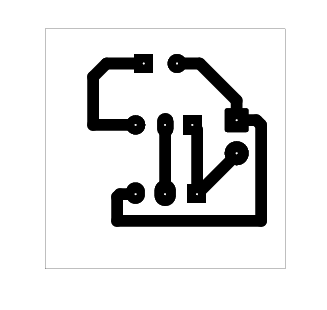
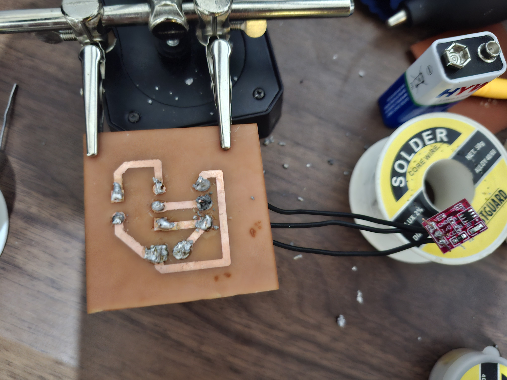

# Touch Sensor Circuit

## Overview

This project contains a touch-sensor-labeled input, a transistor stage, and a lamp output.

## Project Information

| Item | Details |
| --- | --- |
| Status | Educational prototype |
| Difficulty | Intermediate |
| KiCad project file | [`touch sensor circuit.kicad_pro`](<touch sensor circuit.kicad_pro>) |
| Hardware tested | ✅ Yes (prototype successfully assembled and functionally tested) |
| Manufacturing release | Not yet prepared |

## Project Gallery

### Schematic

### PCB Layout

### 3D Render

### Finished Hardware

## Repository Navigation

This project is part of the DIY-Circuits collection.

- [Return to the repository overview](../README.md).
- Open the project by opening the `.kicad_pro` file in KiCad.
- The KiCad project, schematic, and PCB files are the authoritative design files.

## Circuit purpose

U1 is labeled `touch sensor` and LA1 is labeled `Lamp`, indicating a touch-controlled load project. The exact touch-sensor model and load behavior are To be verified.

## Estimated difficulty

Intermediate.

## KiCad source files

- `touch sensor circuit.kicad_pro`
- `touch sensor circuit.kicad_sch`
- `touch sensor circuit.kicad_pcb`

## Operating principle

The touch-sensor-labeled input feeds a BC547 transistor stage connected to the lamp output. Signal thresholds and the switching arrangement are To be verified.

## Main components

- U1: component labeled `touch sensor`.
- Q1: BC547 transistor; LA1: lamp output.
- J1: input connector.

## Supply voltage

To be verified. The source does not provide the touch-sensor operating voltage, lamp rating, load current, or connector polarity.

## Files included

The folder includes the KiCad project, schematic, PCB, and eight PDF plot/export files. A BOM is not included.

## Build and test notes

Confirm the touch-sensor module interface and lamp load before assembly. Touch sensitivity and switching behavior are To be verified.

## Safety notes

Do not connect an unspecified lamp load to mains electricity. Use a low-voltage demonstrator load until ratings and isolation are documented.

## Known limitations

The touch-sensor model, output logic level, lamp type, and load-driving limits are not documented.

## Before You Power the Circuit

- Verify transistor orientation and E/B/C pinout.
- Verify LED polarity.
- Check for solder bridges and cold solder joints.
- Verify resistor values before power-up.
- Confirm supply voltage and polarity.
- Perform a continuity check before applying power.

## Future improvements

- Add schematic and PCB screenshots that identify the touch-sensor input and lamp output.
- Add touch-input, lamp-output, and connector-polarity silkscreen labels.
- Add test points for the sensor signal and transistor output.
- Document the sensor interface, low-voltage load limits, and touch-response test procedure.

## Learning Objectives

After studying this project, readers should understand:

- How a sensor-module output can be connected to a transistor-controlled load stage.
- Why an unknown load must be characterized before it is connected to a driver circuit.

## Common Beginner Mistakes

- Assuming a touch-sensor output can directly drive any load.
- Rotating the transistor incorrectly relative to its pinout.
- Installing a substitute transistor without confirming the emitter, base, and collector pin order.
- Connecting a lamp without confirming voltage, current, and isolation requirements.

## License

MIT - see the repository [LICENSE](../LICENSE).
