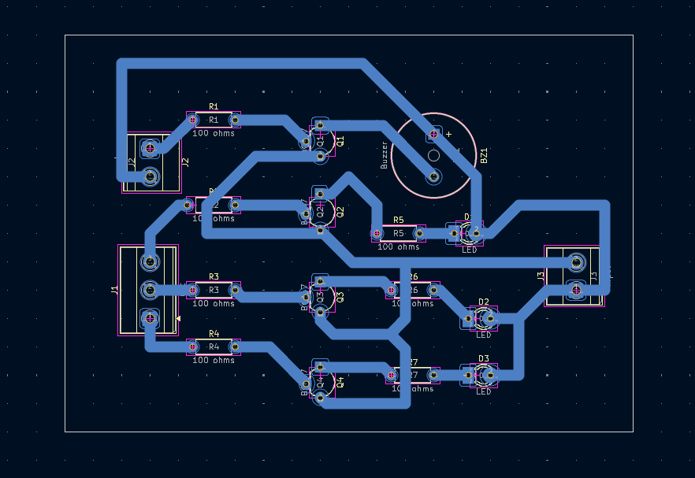
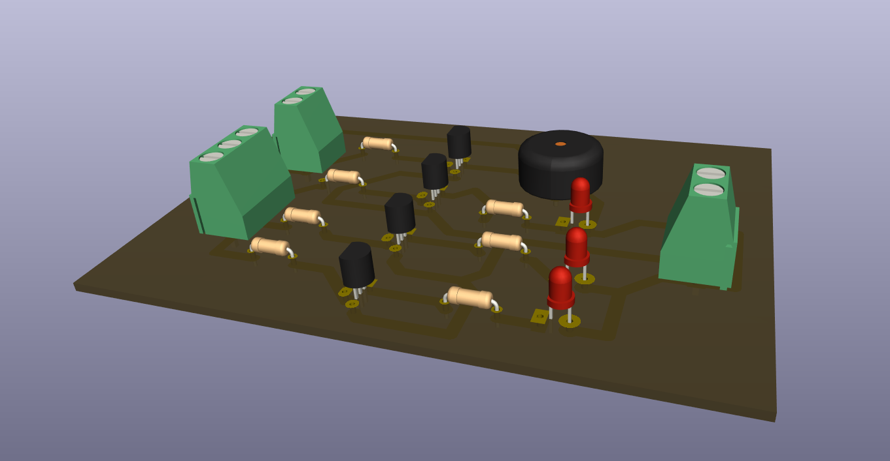

# Water Level Indicator

## Overview

This project contains a multi-stage water-level indication circuit with LEDs and a buzzer.

## Project Information

| Item | Details |
| --- | --- |
| Status | Educational prototype |
| Difficulty | Intermediate |
| KiCad project file | [`water level indicator.kicad_pro`](<water level indicator.kicad_pro>) |
| Hardware tested | ✅ Yes (prototype successfully assembled and functionally tested) |
| Manufacturing release | Not yet prepared |

## Project Gallery

### Schematic

### PCB Layout

### 3D Render

### Finished Hardware

> Hardware photos will be added after additional prototype boards are assembled and photographed.

## Repository Navigation

This project is part of the DIY-Circuits collection.

- [Return to the repository overview](../README.md).
- Open the project by opening the `.kicad_pro` file in KiCad.
- The KiCad project, schematic, and PCB files are the authoritative design files.

## Circuit purpose

The schematic uses multiple BC547 transistor stages, three LEDs, a buzzer, and input/output connectors for a water-level indication concept.

## Estimated difficulty

Intermediate.

## KiCad source files

- `water level indicator.kicad_pro`
- `water level indicator.kicad_sch`
- `water level indicator.kicad_pcb`

## Operating principle

Separate sensing inputs are routed through transistor stages Q1 through Q4. The stages control the LED and buzzer indication outputs for different sensed water levels.

## Main components

- Q1, Q2, Q3, Q4: BC547 transistors.
- D1, D2, D3: LEDs; BZ1: buzzer.
- R1 through R7: 100 ohms.
- J1, J2: output connectors; J3: input connector.

## Supply voltage

To be verified. The source includes GND symbols but does not document a numeric supply voltage, probe arrangement, connector polarity, or buzzer rating.

## Files included

The folder includes the KiCad project, schematic, PCB, and two B.Cu PDF plot exports. A BOM is not included.

## Build and test notes

Confirm the probe wiring and power polarity before testing. A safe water test setup, indication thresholds, and buzzer behavior are To be verified.

## Safety notes

Use an isolated low-voltage supply for any water test. Keep the PCB dry and do not use this circuit with mains-connected equipment.

## Known limitations

The probe geometry, water conductivity range, supply requirements, and long-term corrosion behavior are not documented.

## Before You Power the Circuit

- Verify transistor orientation and E/B/C pinout.
- Verify LED polarity.
- Verify electrolytic capacitor polarity.
- Check for solder bridges and cold solder joints.
- Verify resistor values before power-up.
- Confirm supply voltage and polarity.
- Perform a continuity check before applying power.

## Future improvements

- Add schematic and PCB screenshots that identify the probe inputs and indication stages.
- Add probe, LED, buzzer, and connector-polarity silkscreen labels.
- Add test points for each water-level sensing stage.
- Document probe placement, safe water-test procedure, and corrosion-aware assembly guidance.

## Learning Objectives

After studying this project, readers should understand:

- How multiple transistor stages can represent separate input levels.
- Why water conductivity and probe arrangement affect a level-indication circuit.

## Common Beginner Mistakes

- Wiring sensor probes to the wrong connector positions.
- Testing with non-isolated power near water.
- Installing transistors without checking each device’s emitter, base, and collector pin arrangement.
- Reversing LEDs or the buzzer supply polarity.

## License

MIT - see the repository [LICENSE](../LICENSE).
